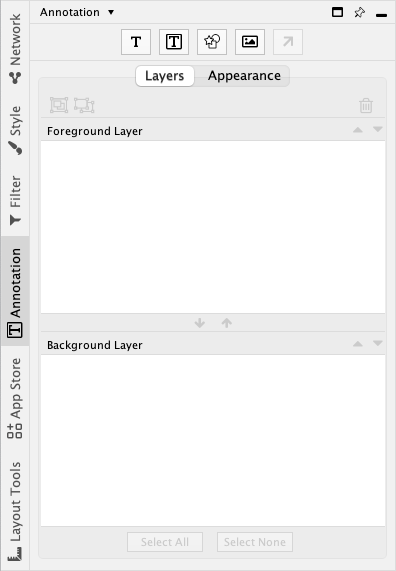
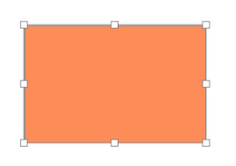
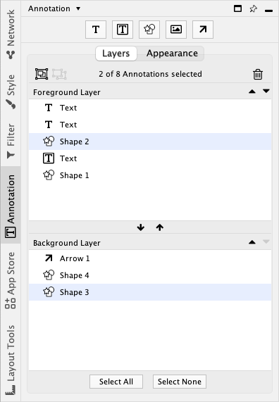
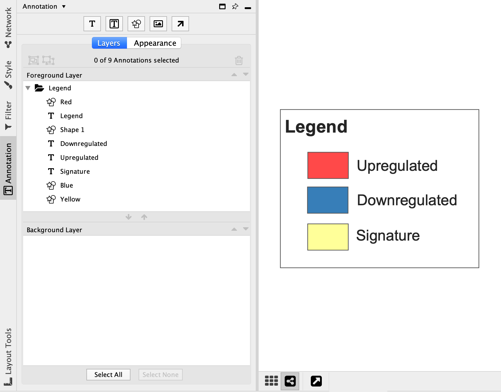
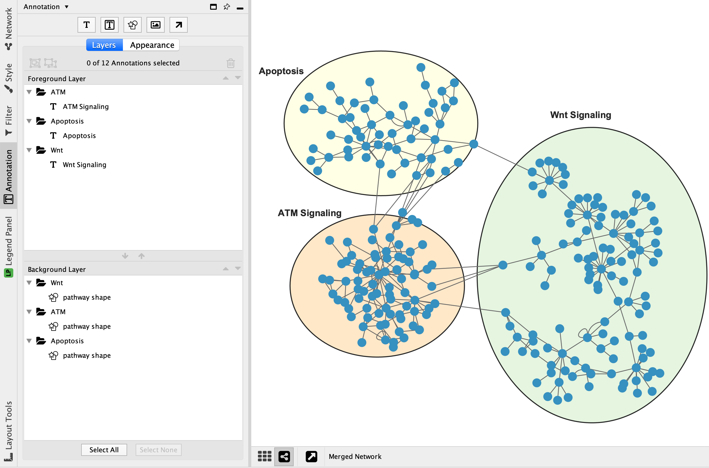

# 网络注释

形状、图像或文本均可以作为注释添加到网络画布中。

网络画布由 3 个透明层组成：

- 前景层
- 网络层
- 背景层

中间的网络层包含节点、边和图表，前景和背景层包含注释。

## 注释类型

有 5 种类型的注释可用：

1. 图像（从图像文件加载）
2. 形状（正方形，三角形等）

    

3. 文本

    

4. 带边框的文本（文字与周围的形状组合在一起）

    

5. 箭头（连接其他注释或节点）

    

## 注释面板

注释面板显示了当前前景层和背景层上的注释。该面板允许你创建和删除注释、选择注释、上下移动注释、在层之间移动注释以及注释分组。

## 创建注释

注释面板顶部共有 5 个按钮，用于创建不同类型的注释。首先，单击要添加类型的注释按钮。

或者，右键单击网络画布，然后在 `Add` 菜单下选择注释类型。

### 形状、带边框的文本、图像

- 单击创建形状、带边框的文本或图像注释的按钮。
- 在网络画布上单击一个位置放置注释。
- 在弹出的对话框中可以编辑注释属性。创建注释后，可以再次编辑这些属性。
- 单击对话框中的 `OK` 按钮。
- 注释将出现在画布中。
- 鼠标光标会自动移动到画布上，并且注释处于调整大小模式。
- 移动鼠标可以调整注释大小。注释可以稍后再次调整大小。
- 再次单击鼠标停止调整大小。

### 文本

- 单击创建文本注释的按钮。
- 在网络画布上单击一个位置放置注释。
- 在弹出的对话框中可以编辑文本。
- 单击对话框中的 `OK` 按钮。
- 注释将出现在画布中。

### 箭头

- 创建箭头注释需要网络画布上至少存在一个其他注释。
- 单击创建箭头注释按钮。
- 单击画布上的一个注释作为源注释。
- 单击画布上的另一个注释或节点作为目标。
- 此时将会出现一个箭头注释连接源和目标。

## 选择注释

单击 `Annotations` 面板中可以选择一个或多个注释。

为了能够在网络画布中选择注释，必须启用 `Toggle Annotation Selection`。单击  按钮来启动/禁用注释选择模式。

选择注释后，注释将被黄色选择矩形包围，并且可以看到 8 个调整大小的控制块。注释可以通过使用鼠标单击并拖动来移动。通过单击并拖动任意控制块来调整注释的大小。

在 Windows 上按住 ++ctrl++，在 macOS 上按住 ++command++，同时单击要选择的每个注释可以同时选择多个注释。这在 `Annotations` 面板和网络画布上均起作用。选择多个注释时，可以同时移动和调整大小。

## 上移或下移注释

`Annotation` 面板显示了前景层上和背景层上的注释列表。

靠近列表顶部的注释将绘制在列表下方注释的上面。要在图层中移动注释，选择注释后单击  按钮向前移动，单击  按钮向后移动。要在层之间移动注释，选择注释后单击  按钮移至前景层，单击  按钮移至背景层。

## 重命名注释

每个注释都有一个显示在 `Annotation` 面板中的名称。这些名称主要用于组织，并不影响注释在画布上的显示方式。要重命名注释，在 `Annotation` 面板中双击注释，然后输入新名称即可。

## 编辑注释

要修改注释的属性（例如：颜色，文本），在 `Annotation` 面板中，右键单击注释，然后在上下文菜单中选择 `Modify Annotation...`。

## 删除注释

要从 `Annotation` 面板中删除注释，选择一个或多个注释，单击  按钮进行删除。

要从网络视图中删除注释，右键单击注释，然后选择 `Edit -> Cut` 即可。

## 注释分组

可以将两个或更多注释合并为一组。分组后，注释可以像单个注释一样移动并调整大小。分组可以嵌套（一个分组可以包含其他分组）。

选择两个或多个注释，然后单击  按钮创建分组。分组有一个默认名称，在创建后可以进行修改。选择分组，单击  可以对注释取消分组。

一个分组可能包含来自前景层和背景层的注释。该分组将同时显示在注释面板的前景层和背景层中。

**注意**，删除一个分组将会删除该分组包含的所有注释。
