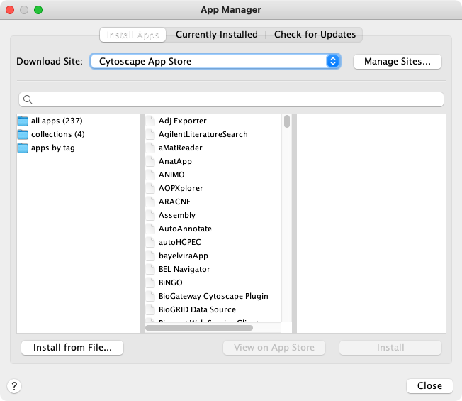

# 应用管理

## 什么是应用？

Cytoscape 的功能并不是固定的，可以通过应用进行扩展。通过多种方式可以扩展 Catoscape。有的应用可以从在线数据库导入数据，有的应用可以提供分析网络的新方法。你可以在安装 Cytoscape 之后安装应用。大多数应用都是由向你这样的 Cytoscape 用户构建的。

如果你对 Cytoscape 2.x 熟悉，可能知道 Cytoscape 应用之前称为插件。从 Cytoscape 3.0 开始，我们将其称为应用。Cytoscape 2.x 的插件不能在 Cytoscape 3.x 版本中使用。

## 安装应用

你可以通过 [App Store](http://apps.cytoscape.org/) 或 Cytoscape 安装应用。在本节，我们将讨论通过 Cytoscape 安装应用，你可以从[这里](http://apps.cytoscape.org/help/getstarted_app_install)了解通过 App Store 如何安装应用。

通过菜单栏中的 `Apps -> App Manager...` 可以在 Cytoscape 中安装应用。在 `App Manager` 窗口的顶部选择 `Install Apps` 选项卡。

你可以通过 4 种方法查找应用：

- 如果知道要查找的应用名称，可以在搜索框内输入名称。应用管理器将在中间窗格中列出名称或描述与搜索字段匹配的应用。
- 如果不确定使用哪种类型的应用，单击 `all apps` 文件夹可以在中间窗格中列出所有应用来查看所有内容。
- 如果需要为特定场景安装应用集合，可以单击 `collections` 文件夹。将在中间窗格中显示可用的集合。集合仅包含适用于特定场景的应用。
- 如果您大致了解要查找的应用类型，双击 `apps by tag` 文件夹，然后单击你感兴趣的标签。具有该标签的应用将在中间窗格中列出。

单击中间窗格中的一个应用（或集合）时，应用管理器将在右侧面板中显示简短说明和图标。如果需要更多信息，可以单击右下角 `View on App Store` 按钮。如果要继续安装，请单击 `Install` 按钮。

如果你已经将应用下载到计算机上，可以通过左下角的 `Install from File` 按钮进行安装。

## 管理已安装的应用

单击顶部的 `Currently Installed` 选项卡，可以查看已安装的所有应用列表。单击列表中的一个应用，你会在底部看到该应用的说明。利用底部的几个按钮，你可以：

- 卸载应用。这将从你的计算机中删除该应用。如果要重新安装该应用，需要在 `Install Apps` 选项卡或 App Store 中再次找到并重新安装。
- 禁用应用。这会暂时禁用该应用。该应用会保留在你的计算机上，但 Cytoscape 不会加载它。通过在列表中选择禁用的应用，然后单击 `Enable` 来启用该应用。

**注意**，卸载或禁用集合不会卸载或禁用该集合安装的任何应用。
