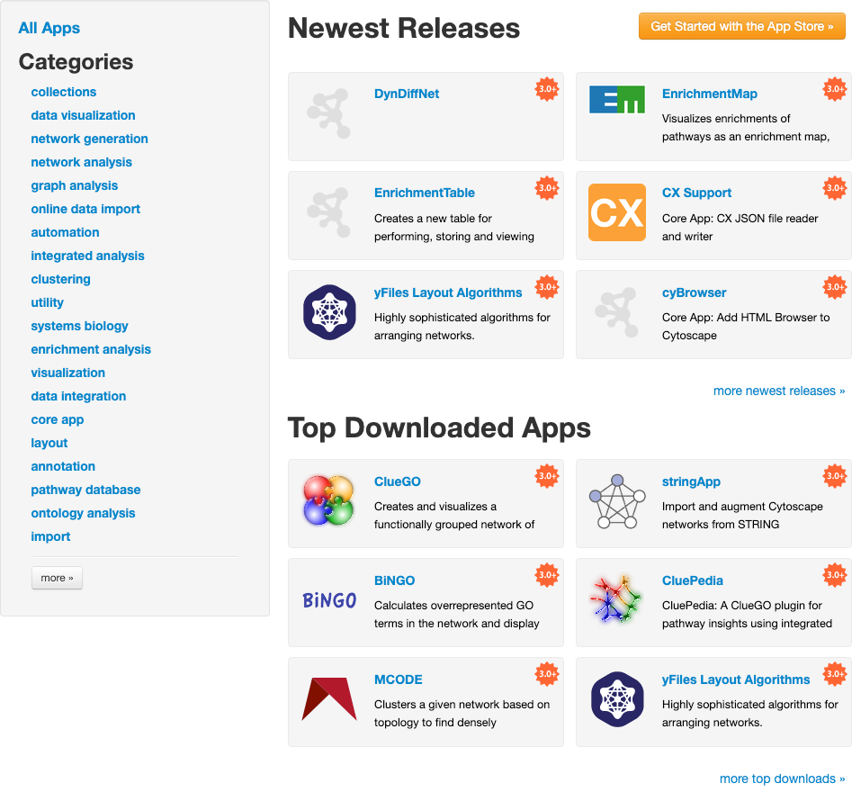

# 应用商店

## 什么是应用？

Cytoscape 的功能并不是固定的，可以通过应用进行扩展。通过多种方式可以扩展 Catoscape。有的应用可以从在线数据库导入数据，有的应用可以提供分析网络的新方法。你可以在安装 Cytoscape 之后安装应用。大多数应用都是由向你这样的 Cytoscape 用户构建的。

如果你对 Cytoscape 2.x 熟悉，可能知道 Cytoscape 应用之前称为插件。从 Cytoscape 3.0 开始，我们将其称为应用。Cytoscape 2.x 的插件不能在 Cytoscape 3.x 版本中使用。

## 访问应用商店

你可以通过 3 种方法访问 Cytoscape 中的应用商店：

- 使用 **控制面板** 顶部的下拉菜单。
- 转到 **控制面板** 的 **App Store** 选项卡。

    

- 转到菜单并选择 `App -> App Store -> Show App Store`。

    

    

## 安装应用

你可以通过[应用商店网站](https://apps.cytoscape.org)或在 Cytoscape 中安装应用。在本节中，我们将讨论如何通过 Cytoscape 安装应用。单击[此处](https://apps.cytoscape.org/help/getstarted_app_install)了解如何通过应用商店安装应用。

你可以通过 3 种方法查找应用：

- 如果你知道应用的名称，可以将其填入应用商店顶部的 `Search` 文本框中，然后单击搜索按钮。在线应用商店中名称或描述匹配搜索词的结果将显示在你默认的浏览器中。
- 如果你不确定需要哪些应用，希望浏览所有内容，单击右上角按钮并选择 `Browse all apps`。

    

- 如果你对正在寻找的应用有一个大概的了解。前往[应用商店网站](https://apps.cytoscape.org)，在左侧单击感兴趣的类别，该类别的所有应用将展示在网页中。

    

找到要安装的应用后，单击[应用商店网站](https://apps.cytoscape.org)相应页面上的 `Install` 按钮。安装完成后，应用将显示在 Cytoscape 应用商店顶部的 `Installed Apps` 中。

如果你已经将应用下载到本地计算机中，可以通过单击 `Apps -> App Store -> Install Apps From File` 进行安装。请注意，只能安装 `*.jar` 格式的文件。

## 管理已安装的应用

### 获取应用信息

你可以在应用商店的 `Installed Apps` 中查看所有已安装的应用。当鼠标悬停在应用上时，会显示该应用的简要说明。如果你想了解更多信息，可以单击应用的名称，它会将你重定向至应用程序页面。

应用商店为每个应用提供了 3 个按钮，对应如下描述的特定功能：**卸载应用**、**切换启用状态** 和 **更新应用**。

### 启动/禁用应用

要暂时禁用某个应用，可以改变该应用复选框的状态来 **切换启用状态**。该应用仍会保留在计算机中，但 Cytoscape 不会加载它。你可以再次勾选复选框来启用该应用。

### 卸载应用

单击 **卸载应用**（垃圾桶）按钮来从计算机上卸载应用。如果想重新安装该应用，则必须在应用商店中找到并重新安装。

### 核心应用

核心应用为 Cytoscape 提供了基础功能，其重要性导致无法将核心应用同 Cytoscape 分离，也就是无法禁用或删除核心应用。默认情况下，核心应用选项卡处于折叠状态。如果核心应用有更新，则该选项卡将展开。

你可以在[此处](https://github.com/cytoscape/cytoscape#new-from-330-core-apps)查看完整的核心应用列表。

### 更新应用

如果应用有更新，应用商店会提醒升级应用。单击 **更新应用**（绿色箭头）按钮来更新应用。

此外，如果安装的应用有更新时，Cytoscape 右上角的 `App Updates` 按钮  将可点击。单击按钮 Cytoscape 将跳转至应用商店选项卡。
