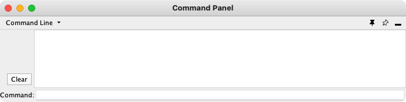
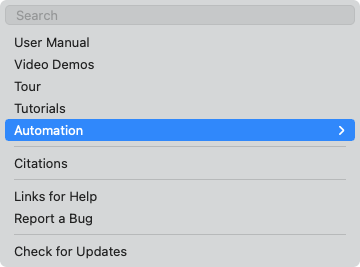
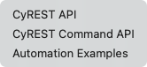
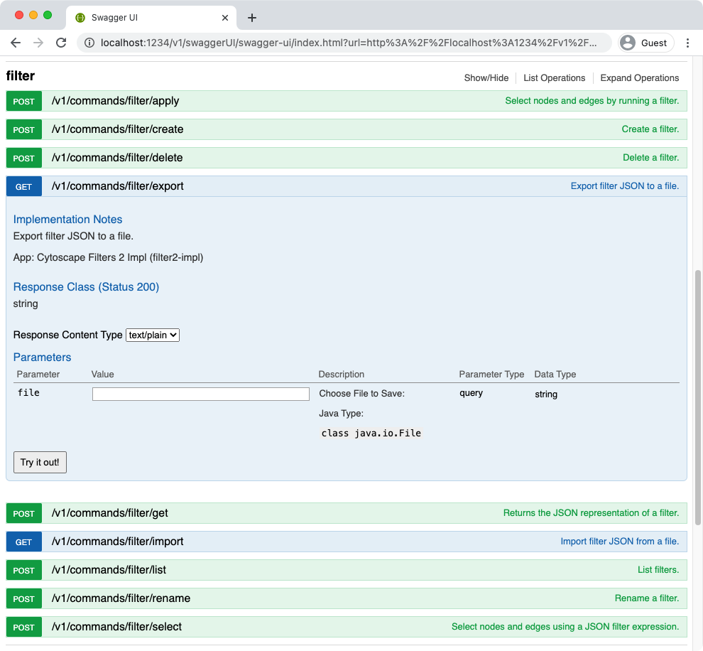
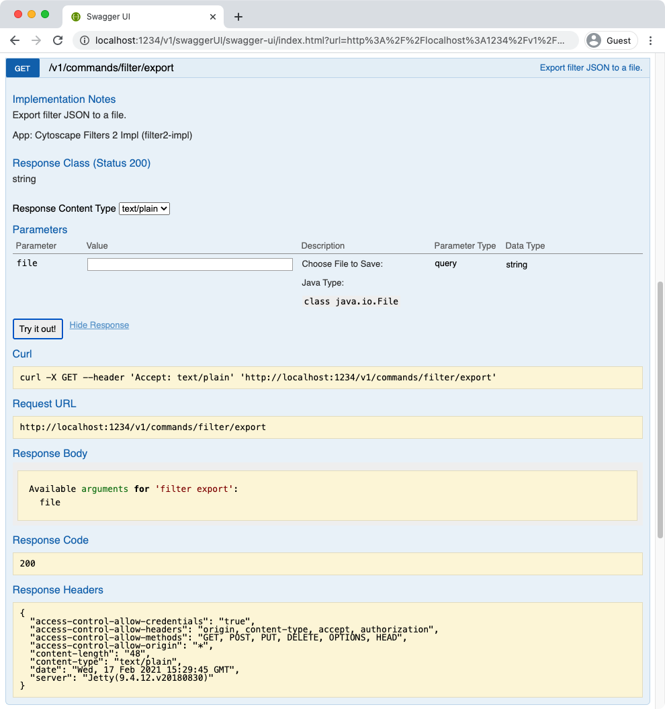

# 自动化

Cytoscape 直观的图形用户界面对于交互式网络数据集成、分析和可视化很有用。它提供了探索性数据分析的强大功能，但是如果你有成百上千个数据文件或需要他人执行你的数据分析工作流，会发生什么呢？使用 GUI 手动将相同的操作应用于数百个网络几乎是不可能的。更重要的是，尽管你可以将结果另存为会话文件，但是如果使用 GUI 操作进行数据分析，则无法保存工作流。Cytoscape 在 Cytoscape Automation 的帮助下包含几个支持自动化工作流的选项。[Cytoscape Automation 网站](http://automation.cytoscape.org)上提供了更多的教程和示例。

## R 和 Python 扩展包

如果你在使用 R 或 Python，那么很幸运。我们为这些语言提供了带有帮助函数的软件包，以便快速直观地访问和控制 Cytoscape。

R 扩展包为 RCy3，通过 Bioconductor 可以获得，请参见：https://www.bioconductor.org/packages/release/bioc/html/RCy3.html。RCy3 提供了一个不错的界面用于浏览文档和说明文，请参见：http://cytoscape.org/RCy3/index.html。[Cytoscape Youtube 频道](https://www.youtube.com/playlist?list=PLFQS98nmv__wYlu_XoscNb6DKu_vo6_vH)中还提供了一些视频教程。

[py4cytoscape](https://py4cytoscape.readthedocs.io/) 是通过 Cytoscape 的 REST API 进行通信的 Python 扩展包。可以在独立或 Notebook Python 编程环境中提供 250 多种函数。它提供了与 RCy3 几乎相同的功能。

## 命令行

命令行功能使你可以编写一系列 Cytoscape 命令和菜单项脚本，其中命令可以包括用户通过 Cytoscape 对话框提供的参数值。例如，`session open file="C:\myfile.cys"` 从文件载入一个会话文件与 `File -> Open` 菜单功能类似。命令可以解析为 Cytoscape 的核心功能或启用自动化的应用。你可以创建脚本文件，通过 `Tools -> Execute Command File` 或在启动 Cytoscapt 时执行。



`Command` 是内置的 Cytoscape 功能，可以将你的工作流自动化为简单的脚本。你可以在[自动化面板](/automation-panel/)部分中了解有关命令的更多信息。

## CyREST 接口层

在某些情况下，你可能需要利用 R，Python，Ruby 或 JavaScript 等功能齐全的编程语言提供复杂的控制和数据结构。这些语言支持复杂的以 Cytoscape 为中心的工作流或将 Cytoscape 集成到更大的工作流中。Cytoscape 可以通过 CyREST 接口对命令和函数提供程序性访问。

默认情况下，CyREST 接口处于启用状态，并且在 TCP/IP 的 1234 端口上启动。要验证这一点，可以在 Cytoscape 工作站上启动 Web 浏览器，然后打开 http://localhost:1234/v1/ 或 http://localhost:1234/v1/commands。第一个连接将以 JSON 对象的形式返回 Cytoscape 的基本信息。

```json
{
  "allAppsStarted": true,
  "apiVersion": "v1",
  "numberOfCores": 4,
  "memoryStatus": {
    "usedMemory": 403,
    "freeMemory": 1644,
    "totalMemory": 2048,
    "maxMemory": 15568
  }
}
```

第二个链接将返回可用的命令空间列表：

```
Available namespaces:
  analyzer
  annotation
  apps
  bridgedb
  command
  cybrowser
  cychart
  diffusion
  edge
  filter
  group
  idmapper
  layout
  network
  node
  session
  table
  view
  vizmap
```

**注意**，命名空间列表将根据你安装的应用有所不同，一些应用会在自己的命名空间中提供命令。

如果你的工作站已经使用了 1234 端口，则可以通过如下两种方式指定其它的 CyREST 端口：

- 通过 `Edit -> Preferences` 菜单修改 `rest.port` 属性来选择其他端口（例如：8888）
- 通过 `-R` 参数在 Cytoscape 命令中指定端口：

    ```
    cytoscape.bat -R 8888 (for Windows)
    ./cytoscape.sh -R 8888 (for Mac or Linux)
    ```

    你可以通过浏览器浏览 http://localhost:8888/v1/ 来测试新端口。

**注意**，如果你希望在一个工作站上运行多个 Cytoscape 示例，则每个 Cytoscape 实例的 CyREST 端口必须唯一。你必须使用属性或命令行参数来使用不同 CyREST 端口运行每个实例。

### 探索 CyREST 命令和函数

Cytoscape 通过 `Help -> Automation` 子菜单提供了可用命令和函数的列表。`CyREST API` 子菜单显示可用的函数，`CyREST Command API` 显示可用的命令。`Automation Examples` 指向了一个 Web 门户，其中包含了有关 Cytoscape 自动化的大量文档、示例和教程。





**注意**，`Automation Examples` 包含了一个说明如何探索 CyREST 命令和函数的教程：https://github.com/cytoscape/cytoscape-automation/wiki/Trying-Automation。

`CyREST API` 和 `CyREST Command API` 子菜单将在 Swagger Web 应用中介绍 CyREST。你可以通过阅读和直接调用来探索 CyREST 接入点。一个函数的示例页面如下：



**注意**，该页面包含了描述、输入参数、输出值、结果代码和试用按钮。单击按钮执行函数，并显示实际的 CyREST 调用及其结果。充分利用 Swagger 作为原型制作工具可以大大减少代码编写和调试时间。



要了解有关 CyREST 的更多信息，请参见 Cytoscape Automation 教程页面：https://github.com/cytoscape/cytoscape-automation/wiki/Trying-Automation。

注意 Swagger 页面在执行时会反射 Cytoscape 中的函数，包括已安装应用贡献的命令和函数。要探索已卸载应用中的 CyREST 函数，你需要先安装它们，再通过 `Help -> Automation` 子菜单来生成 Swagger 页面（或仅重载 Swagger 浏览器页面）。
