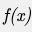
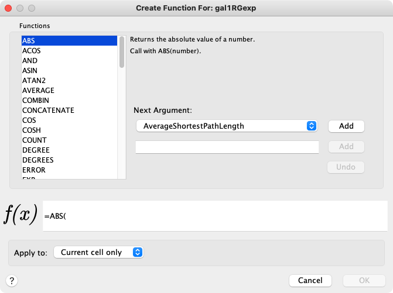

# 列数据函数和方程

## 列公式

### 简介

列数据也可以为公式，一个例子为 `=ABS($otherColumn + LOG(10.2))`。公式以 Excel 规范为基础，但仅支持对同一个节点、边或网络的其他列进行引用。由于 Cytoscape 列名称可能包含空格，因此允许在列名周围使用可选的花括号（如果名称不只是包含字母或数字，则必须使用），例如 `${a name with spaces}`。列名中的反斜杠、花括号和美元符号必须利用反斜杠进行转义，例如列名 `ex$am{p\le` 应该写为 `${ex\$am\{p\\le}`。同时，列名是区分大小写的。

字符串常量利用双引号表示，为了在字符串中插入双引号或反斜杠，同样也必须利用反斜杠对其进行转义，例如：字符串 `"\` 应该写为 `\"\\`。公式结果必须与分配给他们的列的类型兼容。兼容规则是比较宽松的，例如，任何数据都可以被当作字符串，所有的数值类型都可以作为布尔值，其中非零数据表示 `true`，零表示 `false`。对于整型数据列，将使用 Excel 的 `INT` 函数对浮点数进行转换。括号可以用于分组和更改执行顺序，运算符的优先级遵循标准算术规范。

### 操作符

当前支持 4 个基本算术运算符和 `^` 幂运算，`+`，`-`，`*`，`/` 是左连接的，`^` 是右连接的。字符串连接运算符为 `&`。支持的逻辑运算符包括 `<`，`>`，`<=`，`>=`，`=` 和 `<>`（不等于）。

### 函数

当前支持的函数包括：

#### Cytoscape 特定函数

- `Degree`：节点的度
- `InDegree`：节点的入度
- `OutDegree`：节点的出度
- `SourceID`：边的源节点 ID
- `TargetID`：边的目标节点 ID

#### 数值运算函数

- `Abs`：绝对值
- `ACos`：反余弦
- `ASin`：反正弦
- `ATan2`：$\dfrac{y}{x}$ 的反正切
- `Average`：平均值
- `Cos`：余弦
- `Cosh`：双曲余弦
- `Count`：计数
- `Degrees`：弧度转角度
- `Exp`：$e$ 指数
- `Ln`：自然对数
- `Log`：对数
- `Max`：最大值
- `Median`：中位数
- `Min`：最小值
- `Mod`：取余
- `Pi`：$\pi$
- `Radians`：角度转弧度
- `Round`：四舍五入为整数
- `Sin`：正弦
- `Sinh`：双曲正弦
- `Sqrt`：平方根
- `Tan`：正切
- `Tanh`：双曲正切
- `Trunk`：截断

#### 字符串运算函数

- `Concatenate`：字符串拼接
- `Left`：返回左侧部分
- `Len`：字符串长度
- `Lower`：转小写
- `Mid`：返回中间部分
- `Right`：返回右侧部分
- `Substitute`：替换文本
- `Text`：使用 Java 的 `DecimalFormat` 将数值转换为文本
- `Upper`：转大写
- `Value`：文本转换为数字

#### 逻辑运算函数

- `And`：逻辑与
- `Not`：逻辑非
- `Or`：逻辑或

#### 列表运算函数

- `First`：返回列表的第一个元素
- `Last`：返回列表的最后一个元素
- `Nth`：返回列表的第 $N$ 个元素

#### 统计运算函数

- `Largest`：返回列表中的前 $K$ 个最大值
- `GeoMean`：几何平均数
- `HarMean`：调和平均数
- `Mode`：模
- `NormDist`：正态分布的概率密度函数或累计密度函数
- `Permut`：排列数
- `StDev`：标准差
- `Var`：方差

#### 其他运算函数

- `Combin`：组合数
- `If`：条件操作
- `ListToString`：列表转字符串
- `Now`：当前日期时间
- `Today`：当前日期

### 陷阱

可能的最大问题是引用其他具有空值的列。由于会导致错误，通常不允许这样做。为了减轻此问题，可以通过如下语法引用数据列 `${columnName:defaultValue}`。这表示当 `columnName` 为空时将采用默认值，否则将引用真实值。但引用的列必须是一个已经定义的列，不能是其他任意名称。另一个潜在的问题是可能存在循环依赖，这将会在计算公式时导致运行时错误。

### 提示

使用公式时开启开发人员日志控制台会非常有帮助。公式计算过程中的错误将会在此处显示。

## 公式构造器

为了简化公式的构造以及快速调用内置函数，程序在表格面板中提供了一个公式构造器。在选择一个非列表类型列单元格后，通过单击  来启动它，调用的公式构造器如下图所示：

在对话框左侧选择一个函数，这里我们选择 `ABS` 函数。在函数列表旁边可以指定一个或多个参数，参数可以为一个数据列（从下来菜单中选择），也可以在下方的文本框中指定常量。如果选择一个数据列，将使用该列的值，并且当该值改变后，函数的结果也将动态更新。单击 `Add` 可以添加一个参数，根据函数所接受的参数数量你可以添加一个或多个参数。对话框的底部有当前公式的预览。在 `Apply to` 中，你可以选择将公式应用于当前单元格、所选单元格或是整个数据列。单击 `OK` 应用公式，单击 `Cancel` 放弃所有更改。

公式构造器是一个探索内置函数列表的有用工具，可以实现返回值和数据列的数据类型匹配。参数可以是从列名称列表中选择的列，也可以是在文本框中输入的常量值。公式构造器当前的主要缺点在于不允许使用函数调用来构建函数。如果你需要更加通用的功能，可以直接在单元格中输入表达式。

## APP 开发者提示

构建自己的内置公式相对容易。一个简单的函数通常可以在 15 至 20 分钟内实现。通过解析器进行注册后，可以立即对用户可用，同时也会显示在公式构造器的下拉列表中。
