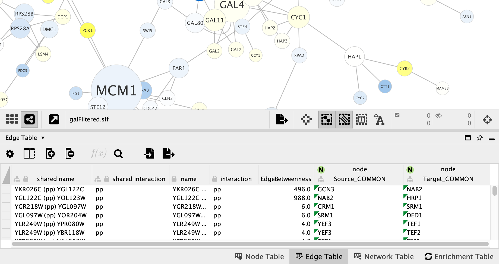
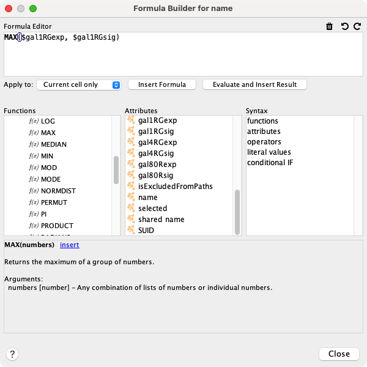

# 列数据函数和方程

## 列公式

### 简介

列可以包含需要计算产生结果的公式。

### 语法

#### 基本语法

公式总是以 `=` 开头。 这表示表格单元格中的值是一个公式。

例如：`=ABS($otherColumn + LOG(10.2))`

公式返回值的类型必须与列类型匹配，或者可以容易地转换为列类型。例如，如果字符串列中公式返回一个数值，则该数值将转换为字符串。但是，如果数值列中公式返回一个字符串值，则该字符串无法自动转换为数字，因此会导致显示错误。

对于布尔（或逻辑）列数据，所有数值都将被接受，其中非零数据表示 `true`，零表示 `false`。浮点值将使用 Excel `INT` 函数的规则进行转换。括号可用于分组和更改执行顺序。

#### 函数

Cytoscape 提供了一组执行特定任务和计算的函数。函数写成函数名，然后是左括号 `(`，然后是可选的逗号分隔的参数列表，然后是右括号 `)`。

例如：`=MAX(10, 20)`

例如：`=IF($otherColumn, "UP", "DOWN")`

例如：`=NOW()`

#### 属性

属性是对与公式相同的表中其他列的命名引用，并取得相同节点、边或网络的列单元格的值。

通过将列名放在美元符号 `$` 之后来引用属性。

例如：`$columnName`

如果列名称包含空格、特殊字符或命名空间标识符，则名称必须放在大括号之间。

例如：`${column name with spaces}`

例如：`${namespace::columnName}`

逗号等特殊字符必须使用反斜杠进行转义。

例如：`${name with \, comma}`

如果列值为空，你可以提供默认值。在列名后放置一个冒号 `:` 和默认值。

例如：`${columnName:0.0}`

最后，列名是区分大小写的。

#### 运算符

运算符写在两个操作数之间。

例如：`=$x + 1`

数字运算符：`+` 加法、`-` 减法、`*` 乘法、`/` 除法、`^` 取幂

文本运算符：`&` 字符串连接

逻辑运算符（对布尔值 true/false 进行操作）：`<` 小于、`>` 大于、`>=` 大于或等于、`<=` 小于或等于、`=` 等于、`<>` 不等于

运算符优先级规则遵循标准算术的优先级规则。

#### 字面值

字符串（文本）文字在双引号之间，例如：`"abc"`。

数字文字，例如：`123`

浮点文字，例如：`123.45`

布尔（逻辑）文字：`true, false`

为了在字符串中嵌入双引号或反斜杠，它们必须用反斜杠进行转义，因此字符串 **"\\** 必须写为 `"\"\\"`。

#### 条件值

条件值写成一个带有三个参数的 `IF` 函数：`IF(condition, a, b)`。如果条件计算结果为真，则返回参数 `a` 的值，否则返回参数 `b` 的值。

例如：`IF($x = $y, "equal", "different")`

### 支持的函数

当前支持的函数包括：

#### Cytoscape 特定网络函数

- `Degree`：节点的度
- `InDegree`：节点的入度
- `IsDirected`：是否为有向图
- `OutDegree`：节点的出度
- `SourceID`：边的源节点 ID
- `TargetID`：边的目标节点 ID

#### 数值运算函数

- `Abs`：绝对值
- `ACos`：反余弦
- `ASin`：反正弦
- `ATan2`：$\dfrac{y}{x}$ 的反正切
- `Average`：平均值
- `Combin`：组合数
- `Cos`：余弦
- `Cosh`：双曲余弦
- `Count`：计数
- `Degrees`：弧度转角度
- `Exp`：$e$ 指数
- `GeoMean`：几何平均数
- `HarMean`：调和平均数
- `Ln`：自然对数
- `Log`：对数
- `Max`：最大值
- `Median`：中位数
- `Min`：最小值
- `Mod`：取余
- `Mode`：众数
- `NormDist`：正态分布的概率密度函数或累计密度函数
- `Permut`：排列数
- `Pi`：$\pi$
- `Product`：乘积
- `Radians`：角度转弧度
- `Round`：四舍五入为整数
- `Sign`：符号函数
- `Sin`：正弦
- `Sinh`：双曲正弦
- `Sqrt`：平方根
- `StDev`：样本标准差
- `Sum`：加和
- `Tan`：正切
- `Tanh`：双曲正切
- `Trunc`：截断
- `Var`：样本方差

#### 字符串运算函数

- `Concatenate`：字符串拼接
- `Left`：返回左侧部分
- `Len`：字符串长度
- `Listtostring`列表转字符串
- `Lower`：转小写
- `Mid`：返回中间部分
- `Right`：返回右侧部分
- `Split`：分割字符串
- `Substitute`：替换文本
- `Text`：使用 Java 的 `DecimalFormat` 将数值转换为文本
- `Upper`：转大写
- `Value`：文本转换为数字

#### 列表运算函数

- `Blist`：返回布尔型列表
- `Count`：返回列表中数值元素的个数
- `First`：返回列表的第一个元素
- `Flist`：返回浮点型列表
- `Ilist`：返回整型列表
- `Largest`返回列表中的前 $K$ 个最大值
- `Last`：返回列表的最后一个元素
- `Len`：返回字符串长度或列表元素个数
- `Nth`：返回列表的第 $N$ 个元素
- `Slist`：返回字符型列表

#### 逻辑运算函数

- `And`：逻辑与
- `If`：条件操作
- `Not`：逻辑非
- `Or`：逻辑或

#### 日期时间函数

- `Now`：当前日期时间
- `Today`：当前日期

#### 其他运算函数

- `Booleantablecell`：返回列中指定 SUID 的值
- `Doubletablecell`：返回列中指定 SUID 的值
- `Error`：抛出运行时异常
- `Integertablecell`：返回列中指定 SUID 的值
- `Longtablecell`：返回列中指定 SUID 的值
- `Stringtablecell`：返回列中指定 SUID 的值

### 映射源节点和目标节点

默认情况下，Cytoscape 使用公式将源节点和目标节点的列添加到 `Edge Table` 中。这个映射会在打开网络是自动执行，`shared name` 列用于存储映射。但是，选择使用哪个 `Node Table` 列是可自定义的。

通过 `Apps -> mapSourceAndTarget` 可以更新映射。可以选择多个 `Node Table` 列进行映射，这会导致 `Edge Table` 中存在多组源节点列和目标节点列。

通过 `Edit -> Properties -> Cytoscape Preferences`，在下拉列表中选择 `mapSourceAndTarget`，将 `autoMap` 属性更改为 `FALSE` 可以关闭自动映射。

如下截图显示了使用 `COMMON` 节点列的源节点和目标节点映射。

## 公式构造器

为了简化公式的构造以及便于发现内置函数，程序在 **表格面板** 中提供了一个 **公式构造器**。通过单击  按钮打开 **公式构造器**。

这应该会显示 **公式构造器**，如下所示：

顶部的文本区域称之为 `Formula Editor`。可以在这个区域直接输入公式本文。文本区域右上角为撤销和重做按钮。

公式准备好后，单击 `Insert Formula` 按钮将公式插入到表格中。根据在组合框中选择的内容，公式可以仅插入选定的单元格、整列或仅插入当前选定的节点/边的单元格。如果公式中有语法错误，当点击 `Insert Formula` 按钮时会立即报告。

通常在需要时公式会重新计算。例如，如果公式包含对另一列的属性引用，并且该列中的值发生变化，则会重新计算公式。这种重新计算有时也会有缺点，例如，对于非常大的网络，重新计算有时会很慢。你可以单击 `Evaluate and Insert Result` 按钮，而不是插入公式本身。这将立即计算公式并将结果插入到所选单元格。

`Formula Editor` 下方为文档区域。

- `Functions` 区域列出了所有可用的功能。单击函数名称可查看有关该函数的用途和使用方式文档。单击文档区域中的插入链接，将函数插入到 `Formula Editor` 的光标位置。
- `Attributes` 区域列出了当前表格中可以在公式中引用的所有可用列。单击文档区域中的插入链接，将属性引用插入到 `Formula Editor` 的光标位置。
- `Syntax` 区域提供有关公式语法的文档。

## APP 开发者提示

构建自己的内置公式相对容易。一个简单的函数通常可以在 15 至 20 分钟内实现。通过解析器进行注册后，可以立即对用户可用，同时也会显示在 `Formula Builder` 中。
