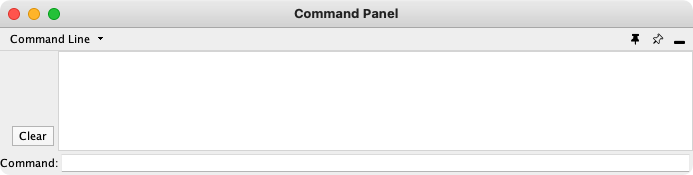

# 命令面板

命令面板使用 `Commands API` 为 Cytoscape 提供了一个简单的命令行界面。它允许用户在 Cytoscape 中键入命令，并在 `Reply Log` 中查看结果。

任何注册命令的应用都可以通过命令面板使用。命令是更通用的 Cytoscape 自动化功能的一部分，该功能包括多种执行 Cytoscape 脚本的方式。

通过 `View -> Show Command Panel` 可以打开命令面板。



命令面板可以用于读取和执行脚本文件。脚本文件中的每一行都是发送到应用的命令。通过 `-S` 命令行参数，`Tools -> Run Script File...` 或 `Tools -> Execute Command File` 菜单来执行脚本文件。


Cytoscape 命令由 3 部分组成：一个命令类或空间，该命名空间中的命令，以及用作参数的 `name=value` 对。例如，要从 `Command Line Dialog` 或命令脚本中导入一个 XGMML 格式文件，可以使用：

```
network import file filePath="path-to-file"
```

其中 `network` 是命名空间，`import file` 是命令，并且只有一个参数 `filePath="path-to-file"`。如果有更多参数，可以在同一行中以空格分隔。

命令面板还可以使用 `Commands API` 提供帮助。`help` 自身可以列出所有命令类（或命名空间），`help` 后跟一个命名空间将会列出该名称空间支持的所有命令。键入 `help`，然后输入命名空间和命令（例如：`help layout force-directed`）可以获得特定命令的详细信息。命令面板将 `command` 注册为命名空间并支持带有文件参数的命令 `run`。如下为 `command` 命名空间中 `command run` 命令的帮助：

```
help command run
    The run command will execute a command script from the file pointed to by the file argument, which should contain Cytoscape commands, one per line. Arguments to the script are provided by the args argument
    command run arguments:
    file=<File>:
    Command File
```

类似的，`network import file` 的帮助如下：

```
help network import file
    Import a new network from a tabular formatted file type (e.g. csv, tsv, Excel, etc.). Use network load file to load network formatted files. This command will create a new network collection if no current network collection is selected, otherwise it will add the network to the current collection. The SUIDs of the new networks and views are returned.
    network import file arguments:
    columnTypeList=<String>:
    List of column types ordered by column index (e.g. "source,target,interaction,source attribute,target attribute,edge attribute,skip" or just "s,t,i,sa,ta,ea,x"):
    dataTypeList=<String>:
    List of column data types ordered by column index (e.g. "string,int,long,double,boolean,intlist" or just "s,i,l,d,b,il"):
    decimalSeparator=<String>:
    Character that separates the integer-part (characteristic) and the fractional-part (mantissa) of a decimal number. The default value is the dot "."
    defaultInteraction=<String>:
    Used to set the default interaction type to use when there is no interaction type column.
    delimiters=<ListMultipleSelection [,,;, ,\t, ]>:
    Select the delimiters to use to separate columns in the table, from the list '``,``',' ','``TAB``', or '``;``'. ``TAB`` and '``,``' are used by default
    delimitersForDataList=<ListSingleSelection (\||\|/|,)>:
    Select the delimiters to use to separate list entries in a list, from the list '``|``','``\``','``/``', or '``,``'. ``|`` is used by default
    file=<File>:
    The path to the file that contains the table or network to be imported.
    firstRowAsColumnNames=true|false:
    If this is ``true`` then the first row should contain the names of the columns. Note that ``startLoadRow`` must be set for this to work properly
    indexColumnSourceInteraction=<int>:
    The column index that contains the source node identifiers.
    indexColumnTargetInteraction=<int>:
    The column index that contains the target node identifiers. If this is not specified then the resulting network will have no edges
    indexColumnTypeInteraction=<int>:
    The column index that contains the interaction type. This is not required.
    networkViewRendererList=<ListSingleSelection ()>:
    Enter the network view renderer that this network should use. This is only useful if multiple renderers have been installed, which is rare.
    rootNetworkList=<ListSingleSelection (-- Create new network collection --|cy:command_documentation_generation)>:
    The name of the network collection (root network) that the imported network should be part of. A name of ``-- Create new network collection --`` will result in the creation of a new network collection for this import.
    startLoadRow=<int>:
    The starting row of the import. This is used to skip over comments and other non-data rows at the beginning of the file.
    targetColumnList=<ListSingleSelection ()>:
    Enter the name of the column in the existing network collection (root network) that you want to map your input identifiers to.
```
