# 创建网络

在 Cytoscape 中有 4 种方法创建网络：

1. 导入已存在的固定格式的网络文件。
2. 导入已存在的未格式化的文本或 Excel 文件。
3. 从公共数据库导入数据。
4. 创建一个空网络并手动添加节点和边。

## 导入固定格式的网络文件

网络文件可以为[支持的网络格式](/supported-network-file-formats/)部分中描述的任意格式文件。通过 `File -> Import` 将其导入到 Cytoscape 中。网络文件可以位于本地计算机上，也可以位于远程计算机上（在这种情况下需要引用 URL）。

### 从本地计算机加载网络

通过 `File -> Import -> Network from File...` 或单击工具栏上的  从本地文件加载网络。在文件选择器对话框中选择正确的文件，然后单击打开。Cytoscape 的 `sampleData` 文件夹中包含一些不同类型的示例网络文件。

选择网络文件后，将弹出另一个对话框。你可以选择为新网络创建新的网络集合，也可以选择将新网络加载到现有的网络集合中。选择后者时，请确保选择正确的映射列，以将新网络映射到现有的网络集合。

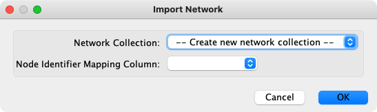

或者，你可以简单地将网络文件从桌面拖到网络列表（控制面板）中，而不是从菜单选项中选择文件。

也可以使用 `-N` 选项直接从命令行加载 SIF，GML 和 XGMML 格式的网络文件。

### 从远程计算机加载网络（URL 导入）

通过 `File -> Import -> Network from URL...` 从远程文件加载网络。在导入网络对话框中，手动或使用 URL 书签插入正确的 URL。通过单击文本字段右侧的箭头来访问带有书签的 URL（有关书签的更多详细信息，请参见 [`Preferences`](/cytoscape-preferences/) 中的 `Bookmark Manager`）。另外，你可以将链接从网页浏览器拖放到 URL 文本框中。指定 URL 后，单击 `OK` 按钮以加载网络。

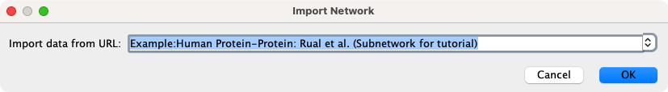

网络导入的另一个问题是由于防火墙的存在可能会影响计算机访问这些文件。Cytoscape 支持使用代理服务器来解决此问题。要配置代理服务器，请选择 `Edit -> Preferences -> Proxy Settings...`，这些将在 [`Preferences`](/cytoscape-preferences/) 中进一步讨论。

## 从未格式化的表格文件导入网络

Cytoscape 支持通过 `File -> Import -> Network from File...` 从分隔的文本文件和 Excel 工作簿导入网络。一个交互式 GUI 允许用户为选择的文件指定解析选项。窗口提供数据预览，显示在当前配置的情况下如何解析文件，随着配置的更改，预览也会自动更新。除了指定如何解析文件之外，用户还必须选择代表源接点和目标节点的列以及可选的边类型。有关详细说明，请参见下面的基本操作。

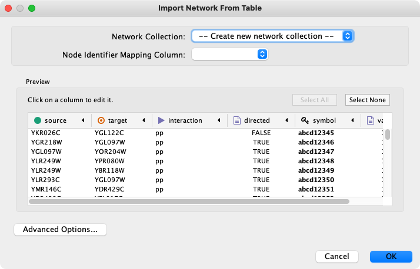

### 支持的文件

导入功能支持带有分隔符的文本文件和 Microsoft Excel 工作簿。对于具有多个工作表的 Excel 工作簿，可以一次选择一个工作表进行导入。以下是一个表格文件的示例数据：

| SOURCE  | TARGET  | INTERACTION | BOOLEAN DATA | STRING DATA | FLOATING POINT DATA |
| :-----: | :-----: | :---------: | :----------: | :---------: | :-----------------: |
| YJR022W | YNR053C |     pp      |     TRUE     |  abcd12371  |      1.2344543      |
| YER116C | YDL013W |     pp      |     TRUE     |  abcd12372  |      1.2344543      |
| YNL307C | YAL038W |     pp      |    FALSE     |  abcd12373  |      1.2344543      |
| YNL216W | YCR012W |     pd      |     TRUE     |  abcd12374  |      1.2344543      |
| YNL216W | YGR254W |     pd      |     TRUE     |  abcd12375  |      1.2344543      |

网络表格文件应该至少包含两列以创建具有边的网络。如果文件只有一列，则创建的网络不包含任何边。在此格式下交互类型是可选的。因此，最小的网络表格如下所示：

| SOURCE  | TARGET  |
| :-----: | :-----: |
| YJR022W | YNR053C |
| YER116C | YDL013W |
| YNL307C | YAL038W |
| YNL216W | YCR012W |
| YNL216W | YGR254W |

网络表格文件中的一行代表边及边的列数据。这意味着将网络文件视为网络数据和边列数据的组合。表格中可能包含并非属于边的数据，在这种情况下，你可以通过单击预览窗口中的列标题来选择不导入那些列。此功能在导入如下所示的数据表 [^sample-table-data] 时是很有用：

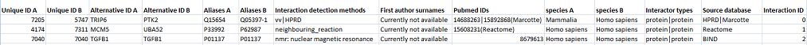

这个数据文件是一个制表符分割的文本文件，包含网络（交互）数据、边数据和节点数据。要从该表导入网络和边数据，请选择 `Unique ID A` 作为源节点，`Unique ID B` 作为目标节点，`Interactor types` 作为交互类型。接下来，关闭用于节点数据的列（`Alternative ID A`，`species B` 等）。其他列可以作为边数据导入。

网络导入功能无法导入节点数据列，只能导入边数据列。要从该表导入节点数据列，请参见[节点和边列数据](/node-and-edge-column-data/)。

[^sample-table-data]: 数据源自 Andrew Garrow，Yeyejide Adeleye 和 Guy Warner 的一个合并的人类交互基因组数据集（Unilever, Safety and Environmental Assurance Center, 12 October 2006）。数据文件位于 http://wiki.cytoscape.org/Data_Sets/。

### 基础操作

从文本或 Excel 表格导入网络，应按照以下步骤操作：

1. 选择 `File -> Import -> Network from File...` 或单击工具栏上的 。
2. 在文件选择器对话框中选择一个表格文件。
3. 通过指定哪些数据列包含源节点、目标节点和交互类型来定义交互参数。单击任何列标题右侧的箭头可以打开用于选择源节点、目标节点和交互类型的界面：

    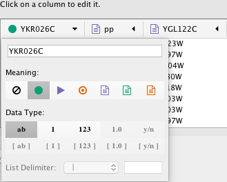

4. 定义边数据列（可选）。网络表格文件除了网络数据外，还可以具有边数据列。
    - 启动/禁用数据列：你可以通过在列编辑器中选择  来启动/禁用数据列。

    

    - 更改列名或数据类型：你可以在列编辑器中修改列名称和数据类型。有关更多详细信息，请参见[修改列名类型](#修改列名类型)。
5. 单击 `OK` 按钮。

#### 导入不包含边的节点列表

表格导入功能支持没有边的节点列表。如果仅选择一个源节点列，它将创建一个没有交互的网络。这对于某些 Web 服务器客户端可能的节点扩展功能很有用。更多详细信息，请参见[从公共数据库导入网络](#从公共数据库导入网络)。

### 高级选项

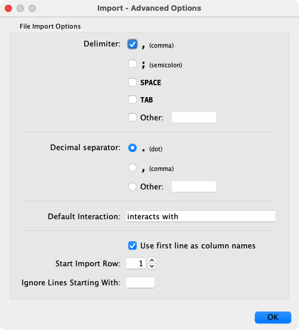

你可以通过单击导入界面中的 `Advanced Options` 按钮来修改多个选项：

- `Delimiter`：你可以为文本表格选择多个分隔符。
- `Default Interaction`：默认交互。
- `Use first line as column names`：选择此选项将导致所有边列根据该列的第一个数据条目进行命名。
- `Start Import Row`：设置要从表的哪一行开始导入数据。例如：如果要跳过文件中的前 3 行，请将其设置为 4。
- `Ignore Lines Starting With`：不会导入以该字符开头的行。此选项可用于跳过文本文件中的注释行。

### 修改列名/类型

在 `Import Network from Table` 界面中，可以通过单击任意列标题来更改列的名称和数据类型：

列名和数据类型可以在此处修改。

- 修改列名：输入一个新的列名。
- 修改列数据类型：支持下列数据类型：
    - 字符串
    - 布尔值（True / False）
    - 整型
    - 浮点型
    - 字符串/布尔值/整型/浮点型的列表

Cytoscape 具有基本的数据类型检测功能，可以根据数据自动建议列数据类型。通过从提供的单选按钮中选择适当的数据类型可以覆盖此设置。对于列表，必须指定全局分隔符（例如：表格中所有单元格都必须使用相同的分隔符）。

## 从公共数据库导入网络

Cytoscape 支持从公共数据库导入网络。用户可以通过 `File -> Import -> Network from Public Databases...` 访问各种数据库。控制面板中 `Network` 面板顶部的搜索栏也是可用。从搜索栏中，你可以直接访问多个公共数据库。

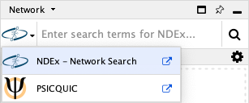

### 什么是 Web 服务？

Web 服务是一种标准的，与平台无关的，用于计算机通过互联网进行交互的机制。如今，很多主要的生物数据库的都是使用 Web 服务 API 发布其数据：

- 生物 Web 服务列表：http://taverna.sourceforge.net/services
- EBI Web 服务：http://www.ebi.ac.uk/Tools/webservices/

Cytoscape 核心开发团队已使用此框架开发了多个 Web 服务客户端。Cytoscape 支持多种 Web 服务，包括：

- [PSICQUIC](https://psicquic.github.io/)：生物交互数据集的标准 Web 服务。PSICQUIC 兼容数据库的完整列表见[这里](http://www.ebi.ac.uk/Tools/webservices/psicquic/registry/registry?action=STATUS)。PSICQUIC 可以在搜索栏中获得。
- [Pathway Commons](http://www.pathwaycommons.org/)：来自 Pathway 和网络资源的集成数据。补充资源的完整列表见[这里](http://www.pathwaycommons.org/pc2/datasources)。通过 `File -> Import -> Network -> Public Databases...` 可以获取 Pathway Commons。
- [STITCH](http://stitch.embl.de/) 和 [STRING](https://string-db.org/)：STITCH 是化学物质和蛋白质之间已知和预测交互的数据库。STRING 是蛋白质和蛋白质之间已知和预测交互的数据库。STITCH 和 STRING 可以通过搜索栏和 `File -> Import -> Network -> Public Databases...` 获取。
- [NDEx](http://www.ndexbio.org/)：The Network Data Exchange (NDEx) 提供了一个开放源代码框架，科学家和组织可以在其中共享、存储、操作和发布生物网络知识。NDEx 可以通过搜索栏和 `File -> Import -> Network -> Public Databases...` 以及工具栏中的  获取。

### 示例：从 NDEx 检索网络

- 在搜索栏中，从下拉菜单选择 NDEx，然后输入一个或多个搜索词，例如：`BRCA1`。
- 单击回车开始搜索。
- `CyNDEx-2 Find Networks` 对话框将会打开并搜索结果。
- 默认情况下，结果将根据您提供的搜索词按照相关性排序。您可以通过单击列标题来改变排序条件。
- 标记结果表格顶部的 `My Networks` 复选框可以显示你拥有的结果（你需要具有 NDEx 账户和与 CyNDEx 浏览器关联的配置文件，有关更多详细信息，请参见[导出选项](/export-your-data/)部分）。
- 单击  将其导入 Cytoscape 并可视化。完成网络加载后，单击关闭对话框按钮关闭该窗口。

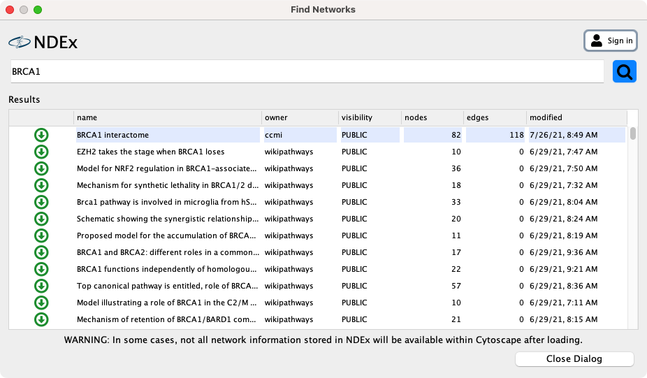

你可以在搜索中通过 UUID 来查找网络，例如：`uuid:50e3dff7-133e-11e6-a039-06603eb7f303`。

与 NDEx 一样，CyNDEx-2 使用标准的 Lucene Syntax 作为网络搜索语法。有关其他信息，请参见[在 NDEx 中搜索网络]()。有关 CyNDEx-2 的更多信息，请参见 [CyNDEx-2 App Store](http://apps.cytoscape.org/apps/cyndex2) 页面。

最后，也可以通过 Cytoscape 工具栏中的  按钮访问 NDEx 导入和导出对话框，单击可以显示两个选项。

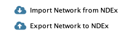

## 创建一个新网络或手动编辑

通过 `File -> Net Network -> Empty` 可以创建一个新的空网络，并手动添加节点和边。然后通过右键单价网络画布或节点的方法手动添加网络组件。你可以使用相同的方式来编辑现有网络。

### 添加节点

通过右键单击网络视图面板的空白区域可以添加新的节点，从弹出的菜单中选择 `Add -> Node`。

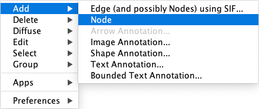

### 添加边

在源节点上单击右键，从弹出的菜单中选择 `Add -> Edge` 可以添加连接节点的边，之后选择目标节点。下图显示了在两个节点之间绘制边的步骤，通过 ++esc++ 可以终止边的绘制。你也可以选择两个或多个要连接的节点，然后在右键菜单中选择 `Add -> Edges Connecting Selected Nodes` 来创建连接所有所选节点的边。

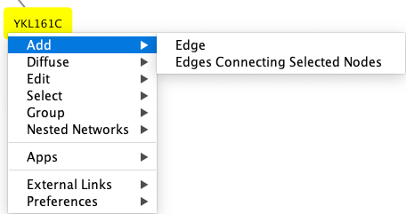

通过选择多个节点和边，然后选择 `Edit -> Cut` 来删除节点和边。通过 `Edit -> Delete Selected Nodes and Edges...` 删除所选的节点和边。通过 `Edit -> Undo` 可以恢复从网络中删除的节点和边。

### 节点分组

可以将任意数量的节点组合在一起，并显示为一个节点组或单个节点。选择两个或多个节点，然后右键单击选择 `Group -> Group Selected Nodes` 创建组。系统将提示你选择节点组的名称。创建分组后，你可以使用右键菜单折叠或展开分组。你还可以通过双击节点分组或任意子节点来快速折叠/展开分组。

**折叠分组**

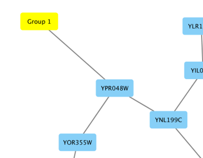

**展开分组**

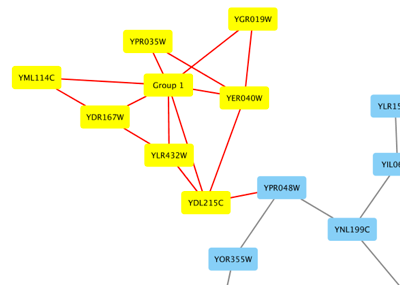

分组节点的外观和行为取决于创建分组时的设置。可以为整个 Cytoscape 会话（通过 `Edit -> Preferences -> Group Preferences...`）或指定的分组（右键 `Preferences -> Group Preferences...`）管理设置。

### 添加网络注释

通过右键单击画布上的任意位置并在 `Add` 菜单中选择注释选项为文本、图像或形状添加[注释](/annotations/)。你可以添加自己的图像，可以从形状库中选择图像，也可以添加纯文本或有边框的文本。形状和文本是可以自定义的，并且可以从右键单击的上下文中编辑任意添加的注释。

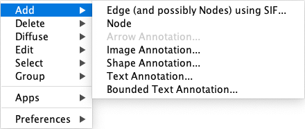
