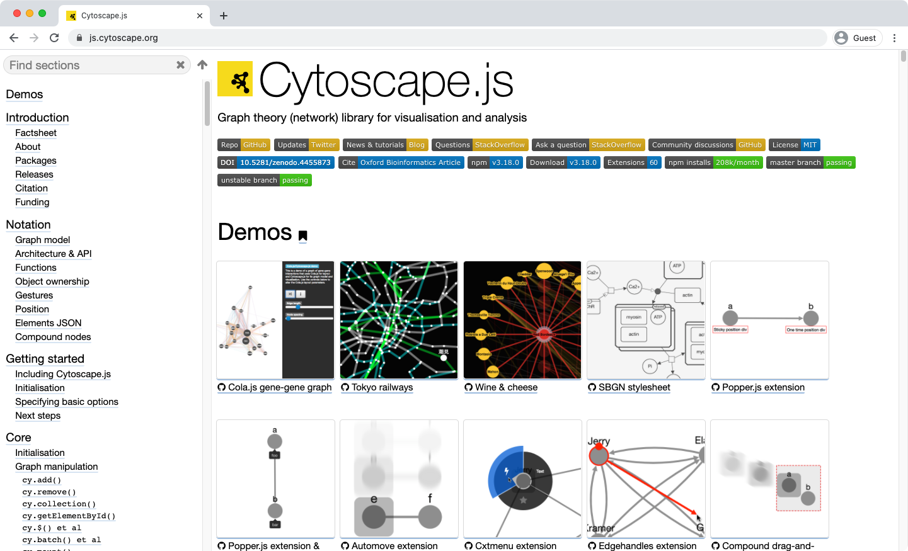
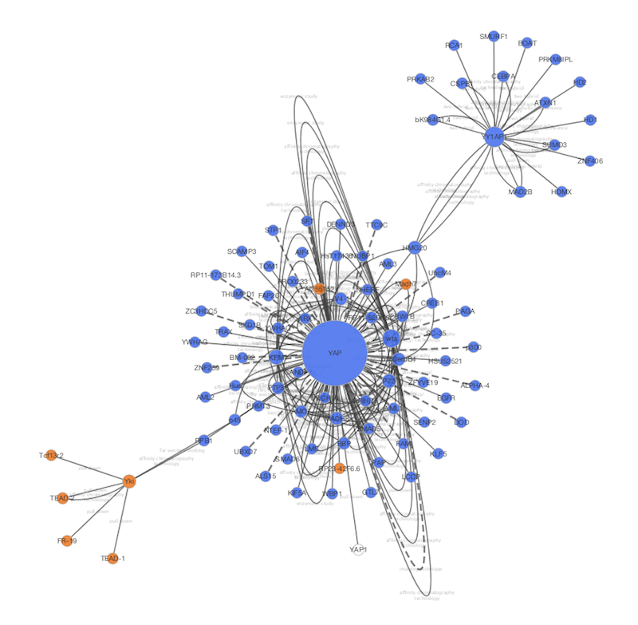

# Cytoscape.js 和 Cytoscape

## 什么是 Cytoscape.js？



[Cytoscape.js](http://cytoscape.github.io/cytoscape.js/) 是一个用于交互式网络可视化的 JavaScript 库。它是 Web 应用程序的组件，但不是完整的 Web 应用。如果你有网络数据并希望通过 Cytoscape 共享可视化，可以使用 Cytoscape.js 和 `Export to Cytoscape.js` 功能构建自己的网站。

### 示例

- 利用 Cytoscape 可视化的网络：

    

- 利用 Cytoscape.js 可视化的相同网络：

    

### 差异和共享概念

尽管 Cytoscape 和 Cytoscape.js 是两个完全独立的软件包，但是它们共享很多高级别概念。以下是两者之间的相似和差异列表：

#### Cytoscape

- 使用 [Java 语言](https://www.java.com/)编写的用于网络可视化的桌面应用程序
- 需要台式机和笔记本才能够运行
- 用户需要安装 Java 运行时
- 用于大型网络分析和可视化的高性能应用程序
- 可以通过[应用](http://apps.cytoscape.org/)扩展
- 使用样式将数据映射到网络属性，例如：节点颜色、边宽度、节点形状等

#### Cytoscape.js

- 用于网络可视化的 [JavaScript 库](http://en.wikipedia.org/wiki/JavaScript)，并非完整的 Web 应用或移动应用
- 可以在大多数现代网络浏览器上运行，包括平板电脑和智能手机
- 无需插件即可运行，现代浏览器是唯一要求
- 需要编写代码来设置你的网络或 Web 应用
- 可以通过 [Extensions](http://cytoscape.github.io/cytoscape.js/#extensions) 扩展
- 使用基于 CSS 的样式将数据映射到网络属性

从长远来看，Cytoscape 和 Cytoscape.js 将集成得更加紧密。作为第一步，Cytoscape 现在支持读写 Cytoscape.js 的网络和表 JSON 文件。另外，Cytoscape 可以将样式转换为 Cytoscape.js 的样式对象。

## Cytoscape 和 Cytoscape.js 之间的数据交换

由于 Cytoscape.js 是 JavaScript 库，因此其基本数据交换格式为 JSON。所有这些导入/导出功能都是标准 Cytoscape 用户界面的一部分，你可以像其他标准文件（例如：SIF）一样读写 Cytoscape.js JSON 文件。

### 将网络和表格导出到 Cytoscape.js

Cytoscape.js 将网络数据（图）及其数据表存储在同一个对象中。Cytoscape 可以将复杂数据写入 JSON 文件，即网络和数据表都将导出为单个 JSON 文件。你可以选择一个网络，通过 `File -> Export -> Network to File...` 导出，并选择 `Cytoscape.js JSON (*.cyjs)` 作为文件类型。

Cytoscape 仅支持 Cytoscape.js 支持的一种 JSON 格式，即：

```json
{
    elements:{
        nodes:[],
        edges:[]
    }
}
```

SUID 将用作 JSON 中节点和边的唯一标识符。有关此格式的更多信息，请访问 [Cytoscape.js 网站](http://cytoscape.github.io/cytoscape.js/)。

#### 数据兼容性的重要说明

Cytoscape 直接从数据表创建 JSON 文件，并尝试从原始表中提取尽可能多的数据。由于会将表列名直接转换为 JavaScript 变量名，因此无效字符将由 `_` 代替：

- 原始数据表列名：

    ```
    Gene Name
    KEGG.pathway
    ```

- 替换后名称：

    ```
    Gene_Name
    KEGG_pathway
    ```

在使用该功能进行数据交换时应避免从 Cytoscape 到 Cytoscape.js 再到 Cytoscape。对于这类用例，我们强烈建议在表列名中使用 JavaScript 安全字符。最好仅使用字母、数字和下划线 `_` 命名列。对于数据实体允许使用所有字符，此限制仅适用于表列名。

## 将样式导出到 Cytoscape.js

Cytoscape 和 Cytoscape.js 共享一个称为样式的概念，这是从数据点到网络属性映射的集合。Cytoscape 可以将样式导出至基于 CSS 的 Cytoscape.js JSON 文件中。

通过 `File -> Export -> Styles to Files...`，选择 `Style for cytoscape.js (*.json)` 格式，可以将所有样式导出到一个 JSON 文件中。

### 局限

Cytoscape.js 不支持所有 Cytoscape 网络属性。导出到 JSON 样式文件时，这些属性将被忽略或简化。

目前，以下视觉属性将不会导出到 Cytoscape.js JSON 中：

- 自定义图形及其位置
- 边弯曲
- 提示
- 节点标签宽度
- 节点边框线型
- 箭头颜色

### Cytoscape.js 和 Cytoscape 兼容性

Cytoscape 的网络渲染系统专为桌面使用而设计，而基于浏览器的渲染器结合了网络技术（例如：Cytoscape.js 和 CSS）。大多数而不是全部网络将在浏览器中呈现与 Cytoscape 中相同的图像。Web 浏览器不支持的 Cytoscape 视觉样式将被忽略。[此处](https://docs.google.com/spreadsheets/d/1iTDKGjro1-L7HGz1ftozqDKRxjQVSPF28jQLt7XGrSg/edit#gid=0)提供完整的兼容性列表。

### 将 Cytoscape.js 数据导入 Cytoscape

通过 `File -> Import -> Network ...` 菜单可以从文件和 URL 加载 Cytoscape.js 网络的 JSON 文件。

## 利用 Cytoscape.js 构建自己的 Web 应用

尽管 Cytoscape 可以将网络、表格和样式导出为与 Cytoscape.js 兼容的 JSON，但用户必须编写一些 JavaScript 代码才能使用 Cytoscape.js 可视化数据文件。使用 Cytoscape.js 进行 Web 应用开发的详细内容不在本文档的讨论范围之内。如果你需要有关使用 Cytoscape.js 开发 Web 应用的示例和教程，请访问：https://github.com/cytoscape/cyjs-sample/wiki。

### 问题

如果你对使用 Cytoscape 和 Cytoscape.js 开发 Web 应用有任何疑问和意见，请发送到我们的[邮件列表](https://groups.google.com/forum/#%21forum/cytoscape-discuss)。
