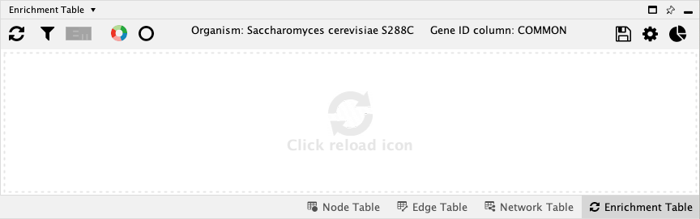
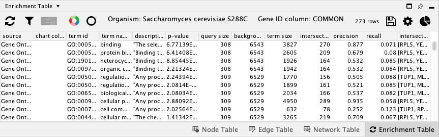

# 富集表格

富集表格核心应用提供了通过使用 [g:Profiler 的网站服务](https://biit.cs.ut.ee/gprofiler/gost) 对加载到 Cytoscape 中的任何网络的富集分析功能。单击 `Enrichment Table` 面板中的 `Perform Gene Enrichment` 按钮  或使用 `Tools -> Enrichment Table -> Perform Gene Enrichment` 菜单项来获取富集分析结果。

## 生物体和基因 ID

运行富集分析需要两个必要参数：

- `Organism`：与查询基因相关的生物体
- `Gene ID`：包含基因符号的节点表列

如果有足够的可用信息，两个参数均可以由 `Enrichment Table` 应用预测。

- 在启动时通过处理网络中 `species`、`organism`、`IntAct::species` 列的数据对可能的 `organism` 进行预测。
- 在启动时对 `gene id` 列通过如下方式预测：
    1. 从通用网络样式中检索 `NODE_LABEL`。
    2. 为 `stringapp` 网络选择 `display name`。

如果你想手动设置生物体和基因 ID 或者预测不正确，可以通过单击 `Enrichment Table` 面板中的齿轮按钮  更改 `Network-specific enrichment panel settings` 中的选项。

## 运行富集分析

可以通过 3 种方式运行富集分析：

- 使用 `Tools -> Enrichment Table -> Perform Gene Enrichment` 菜单项。
- 在 Cytoscape 的 `Command Line` 中输入 `enrichment analysis` 并回车。
- 单击 `Enrichment Table` 面板中的 `Perform Gene Enrichment` 按钮 。

!!! note "注意"

    默认情况下，以基因组为背景对当前网络的所有节点进行富集分析。如果选择了节点的子集，则仅使用完整网络作为背景对那些节点执行富集分析。

之后即可获得包含富集结果的表格。默认情况下，结果按照 $p$ 值升序排列。

## 过滤结果

可以根据如下参数按类别和证据码过滤表格：

- 单击 `Filter enrichment table` 按钮  使用过滤器。
- 在类别中选择 `Gene Ontology Biological Process`，单击 `OK`。之后将得到一个过滤后的表格，表格顶部显示已过滤的行数和所有行数的摘要。
- 再次打开过滤器面板并勾选 `Remove redundant terms`。单击 `OK` 查看应用两个过滤器后的结果。

## 图表

图表提供了可视化网络中每个节点一组项的能力。默认情况下会显示一个圆环图，对应前 5 个项。通过最右边的 `Network-specific chart settings` 按钮  更改项数量和图表类型。

- 单击 `Draw chart using default color palette` 按钮  使用默认配置创建图表。
- 单击 `Reset charts` 删除图表。
- 单击 `Network-specific chart settings` 更改图表设置。

## 项选择

富集表格显示基于网络中所选节点的结果。如果未选择任何节点，则所有项均显示在表格中。选择一组节点时，将显示所有选定节点的项。同样，要可视化一个或多个富集项，请选择表格中的行，相应的节点将在网络中高亮显示。

## 可选配置

除了 `Organism` 和 `Gene ID` 列外，还可以通过更改其他参数来获取更精确的富集结果。这些选项在 `Network-specific enrichment panel settings`  中。例如，可以通过选择适当的冗余（Jaccard）截断值（默认为 0.5）来删除表中的冗余项。

## Enrichment Map 生成

可以根据富集表格应用生成富集数据进而生成 [Enrichment Map](https://www.baderlab.org/Software/EnrichmentMap)。这需要在 Cytoscape 中安装 [Enrichment Map](https://apps.cytoscape.org/apps/enrichmentmap) 应用。一旦 Enrichment Map 可用，单击 Enrichment Map 图表，指定输出文件名和关联截断，单击 `OK` 继续。

## 导出结果

富集表格应用提供将数据导出为 `csv` 格式表格的能力：

- 单击 `Export enrichment table`  按钮。
- 选择导出表格的文件位置和文件名。

默认文件扩展名为 `.csv`。

## 自动化

自动化用例也支持富集分析，基本命令语法为 `enrichment analysis`。你可以使用 `organism` 参数选择与查询基因关联的生物体，使用 `geneID` 参数选择带有基因符号的表格列。所有参数请参见[这里](http://localhost:1234/v1/swaggerUI/swagger-ui/index.html?url=http%3A%2F%2Flocalhost%3A1234%2Fv1%2Fcommands%2Fswagger.json#%21/enrichment/enrichment_analysis)。
