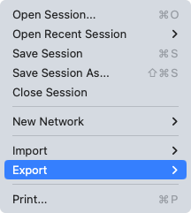
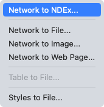
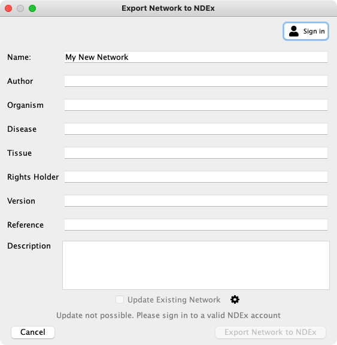

# 数据导出

## 原始数据导出





在外部应用程序中使用来自 Cytoscape 的网络数据时需要将数据导出。由于 Cytoscape 网络包含多种类型数据，在导出各种数据类型时有多种选项。通过 `File -> Export` 可以获取这些选项（网络，表格和样式）。

### Network Data Exchange (NDEx) 公共数据库

`Network to NDEx` 选项用于在公共 NDEx 服务器上存储网络。你可以使用 NDEx 公共服务器将网路存储在云端，与协作者[共享网络](#导出为-ndex-网络)或将[网络存档](#导出为-ndex-网络)并发布。要存储网络你需要首先创建一个免费的 NDEx 账户，通过访问 [NDEx 公共服务器](http://ndexbio.org/)可以轻松创建账户。

`Network to NDEx` 选项仅将当前选择的网络保存到你的 NDEx 账户中。这样的网络适合其他应用程序和 Web 服务进行处理。因为它仅包含所选网络中的节点和边，而其它视图以及它们的节点和边均未写入。如果稍后重新导入该网络，则只会加载你保存的单个网络。

当你选择该选项时，将显示 CyNDEx-2 浏览器对话框，使你可以提供各种元数据对网络进行注释并使其在 NDEx 中更容易被搜索到。你可以通过编辑 `Network Name` 属性来设置网络名称。使用 `Update Existing Network` 选项可以覆盖网络的现有副本（如果你具有相关权限）。我们建议你提供尽可能多的元数据，并且始终至少提供 `Version` 和 `Description` 属性。

要导出网络，你必须首先通过填写配置文件表单将 NDEx 账户同 CyNDEx-2 浏览器相关联（如下图中的红色椭圆形）。



创建配置文件后，你就可以将网络导出到 NDEx 了。


作为网络保存的另一种方法，Cytoscape 网络面板的上下文菜单中也包含导出命令。


最后，工具栏中的 NDEx 按钮为导入和导出到 NDEx 提供了另一种便捷方式。


导出操作完成后，将显示确认对话框，如下图所示。如果你想与外部合作者共享网络或获得更多共享选项，请参阅 NDEx 上的 [Uploading and Sharing Networks](https://home.ndexbio.org/sharing-and-accessing-networks/) 指南。


有关 NDEx 的更多信息，请访问 [NDEx Informational/Doc 网站](https://home.ndexbio.org/quick-start/)。

### 网络


`Network` 选项用于导出网络数据。网络数据包括网络中的节点和边，如果选择的格式支持（例如：XGMML），还可以包括数据属性和可视化信息。网络数据可以导出为多种格式，包括：

- SIF (Simple Interaction Format)
- XGMML，包含或不包含样式数据
- GraphML
- PSI-MI Level 1 and 2.5
- Cytoscape.js JSON (can be used with Cytoscape.js, a tool described in future sections)
- CX JSON (for Cytoscape Cyberinfrastructure network exchange)
- CX2 JSON

默认格式为 SIF，这是一种简单的制表符分隔的网络格式，仅提供节点名称和边交互。通过对话框中的下拉框可以选择该格式。系统会根据网络名称和所选格式自动建议一个文件名，并将当前工作目录作为文件默认路径。你可以使用文本框或 `Browse...` 按钮更改建议的文件名和路径。单击 `OK` 导出相应选项的文件。

### 表格


`Table to File...` 选项用于导出当前 Cytoscape 会话中可用的数据表。这包括可以在 `Table Panel` 中看到的节点、边和网络表格，以及任何未分配的表。当前支持的唯一导出文件格式是 CSV。

表格的导出对话框只有两个可选选项：要导出的表和文件名（文件类型始终为 CSV）。根据所选的表会给出建议使用的文件名，路径默认为当前工作目录。与导出网络一样，可以使用文本框或 `Browse...` 按钮更改建议的文件名和路径。单击 `OK` 导出所选的表。

表格面板中也提供了 `Export Table to File...` 的快捷按钮 。

### 样式


`Styles` 选项用于导出当前 Cytoscape 会话中可用的一种或多种样式。支持的格式包括 Style XML（可以被 Cytoscape 3.x 版本导入）或 Cytoscape.js JSON（可以与 Cytoscape.js 一起使用）。

样式导出具有 3 个选项：导出格式、要导出的样式和文件名（根据当前目录和文件类型建议）。同导出网络和表一样，可以使用 `Browse...` 按钮或文本框更改建议的文件名。样式列表是一个多选列表，使用 ++ctrl++ 或 ++command++ 单击来选择多个不连续的样式，使用 ++shift++ 单击来选择一系列连续样式。单击 `OK` 导出所选样式。

## 出版物级别导出

完成数据分析和可视化后，你可以发布数据共享结果。Cytoscape 有几种选项可以实现，其中大多数选项适用于 Cytoscape 用户，其他适用于创建特殊或复杂网络的程序员。

### 导出为 NDEx 网络

同其他人共享结果的最简单的方法是使用 `Network to NDEx` 或 `Collection to NDEx` 选项将网络保存在 NDEx 公共数据库中。然后，访问你的 NDEx 账户并启用 Sharable URL（类似 Google Doc 共享链接），以便将链接发送给其他人从而可以访问你的私有网络。

NDEx 还具有其他选项，使得可以：

- 申请一个适合于出版物的、申请书和报告的 DOI。
- 在 NDEx 中创建工作组和特定分享。
- 在你的网络上运行不同类型的查询。
- 对各种数据集进行多种分析，包括路径分析、大规模相互作用、药物-靶标关联网络等。

有关 NDEx 发布和共享功能的更多信息，请参见 NDEx 手册中的[发布](http://home.ndexbio.org/publishing-in-ndex/)和[共享](http://home.ndexbio.org/obtaining-and-granting-access-to-a-network/)网络。

### 导出为会话文件

与其他人共享结果的另一种简便方法是将所有内容另存为会话文件（压缩的会话存档）。单击 `Save Session` 图标可以保存当前会话。你可以将其保存到闪存、共享文件系统或网络存储目录（例如：Dropbox）。如果保存到共享目录，请注意不要让两个人同时使用 Cytoscape 处理同一个会话文件，这样可能会产生不可预测的结果。

### 导出为图像文件


Cytoscape 可以从网络视图生成出版物级别质量的图像。通过 `File -> Export as Image...` 可以将当前网络视图导出为如下格式：

- JPG
- PNG
- PS (Post Script)
- SVG
- PDF

图像导出对话框根据所选格式不同选项也不同，文件类型和文件名称始终是可选的。PNG 和 JPEG 具有缩放选项，其他格式只有一个选项，即 `Export Text as Font`。根据所选表格给出建议的文件名，路径默认为当前工作目录。与原始数据导出一样，可以使用 `Browse...` 按钮或文本框更改建议的文件名。单击 `OK` 导出指定文件名和参数的图像。

我们建议使用 PDF 作为出版物级别的导出格式，因为它是标准的矢量图形格式，并且易于在其他应用程序（例如：Adobe Illustrator）中进行编辑。

#### 已知问题

对于 PDF 格式，可以选择将文本导出为字体，该选项不适用于中文或日语等双字节字符。为了避免导出图像中文本损坏，当发布包含非英语字符的网络时，请取消选中该选项。

### 导出为交互式 Web 应用

Web 是用于数据共享和协作的绝佳平台，Cytoscape 提供了多种在 Web 上发布网络的方法，每种选择都会在便捷和自定义之间进行权衡。所有解决方案都利用 Cytoscape.js 绘图库，因此不仅可以查看，还可以使用 Cytoscape 风格的网络和属性交互式浏览。

最简单的选择是 [CyNetShare](#通过-cynetshare-共享)，你可以在其中将网络（以及样式）保存在公共文件系统中，然后在浏览器中交互式查看网络。与 Google Maps 一样，你可以生成并发布一个 URL，该 URL 允许协作者查看你的网络。

另外，Cytoscape 可以生成一个完整的网站，其中包含一个预加载网络的查看器页面。你可以将其直接加载到自己的 Web 服务器上，从而成为网站的一部分。

最后，Cytoscape 可以生成网站的框架，以供 JavaScript 程序员进一步定制。

这些功能可以通过 `File -> Export` 菜单使用，在下文中将进行详细介绍。

例如，下图为 Cytoscape 中的一个网络：


下图为相同网络的交互式 Web 可视化：


!!! note "注意"

    网络浏览器可以快速地呈现小型网络（例如：1000 个节点），尝试渲染大型网络（例如：5000 个节点）将花费很长时间。

将样式导出为交互式 Web 应用程序概括为一句话：Web 应用程序基于 Cytoscape.js 绘图库，并渲染 Cytoscape 样式的一个子集。更多有关信息，请参见导出至 Cytoscape.js 部分。

#### 通过 CyNetShare 共享

[CyNetShare](http://idekerlab.github.io/cy-net-share/) 是一个局域浏览器的 Web 应用程序，用于呈现 JSON 格式的网络和保存在公共目录中的属性。可选的，你可以指定网络应用程序在 Cytoscape 中显示网络时使用的视觉样式。CyNetShare 与 Google Maps 相似之处在于，一旦你加载了网络并对其外观按照你的需要进行了调整，你就可以让 CyNetShare 生成一个新的 URL。该网址使 CyNetShare 预加载你的网络从而任何人都可以访问查看。

CyNetShare 使用方式如下：

1. 选择 `File -> Export -> Network to File...` 将网络导出到公共目录，选择 `Cytoscape.js JSON (*.cyjs)` 导出文件格式。
2. 可选的，选择 `File -> Export -> Style...` 导出样式设置，选择 `Cytoscape.js (*.json)` 导出文件格式。
3. 使用公共目录系统来确定导出文件的 URL。
4. 启动 CyNetShare。
5. 输入网络的 URL 作为 `Graph URL`。
6. 可选的，输入样式 URL。
7. 单击 `Visualize` 按钮。

[CyNetShare](http://idekerlab.github.io/cy-net-share/) 网页上提供了 CyNetShare 用户指南。

!!! note "注意"

    如果你指定了样式网址，该样式会添加到 CyNetShare 的 `Visual Style` 下拉列表的可选样式列表中，并且你可以通过列表来选择应用样式。CyNetShare 初始的视觉样式名称为 `default`，使用 `Visual Style` 下拉列表可以选择 Cytoscape 生成的 .cyjs 和 .json 文件样式。

!!! note "注意"

    在公共目录系统中生成 URL 的机制是一个快速发展的问题。直到最近，诸如 Dropbox 等系统仍允许用户创建可直接解析为文件的 URL，直接的 URL 可用于 CyNetShare。在撰写本文时，某些公共目录系统（例如：Dropbox）会生成可共享的 URL，这些 URL 解析为一个允许下载文件的网址，可共享的 URL 与 CyNetShare 不兼容。提供共享 URL 的系统可能会在其高级（或专业）版本中提供直接的 URL。要判断你的公共目录系统生成的是否为直接的 URL，可以将生成文件的 URL 粘贴到浏览器中，如果观测到的是文件本身则是直接 URL，如果是下载页面则是共享的 URL。

获取直接 URL 的一种简单方式是将文件存储在由 Web 服务器提供的公共目录中。Web 服务器提供的 URL 可能显示为：`http://myserver.com/~mypublicdir/netstyle.json`。

或者，你可以使用 [Gist](https://gist.github.com/) 创建具有直接 URL 的共享网址：

1. 使用 Cytoscape 在本地磁盘上将网络生成为 .cyjs 文件。
2. 使用编辑器打开该文件并将其内容复制到剪切板。
3. 使用网络浏览器浏览 Gist。
4. 将内容粘贴到 Gist 文档中。
5. 选择创建公开的 Gist。
6. 选择 `Raw` 在浏览器地址框中选择直接的 URL。
7. 在 CyNetShare 中使用该网址。

#### 创建完整的 Web 应用

`full page export` 选项是为了希望将网络作为完整的应用发布的用户设计。Cytoscape 可以创建一个 zip 存档，其中包含一个完整的基于 JavaScript 的 Web 应用。该应用可用作 Cytoscape 生成的网络可视化的基础查看器。你可以将存档解压到 Web 服务器（或 PC）上，并通过 PC 或平板电脑上的 Web 浏览器查看网站。


为会话中所有网络生成一个 zip 存档，选择 `File -> Export as Web Page...`，将出现如下对话框：


这个简单的对话框只有两个选项：文件名和 Web 导出的类型。对于完整的 Web 应用，我们使用默认值。根据所选的表格会给出建议使用的文件名，路径默认为当前工作目录。与导出原始数据一样，可以使用文本框或 `Browse...` 按钮更改建议的文件名和路径。单击 `OK` 导出一个 Web 存档。

要查看网络，请将存档解压到 PC 或 Web 服务器上的文件夹中。该文件夹包含 `index.html` 文件、网络数据和其他文件。你可以在浏览器中打开 `index.html` 文件。

如下为从 Cytoscape 导出文件的示例：

- [Example full export deployed to web server](http://chianti.ucsd.edu/~kono/webapp/cytoscape-export-full/)


!!! note "注意"

    由于 Cytoscape 使用最新的基于 HTML5 的 Web 技术，因此它不支持较旧或不符合要求的 Web 浏览器，例如：Internet Explorer。我们强烈建议你使用最新版本的现代浏览器，例如：Google Chrome，Mozilla Firefox 或 Apple Safari。

#### 生成简单的网络视图（适用于 Web 应用开发人员）

`Simple Network View` 导出选项是为了希望将数据作为完整的单页面应用发布，同时希望自定义 Web 查看器的用户设计。Cytoscape 创建一个 zip 存档，其中包含基于 Cytoscape.js 库并包含简单的样板代码和当前网络视图的基于 JavaScript 的 Web 应用。用户通过自定义代码可以创建自定义的查看器。


同之前一样选择 `File -> Export as Web Page...` 可以为单个网络生成一个 zip 存档的网页。但这次需要选择如下图所示的 `Simple viewer for current network only`：


其他所有操作与之前一样，这次查看器将仅包含当前网络，单击 `OK` 按钮确认导出。

有关测试自定义的 Web 应用的说明，请参见上面的[创建完整的 Web 应用](#创建完整的-web-应用)。

#### 使用 Cytoscape.js 功能扩展网页

从 3.6.2 版本开始 Cytoscape 核心应用开始支持 JSON，用户可以将自定义的 [Cytoscape.js 事件](http://js.cytoscape.org/#core/events)添加到导出的网页中。在 `web_session/scripts` 目录中，添加一个 `custom.js` 文件，其中包含自定义的 JS 代码。

例如：在网页中向节点添加 linkouts（当用户单击节点时打开节点 `href` 属性指定的 URL），`custom.js` 文件如下：

```javascript
// Notice that the `cy` object may only be referenced
// after the document has finished loading.

$(document).ready(function(){
  cy.on('tap', 'node', function(){
    try { // your browser may block popups
      window.open( this.data('href') );
    } catch(e){ // fall back on url change
      window.location.href = this.data('href');
    }
  });
});
```

每次导出网页时都必须进行此修改。如果要更改默认的导出模板，请参考下一节。

#### 自定义导出模板（适用于 Web 应用开人员）

Cytoscape 为完整 Web 应用和简单网络视图 Web 应用生成的代码非常简单。尽管你可以自己直接修改此代码来创建自定义的页面或添加新功能，但这些修改将仅应用于单个导出的网络。如果你是 Web 应用开发人员，可以通过编辑 `~/CytoscapeConfiguration/web` 目录中的 HTML5 模板代码来改变所有生成应用的导出代码：


在此文件夹中，你可以找到上述完整 Web 应用和简单网络视图对应的目录。

##### 依赖

要构建这些项目，需要安装以下工具：

- Node.js
- gulp
- grunt

##### 完整导出模板

这是一个使用 `grunt` 构建的基于 AngularJS 的 Web 应用。源代码和更多文档可在此处获得：https://github.com/idekerlab/cyjs-full-export。要构建项目，请输入：

```
grunt
```

##### 简单导出模板

这是一个由简单的 `gulp` 项目生成的模板，源代码可在此处获得：https://github.com/idekerlab/cyjs-export-simple。要构建项目，请输入：

```
gulp
```

##### 使用自定义模板导出

在构建之后，你可以通过自定义的构建替换完整和简单的内容来部署你的模板。
