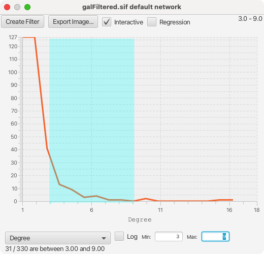
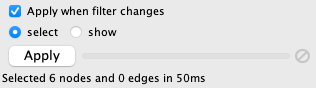

# 搜索和过滤节点和边

## 搜索栏

你可以直接在工具栏的搜索框通过列值搜索节点和边，然后单击表格面板中的 `Search Table` 按钮来查找节点和边表格。例如，要选择以 STE 开头的列值的节点或边，可以在搜索栏中输入 `ste*`。搜索不区分大小写，`*` 为零个或多个字符匹配的通配符，`?` 表示完全匹配一个字符。因此 `ste?` 将会匹配 STE2 而不会匹配 STE12，而 `ste*` 则会两者都匹配。


要搜索指定的列，可以在搜索词前面添加列名，并以 `:` 分隔。例如，选择以 STE 开头的 COMMON 列值的节点和边，可以输入 `common:ste*`。如果未指定列，将会搜索所有的列。

### 查询语法

查询语法使用标准的 [Lucene QueryParser](https://lucene.apache.org/core/8_0_0/queryparser/org/apache/lucene/queryparser/classic/package-summary.html#package.description) 并对其进行少量修改。

| 查询类型     | 语法                                                         |
| ------------ | ------------------------------------------------------------ |
| 多字段查询   | 例如：`hello there`。输入任何数据都会查询数据的所有字段（列）。仅适用于文本数据，数值数据必须指定列。 |
| 字段查询     | 例如：`name:hellp`。在名称为 `name` 的列中搜索 `hello`。     |
| 列命名空间   | 在字段查询中使用带有命名空间的列需要转义命名空间分隔符：`EnrichmentMap\:\:pvalue:1.0`。也可以使用不带命名空间的列名：`pvalue:1.0`。 |
| 通配符       | `?` 匹配任意字符，`*` 匹配任意字符串：`hell?`，`h*`。        |
| 数值查询     | 由于 Lucene 的限制，在执行数值查询时必须提供字段名称：`pvalue:1.0`。 |
| 数值范围查询 | `pvalue:[0.2 TO 0.4]`。同时支持使用大括号的查询：`pvalue:{0.0 TO 0.5}`。 |
| 布尔运算符   | 支持布尔运算符，多个项默认使用 `OR`。输入 `YKR026C AND gcn3` 将只选择同时匹配 `YKR026C` 和 `gcn3` 的节点。 |

要搜索包含特殊字符的列值，需要使用 `\` 对这些字符进行转义。例如，要搜索 GO:1232，需要输入 `GO\:1232`。特殊字符的完整列表如下：

```
+ - & | ! ( ) { } [ ] ^ " ~ * ? : \ space
```

## 选择菜单

`Select -> Nodes` 和 `Select -> Edges` 菜单提供了多种选择节点和边的机制。大多数选项都相当直接且不言自明。

引用还提供了一组用于选择节点、边和注释的键盘快捷键。请注意，无论鼠标单击或拖动选择的选择模式如何，这些键盘快捷键都有效。

| 快捷键                                                         | 动作                           |
| -------------------------------------------------------------- | ------------------------------ |
| ++ctrl+a++（macOS 系统为 ++command+a++）                       | 选择所有（节点、边和注释）     |
| ++alt+n++（macOS 系统为 ++option+a++）                         | 选择所有节点                   |
| ++alt+e++（macOS 系统为 ++option+e++）                         | 选择所有边                     |
| ++ctrl+shift+a++（macOS 系统为 ++command+shift+a++）           | 取消选择所有（节点、边和注释） |
| ++alt+shift+n++（macOS 系统为 ++option+shift+n++）             | 取消选择所有节点               |
| ++alt+shift+e++（macOS 系统为 ++option+shift+e++）             | 取消选择所有边                 |
| ++ctrl+i++（macOS 系统为 ++command+i++）                       | 反选节点                       |
| ++alt+i++（macOS 系统为 ++option+i++）                         | 反选边                         |
| ++ctrl+alt+e++（macOS 系统为 ++command+option+e++）            | 选择相邻边                     |
| ++ctrl+alt+n++（macOS 系统为 ++command+option+n++）            | 按选定边选择节点               |
| ++shift++ + 拖选（macOS 系统为 ++command++ + 拖选）            | 通过矩形选择拖动选择节点       |
| ++ctrl+shift++ + 拖选（macOS 系统为 ++command+shift++ + 拖选） | 通过套索选择拖动选择节点       |

`Select -> Mouse Drag Selects` 包括与 [Network View Tools](/quick-tour-of-cytoscape/#网络视图工具) 的当前选择模式相同的用于鼠标单击或拖动选择的选择模式选项。

`Select -> Nodes -> Largest Subnetwork` 选择当前网络中最大的连通分量。当处理由两个或多个明显连接的图组成的分割网络时，此操作很有用。当选择最大的子网络后，可以轻松地根据选择创建新网络。

`Select -> Nodes -> From ID List File...` 根据指定文件中找到的节点标示符来选择节点。文件格式为每一行一个节点 ID：

```
Node1
Node2
Node3
...
```

## cyChart

cyChart 作为 Cytoscape 的核心应用是一个绘图包。cyChart 提供了利用节点和边数据的简单一维和二维绘图功能。在图表中进行选择将会相应地选择网络中的节点和边。这提供了另一种在 Cytoscape 中可视化数据并与之交互的方法。

### 直方图

直方图描述了变量在一定区间范围内的分布情况。它可以展示常见数值的位置，以及这些值是均匀分布（平线）、正态分布（钟形曲线）还是其他模式（山峰和山谷）。这对于查找表达相似区间范围的数据很有用，例如正向和负向表达的基因。

使用 cyChart 创建直方图，右键单击节点或边表格中数值类型数据列的标题，然后选择 `Plot Histogram...`。`Tools` 菜单也提供了 CyChart 选项。


cyChart 窗口包含一个具有常用功能和设置的头部、图表的内容和一个具有选择状态和设置轴控件的底部。



要选择直方图的范围，单击并向左或向右拖动，可以在数据中看到背景颜色的变化。要编辑选择的范围，拖动选择的中间区域可以移动整个选择，或者拖动选择的任意一个边缘可以编辑范围的起始和结束位置。单击选择范围之外可以清除选择。

如果图处于交互模式，则可以看到网络会随着图表的更改而改变选择内容。但是在大型网络中，这会给计算机带来较大的计算压力，使得整个界面反应变慢。因此，cyChart 中包含一个 `Interactive` 的复选框，用于控制是在鼠标移动时重新计算选择还是仅在拖动结束后进行选择。

底部控件用于设置图表的坐标轴和显示选择的状态。单击下拉框可以查看可用的维度列表。当改变任一维度后，图表都会重新生成，当轴更改后，当前的选择将丢失。

!!! note "注意"

    第一次弹出下来菜单可能需要几秒钟才能做出响应，之后的点击则会快速响应。

!!! note "注意"

    对数轴将在之后的版本中启用。

无论实验的大小如何，直方图均被划分为 100 个 bin，通过平滑绘制，使得线上 Y 值等于该 bin 内节点（边）的数量。bin 具有相同的宽度。这是一个用来确定数据采样中 bin 的数量的简单统计规则，在你手动设置范围的情况下并非不无道理。

### 散点图

散点图是一个二维的图表，每个点表示表格中的一行。根据标准，水平 X 轴和垂直 Y 轴为两个不同的数据列。与直方图类似，在图表中单击并推动将选择一个矩形区域的内的点，并改变当前网络中的选择。通过拖动任意一个角可以编辑所选矩形的大小，通过单击矩形内部可以改变所选矩形的位置。

通过右键单击要作为 X 轴的数据列标题，选择 `Plot Scatter...` 来创建散点图。


在对话框中包含一个 `Regression` 复选框，选中后将在数据中添加回归线。回归采用最小二乘法计算得到。拟合直线的斜率、截距和拟合程度也将显示在图中。

与直方图一样，散点图也包含一个复选框用于设置是否在鼠标移动时或仅在释放时更改网络中的节点选择。如果拖动选择矩形时出现闪烁，则应该关闭 `Interactive` 模式。


### 火山图

火山图是一种特定领域的散点图，其中 X 轴为表达水平，范围为测度的显著性程度。这类图可以凸显具有强显著性的正值和负值。在这种情况下，可以在轴两侧对称地选择散点图的区域，通过按住 ++option++（macOS）或 ++alt++（Windows），再进行推动实现。仅在 X 轴跨越 0 时才会启用此功能，如果你无法观测到对称的选择，请确保数据中包含正值和负值。


## 过滤器

控制面板的 `Filter` 选项卡可以创建用于节点和边选择的表达式。


此处包含两个选项卡：

1. `Filter` 选项卡为一个缩小选择范围的过滤器，其可以被组合成为一棵树。
2. `Chain` 选项卡为一个级联的转换器，其可以被组合为一个线性链条。

### 缩小范围的过滤器

缩小范围的过滤器可以应用于网络中所有的节点和边，根据用户指定的约束条件选择节点和边的子集。例如：你可以寻找权重在 0 到 5.5 之间的边，或是度小于 3 的节点。一个过滤器可以包含任意数量的子过滤器。

单击  按钮添加过滤器，单击  按钮删除一个过滤器及其子过滤器。使用鼠标按住  按钮，然后将过滤器拖动到期望的位置来移动过滤器。将一个过滤器拖放到另一个过滤器的顶部会将这些过滤器分组为一个组合过滤器。

#### 交互式过滤模式

根据过滤器的性质，Cytoscape 可以将他们高效且交互地应用于网络。某些过滤器提供滑块控件可以快速浏览不同的阈值。这在较小的网络上是默认开启的，对于大型网络，Cytoscape 会自动禁用此交互特性。通过选择 `Apply when filter changes` 复选框可以手动开启此设置。



`Apply` 按钮将重新应用活动的过滤器。进度条的右端为取消按钮，你可以使用它来中断运行时间过长的过滤器。

你还可以通过选中 `show` 单选按钮仅显示过滤器选中的节点。默认情况下，`select` 单选按钮处于选中状态，并选中通过过滤器的节点。

Cytoscape 包含如下用于缩小范围的过滤器：

#### 列过滤器

列过滤器将匹配具有特征列值的节点和边。根据列数据类型，提供了多种匹配选项：

- 数值类型列
    - 将显示一个包含最小值和最大值的滑块，拖动两个控制柄可以选择一个范围。
    - 数值范围可以手动输入。
    - 选项：
        - `is`：选择范围内的值。
        - `is not`：选择范围外的值。

    

- 字符串类型列
    - 根据以下选项将列与文本框中输入的文本进行匹配。
    - 选项：
        - `contains`：选择包含文本的值。
        - `doesn't contains`：选择不包含文本的值。
        - `is`：选择与文本完全匹配的值（不区分大小写）。
        - `is not`：选择与文本完全不匹配的值（不区分大小写）。
        - `regex`：使用 [Java 正则表达式语法](https://docs.oracle.com/javase/8/docs/api/java/util/regex/Pattern.html) 选择与正则表达式匹配的值。这比上述选项提供的匹配要复杂得多。
    - 默认情况下字符串匹配不区分大小写。区分大小写的匹配可以使用 `(?-i)` 开头的正则表达式。例如：要以区分大小写的方式匹配 `ABC`，应该使用正则表达式 `(?-i)ABC`。

    

- 布尔类型列
    - 布尔类型列仅可能包含三种值：`true`，`false` 或空白。
    - 选项：
        - `true`：选择为 `true` 的值。
        - `false`：选择为 `false` 的值。

    

- 列表类型列
    - 列表类型列过滤器同非列表类型列过滤器相似，但还有一个附加选项：
        - `any element`：如果列表中任意值与过滤器匹配则匹配。
        - `each element`：如果列表中所有值与过滤器匹配才匹配。

    

#### 度过滤器

度过滤器将匹配度在给定的最小值和最大值（包含最小值和最大值）之间的节点。你可以选择按照入度、出度或入度和出度进行过滤。

#### 拓扑过滤器

拓扑过滤器将匹配具有指定数量的邻居节点，这些邻居节点将在指定的距离之内，并且与子过滤器匹配。可以单独设置邻居节点的大小和距离，并将子过滤器应用于每个邻居节点。

#### 分组和组织过滤器

默认情况下，节点和边需要满足所有过滤器的约束。你可以改变这个设置，从而匹配的节点和边只需要满足至少一个过滤器的约束条件。通过 `Match all (AND) / Match any (OR)` 下拉框可以对其进行控制。当过滤器中包含多个子过滤器时，下拉框会自动显示。例如：假设你想匹配 COMMON 列包含 `ste` 和 `cdc`，同时只希望度为 5 或更大的节点，你需要构建如下所示的过滤器：


这个过滤器将会匹配 COMMON 列包含 `ste` 和 `cdc` 节点。如果希望修改为逻辑或的过滤条件，通过拖动  按钮将一个过滤器拖到另一个过滤器上可以创建一个新的过滤器组。之后便可以将组的匹配模式改为 `Match any (OR)`：


你还可以对现有的过滤器进行重排。

### 级联转换器

级联转换器的输入为一组节点和边，或者当前网络中选择的节点和边，或者是过滤器的输出。级联转换器可以用于过滤输出节点和边，或包含更多的节点和边。例如：级联转换器可以用于添加数据节点的邻居节点。

级联过滤器组合在一个有序的列表中，一个转换器的节点和边输出作为下一个转换器的输入。第一个转换器将前的网络中的选择或 `Filter` 选项卡中的一个过滤作为输入，最后一个转换器的输出将作为新的选择。

你可以在 `Start with` 中指定第一个转换器的输入，其中 `Current Selection` 表示当前选择的节点和边。也可以选择一个可以产生一组不同选定节点和边的过滤器。


级联转换器可以通过拖拽将其放置现有转换器之间来进行重新排序。

Cytoscape 当前包含的转换器如下：

#### Edge Interaction Transformer

这个转换器将遍历所有输入边，并有选择性地将源节点和/或目标节点添加到输出中。这对于添加连接到与特定过滤器匹配的边的节点时很有用。

输出选项有：

- `add`（默认）：自动在输出中包括所有输入节点和边，并将源和目标节点从输入边添加到输出中。
- `replace with`：并不自动包括输入节点和边，仅输出与过滤器匹配的节点。

也可以添加一个子过滤器。当存在子过滤器时，源/目标节点必须与要包含在输出中的过滤器相匹配。

#### Node Adjacency Transformer

这个转换器用于添加与输入节点相邻的节点和边。同时也可以指定一个子过滤器。

请注意，反复按 `Apply` 按钮可能会使选择范围不断扩大。这允许添加距离更远的邻居节点。

输出选项有：

- `add`（默认）：自动在输出中包括所有输入节点和边，并将源和目标节点从输入边添加到输出中。
- `replace with`：并不自动包括输入节点和边，仅输出与过滤器匹配的节点。

选择选项有：

- `adjacent nodes`：输出与输入节点相邻的点。
- `adjacent edges`：输出与输入节点相邻（入射）的边。
- `adjacent nodes and edges`（默认）：输出与输入节点相邻的节点和边。

边方向选项（默认隐藏，单击  按钮以显示）有：

- `incoming`：仅包含相邻的节点/边当相连边为入边时。
- `outgoing`：仅包含相邻的节点/边当相连边为出边时。
- `incoming and outgoing`（默认）：忽略相连边的方向。

子过滤器选项（当添加子过滤器后可用）有：

- `adjacent nodes`（默认）：子过滤器仅应用于相邻节点（到相邻节点的边包含在输出中）。
- `adjacent edges`：子过滤器仅应用于相邻边（到相邻边的节点包含在输出中）。
- `adjacent nodes and edges`：相邻边及其连接的节点必须与过滤器匹配。请注意，使用过滤器同时匹配边和节点时，应将复合过滤器设置为 `Match any (OR)`。

### 使用缩小范围的和级联过滤器

活动的过滤器名称显示在 `Select` 面板顶部的下拉框中。单击旁边的按钮可以重命名、删除或导出活动的过滤器。同时还允许创建一个新的过滤器或导入过滤器。


## 扩散

Cytoscape 的扩散算法使用一组节点和整个交互网络来寻找与原始集合最相关的节点。从概念上讲，扩散算法将热量应用于集合中的每个节点，让热量经相连的边流至相邻的节点。之后，将生成一个节点列表，这些节点按照他们积累的热量进行排序。包含更多连接的节点将具有更高的排序，而相对孤立的节点将具有较低的排序（从而被排除在结果节点集合之外）。

默认情况下，扩算算法使用选定的节点作为热源，每个节点具有相同的初始热量。在扩散结束时，Cytoscape 会保留所选节点热量排行前 90% 的节点。它允许使用结果面板动态选择更高或更低的排行百分比。节点的初始热量存储在 `diffusion_input` 列中，算法返回的热量和排名储存在 `diffusion_output_head` 和 `diffusion_output_rank` 列中。

扩散的高级选项允许通过 `diffusion_input` 属性为每个节点指定初始热量值。

下图显示了选择 PHO4、GCR1 和 ICL1 基因（通过搜索栏）和通过 `Tools -> Diffuse -> Selected Nodes` 或右击 `Diffuse -> Selected Nodes` 运行扩散算法的结果。扩散算法计算了网络中所有 331 个节点的热量排名，然后选择了前 33 个节点。


要选择 33 个以上的节点，可以向右移动 `Diffuse Output` 面板中的 `Node Rank` 滑块，或在 `Current Rank` 中输入大于 33 的数字。你还可以通过使用 `Range Column` 选择包含热量值的列指定选择节点的数值范围。最后，通过 `Visual Style` 选择器和 `Create` 按钮将所选的节点提取到新的网络中。

你可以在网络上多次执行扩散算法，从而创建多个 `heat`，`output_heat` 和 `output_rank` 列。
