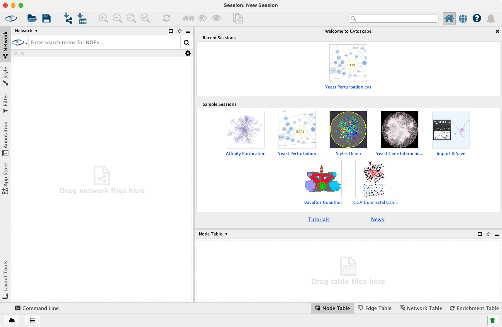

# 启动 Cytoscape

Cytoscape 是一个可在 Linux，Windows 和 macOS 系统上运行的 Java 应用程序。尽管没有得到官方支持，但在包含 Java 8 的 Solaris 和 FreeBSD 等 UNIX 平台上也可以运行 Cytoscape。

## 系统要求

Cytoscape 的系统要求取决于你载入、查看和操作的网络的大小。

_请注意，从 Cytoscape v3.2 开始，相比之前的版本，网络加载速度更快，内存消耗更少。虽然这是一个好消息，但在 v3.2 版本上在给定的内存配置（例如：1GB）上创建的网络可能无法被之前版本的 Cytoscape 以相同的内存配置打开。_

|        | 小型网络可视化   | 大型网络分析/可视化 |
| ------ | ---------------- | ------------------- |
| 处理器 | 1GHz             | 多核，越快越好      |
| 内存   | 512MB            | 2GB+                |
| 显卡   | 集成显卡         | 高性能独立显卡      |
| 显示器 | XGA (1024X768)   | 宽屏或多个显示器    |

_不同平台的系统要求、限制和配置选项请参考 https://cytoscape.org 网站上的 **Release Notes**。_

## 入门

### 安装 Java

**Cytoscape 依赖于 Java 11。**

- Cytoscape v3.2 之前的版本运行在 Java 6 上，由于 Oracle 和其他 JVM 供应商已经放弃对 Java 6 的支持，因此 Cytoscape v3.2 及其之后版本也不再支持 Java 6。从 v3.3 版本开始，放弃了对 Java 7 的支持。Cytoscape v3.8 版本放弃了对 Java 8 的支持。
- 我们建议使用一个 64 位的 Java 运行时环境，例如：OpenJDK 11。

更多有关信息，请参考 https://cytoscape.org 网站上的 **Release Notes**。

### 安装 Cytoscape

#### 下载和安装

下载和安装 Cytoscape 有多种方式，可以参考 https://cytoscape.org 网站上的下载页面。

- 用于 Windows，macOS 和 Linux 平台的安装包（适用于大多数用户）。
- 从发行版压缩包安装 Cytoscape。
- 从源代码构建 Cytoscape。可以从 [Git 仓库](https://github.com/cytoscape/cytoscape)中获取最新代码。

#### 安装程序

安装 Cytoscape 最简单和常见的方法是从 Cytoscape 网站上下载[安装包](https://cytoscape.org/download.html)。运行安装包将会引导你完成安装目录选择、许可协议、文件关联和隐私设置等过程。

通过从命令行或脚本使用 `-q` 命令参数（例如：`Cytoscape_3_8_0_windows_64bit.exe -q`）运行安装包可以执行静默安装。为了保证操作成功，你的运行环境必须已经具有足够的权限（例如：Windows 管理员权限）。使用 `-q` 参数，安装包将会自动选择所有默认设置。

如 [Install4j 手册](http://resources.ej-technologies.com/install4j/help/doc/help.pdf) 的附录 A 所述，使用其他设置和预编写的响应文件可以提供更多的自动化灵活性。

#### Cytoscape 目录

Cytoscape 安装后（与平台无关）包含如下文件和目录：

| 目录 / 文件                                 | 描述                                             |
| ------------------------------------------- | ------------------------------------------------ |
| `P/CYTOSCAPE_V3.x`                          | Cytoscape 程序文件、启动脚本和会话文件的默认位置 |
| `P/CYTOSCAPE_V3.x/CYTOSCAPE.VMOPTIONS`      | Cytoscape 内存配置设置                           |
| `P/CYTOSCAPE_V3.x/SAMPLEDATA`               | `README.txt` 中描述的预设网络                    |
| `P/CYTOSCAPE_V3.x/FRAMEWORK`                | Cytoscape 程序文件                               |
| `P/CYTOSCAPE_V3.x/APPS`                     | Cytoscape 核心应用程序文件                       |
| `U/CYTOSCAPECONFIGURATION`                  | Cytoscape 配置和程序缓存文件                     |
| `U/CYTOSCAPECONFIGURATION/CYTOSCAPE3.PROPS` | Cytoscape 配置设置                               |

`P/` 目录表示程序目录，该目录因平台而异。为了使 Cytoscape 正常工作，所有文件都应保留在解压缩后的目录中。核心 Cytoscape 应用程序会依据此目录结构寻找运行所需的各种库。

`U/` 目录表示用户的主目录，该目录因用户和平台而异。通过将 Java 的环境变量 `user.home` 设置为其他目录可以修改默认的用户主目录。当 Cytoscape 安装在一个工作站，但主目录存储在一个中央文件服务器上时很有用。也可以通过将以下选项添加到 `Cytosvape.vmoptions` 文件或 `JAVA_OPTIONS` 环境变量中来设置 `user.home`：

```
-Duser.home=/path/to/desired/home
```

#### 升级已安装的 Cytoscape

如果之前安装过 Cytoscape，有两种方式进行升级：

1. 重新开始。此时，你应该删除以前的安装目录和 `CytoscapeConfiguration` 目录（目录位置请参考下文）。
2. 保留所有内容，选择一个新目录进行安装。如果遇到任何问题，请删除 `CytoscapeConfiguration` 目录中的 `.props` 文件。如果仍然存在问题，请尝试删除 `CytoscapeConfiguration` 目录。后面的步骤将会导致丢失通过 App Store 安装的所有应用，因此请只在遇到问题或不介意重新安装应用时采取上述操作。核心应用程序不会受到该操作的影响。

### 启动程序

与其他应用程序一样，双击安装程序生成的图标启动 Cytoscape。也可以运行 `cytoscape.sh`（Linux 或 macOS）或双击 `cytoscape.bat`（Windows）启动 Cytoscape。

启动 Cytoscape 后，将出现一个如下所示的窗口：



_如果你的 Cytoscape 窗口与此不同，可能需要进一步配置。请参考 https://cytoscape.org 网站上的 **Release Notes**。_

### 内存消耗

对于大多数普通用户，Cytoscape 会估计并保留适当的内存。错误的估计值可能会导致 Cytoscape 在启动时挂起，或者无法加载你的网络。除非 Cytoscape 无法启动或载入你的网络，否则它可能正确地估计了可用的内存，你可以继续并来到[快速教程](/quick-tour-of-cytoscape)。如果 Cytoscape 错误估计了内存大小或无法分配到足够内存，则可能是你使用了 32 位的 JRE，通过安装 64 位 JRE 可以获得更好的结果。

Cytoscape 启动时，主界面的右下角会显示当前内存的使用情况。你可以随时单击  按钮来访问  选项。大多数用户不需要使用该选项，但对于载入了多个大型网络的用户而言很实用。

### Cytoscape 内存大小

默认情况下，Cytoscape 会根据你的操作系统、系统架构（32 或 64 位）和已安装的内存来估计初始和最大内存分配。通过编辑 `Cytoscape.vmoptions` 文件可以修改 Cytoscape 的初始和最大内存大小，该文件与 Cytoscape 程序位于同一个目录。该文件每行包含一个选项，并以换行符结尾，同时在文件末尾有一个额外的换行符。请注意，在 macOS 平台，情况略有不同，如果通过单击 Cytoscape 图标启动程序，则需要编辑 `Cytoscape.app/Contents/vmoptions.txt` 文件。你需要右键单击 Cytoscape 应用程序图标并选择 `Show Package Contents`，从而显示包含 `vmoptions.txt` 的 `Contents` 子目录。

例如，如果你希望 Cytoscape 最初分配 2GB 的内存并最多使用 4GB 内存，可以在 `Cytoscape.vmoptions` 文件中添加如下两行（不要忘记每行末尾的换行符，以及文件末尾的额外换行符）：

```
-Xms2GB
-Xmx4GB
```

### 栈大小

还有另一个与内存分配有关的选项。Cytoscape 中的某些功能使用较大的堆栈空间（例如：布局）。由于该值是独立于上述值设置的，因此有时布局算法会由于内存不足而失败。为了避免这种情况，可以使用 `cytoscape3.props` 文件（位于 `CytoscapeConfiguration` 目录）中的 `taskStackSize` 选项为 Cytoscape 任务设置更大的堆栈。通过 `Preferences` 编辑器（`Edit -> Preferences -> Properties ...`）查找 `taskStackSize` 进行编辑，该值的单位为字节。
