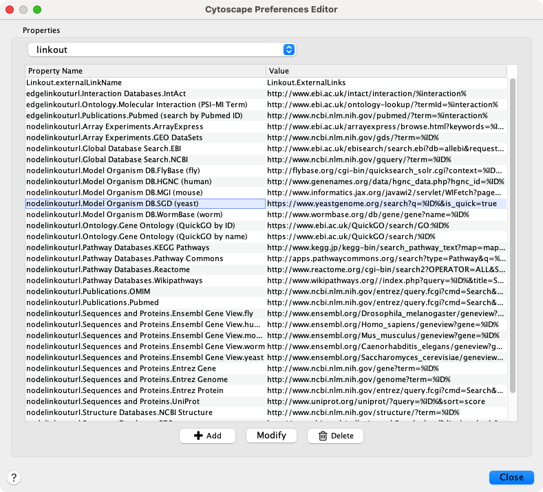

# Linkout

Linkout 提供了一种在 Cytoscape 里面链接节点和边到外部资源的机制。右键单击 Cytoscape 中的节点或边，将弹出一个菜单，其中包含一个 Web 链接列表。

默认情况下，Cytoscape 包含许多链接，例如：Entrez(NCBI)，SGD 和 Google 等用于特定领域的链接。除了默认链接之外，用户还可以使用 Cytoscape 首选项编辑器（位于 `linkout` 组中的 `Edit -> Preferences -> Properties` 下）来自定义 `External Links` 菜单并添加或删除链接。

外部链接在编辑器中以键值对的形式列出，其中 `Property Name` 表示链接的名称，`Value` 为搜索的 URL。Linkout 菜单可以通过键的一部分组织为一个层级结构。特定节点的 Linkout 的键以 `nodelinkouturl` 关键词开头，对于边则为 `edgelinkouturl`。

例如，如下条目：

```
nodelinkouturl.Model Organism DB.SGD (yeast)=http://www.yeastgenome.org/cgi-bin/locus.fpl?locus=%ID%
```

将 SGD 链接放在 `Model Ogranism DB` 子菜单下。该链接在 Cytoscape 中显示为：


使用类似的方式可以添加新的子菜单。

URL 中的 `%ID%` 字符串是节点标签的占位符，生成弹出菜单时将替换为节点标签。在上例中，生成的 YNL050C 蛋白质 SGD 链接为：

```
http://www.yeastgenome.org/cgi-bin/locus.fpl?locus=YNL050C
```

如果要基于其他列进行查询，需要使用样式指定其他节点标签。

对于边，方法基本相同。但是此处的占位符 `%ID1%` 和 `%ID2%` 分别代表了源节点标签和目标节点标签。

目前没有机制能够检查构造的 URL 查询是否正确以及节点标签是否有意义。同样，各种标示符之间也没有 ID 映射。例如，从使用 Emsembl 基因标示符作为节点标签的网络到 NCBI Entrez 的链接将使用 Ensembl ID 生成到 Entrez 的链接，这将导致错误的链接。用户需要自行确保在 URL 链接中用作搜索词的节点标签可以生成有意义的链接。

## 添加和删除链接

默认链接定义在 `CytoscapeConfiguration` 目录中的 `linkout.props` 文件中。这些链接是常规的 Java 参数，可以直接通过文本编辑器或 Cytoscape 配置编辑器（`Edit -> Preferences -> Properties...`）并选择 `linkout` 进行编辑（如下图所示）。



另外，当从命令行启动 Cytoscape 时，可以通过指定单独属性来定义新链接。命令的格式为 `cytoscape.sh -P [context_menu_definition]=[link]`。其中，`context_menu_definition` 用于指定显示链接菜单项的上下文菜单。定义的结构为 `nodelinkouturl` 或 `edgelinkouturl` 后跟上一个 `.`，然后是 `.` 分隔的菜单层次结构。

```
cytoscape.sh -P "nodelinkouturl.yeast.SGD=http://db.yeastgenome.org/cgi-bin/locus.pl?locus\=%ID%"
```

将添加如下菜单项：


通过 `Edit -> Preferences -> Properties...` 并选择 `commandline` 从菜单中删除链接。在命令行中添加的 Linkout 仅用于当前运行的 Cytoscape 实例。
