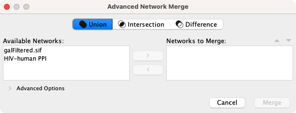
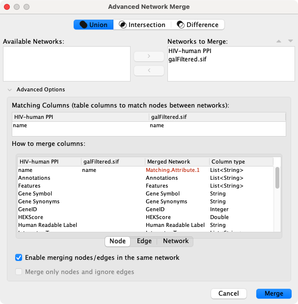

# 合并

通过 `Tools -> Merge` 可以合并网络和表格数据。

## 合并网络

通过 `Tool -> Merge -> Networks...` 打开 `Advanced Network Merge` 界面合并两个或多个网络。

### 基本操作

- 选择 `Union`，`Intersection` 或 `Difference` 选项卡。
- 可用于合并的网络将列在 `Available Networks` 中。从列表中选择一个网络，然后单击右箭头将该网络传输到 `Networks to Merge` 中。单击 `Merge` 继续，合并后的网络将显示为单独的网络。

### 高级选项

高级网络合并界面包含一个扩展的面板，你可以在其中指定要合并的详细信息。可用的选项有：

- 匹配列：指定用于合并的网络列。通常使用 `name` 或其他包含标识信息的列。
- 如何合并列：用户可以在表中指定每个单独网络的列，以及合并后网络中对应的列名和数据类型。

## 合并表格

通过 `Tool -> Merge -> Tables...` 可以合并表格。

节点和边的合并与网络合并的方式类似，可以在网络集内部或网络集之间合并表格。
