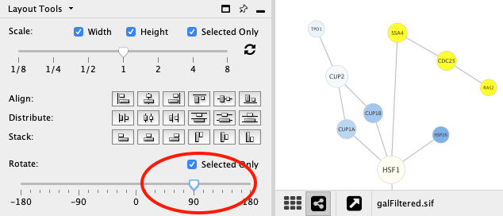
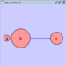
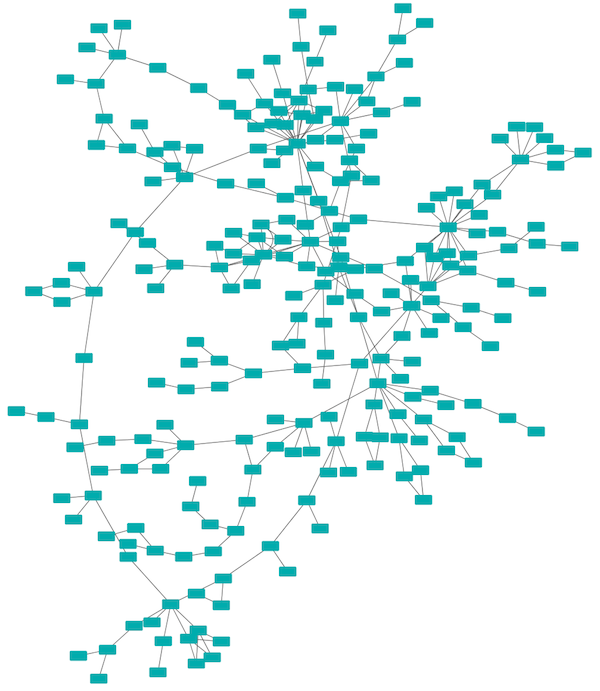
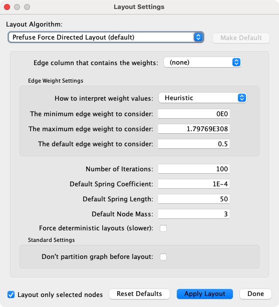

# 导航和布局

## 基础网络导航

Cytoscape 使用[可缩放用户界面](http://en.wikipedia.org/wiki/Zooming_User_Interface)来进行导航和查看网络。ZUIs 采用两种导航机制：缩放和平移。根据用于想要看到的视图多少，缩放将增加或减少视图的放大比例。平移允许用户将屏幕焦点移动至视图的不同部分。

### 缩放

Cytoscape 提供 4 种缩放机制：工具栏按钮，菜单选项，键盘快捷键和滚轮。

使用工具栏上的缩放按钮可以放大和缩小当前网络显示中的交互部分。缩放图标详细说明如下：

从左至右分别为：

- 放大
    - 菜单选项：`View -> Zoom In`
    - 键盘快捷键：++ctrl+plus++（Windows）或 ++command+plus++（macOS）
- 缩小
    - 菜单选项：`View -> Zoom Out`
    - 键盘快捷键：++ctrl+minus++（Windows）或 ++command+minus++（macOS）
- 缩小以显示当前网络的全部
    - 菜单选项：`View -> Fit Content`
    - 键盘快捷键：++ctrl+0++（Windows）或 ++command+0++（macOS）
- 缩放选择区域
    - 菜单选项：`View -> Fit Selected`
    - 键盘快捷键：++ctrl+9++（Windows）或 ++command+9++（macOS）

使用滚轮，通过向上滚动来放大，向下滚动来缩小。在启动自然滚动的 macOS 系统上，这些方向是相反的。

### 平移

有两种方法平移网络：

- 左键单击并拖动。你可以通过按住鼠标左键并移动鼠标来平移网络。
- `Network Overview` 上的拖动框。你可以通过左键单击并拖动 Overview 面板中的蓝色矩形框来平移视图。

## 其他鼠标行为

### 选择

- 在节点、边或注解上单击鼠标左键来选择元素。
- 按住 ++shift++ 或 ++ctrl++ 键（macOS 系统为 ++command++ 键），然后在节点、边或注解上单击鼠标左键来添加选择。在所选元素上执行相同操作会取消选择它。
- 按住 ++shift++ 或 ++ctrl++ 键（macOS 系统为 ++command++ 键）的同时在画布背景上拖动鼠标来选择一组节点、边或注解。
- 请记住，只有在启用该类型元素（节点、边或注释）的 `Selection Mode` 的情况下，选择操作（鼠标单击或拖动选择）才是有效的。为了启动或禁用可选元素的类型，需要在网络视图的底部切换相应的按钮（请参见下图），或使用 `Select -> Mouser Drag Selects` 菜单下的选项即可。

- 如果你不想选择任何节点，可以关闭  按钮。
- 如果你不想选择任何边，可以关闭  按钮。
- 如果你不想选择任何注释，可以关闭  按钮。

### 上下文

在节点/边上单击鼠标右键（或在 macOS 系统上按住 ++ctrl++ 单击鼠标左键）来启动上下文菜单，其中包含有关节点/边的其他信息。

### 节点上下文菜单

这个菜单会根据上下文发生变化。对于节点，通常包含：

- Add
- Diffuse
- Edit
- Select
- Group
- Nested Networks
- Apps
- External Links
- Preferences

对于边，通常包含：

- Diffuse
- Edit
- Select
- Apps
- External Links
- Preferences

应用可以将自己的选项添加到节点和边的上下文菜单中。这些选项通常在上下文菜单中 `Apps` 部分显示。

#### 嵌套网络节点上下文菜单

- `Add Nested Network`：允许用户在 Cytoscape 中选择任何网络作为当前节点的嵌套网络。如果当前节点已经具有嵌套网络，则它将被替换。
- `Remove Nested Network`：从节点中删除当前关联的嵌套网络。关联的网络未被删除，仅删除节点和网络之间的关联。
- `Go to Nested Network`：将当前节点的嵌套网络作为当前网络视图的焦点。如果嵌套网络的网络视图不存在，则将为其创建视图。

有关嵌套网络的更多信息，请参见[嵌套网络](/nested-networks/#嵌套网络)部分。

## 手动布局

手工组织网络最简单的方法是单击节点并拖动。所有选定的节点将一起移动。

除了可以单击节点并将其拖动到新位置之外，Cytoscape 支持使用键盘上的箭头键来移动节点。使用鼠标选择一个或多个节点并单击箭头键（++left++，++up++，++right++，++down++）之一，所选节点将沿着所选方向移动一个像素。如果在按住 ++shift++ 键的同时按下箭头键，所选节点将沿着所选方向移动 15 个像素。

## 节点布局工具

通过菜单 `View -> Show Tool Panel` 或 `Layout -> Node Layout Tools` 打开工具面板。

它包含多个 `Node Layout Tools`，可以帮助自动化或微调布局。

### 缩放

调整 Scale 滑块可以改变边的长度。节点的位置而不是大小将被缩放。节点大小可以通过[样式](/styles/)进行调整。下图展示了所选节点（黄色）缩放至原始值 50% 的结果。

**之前**

**之后**

### 旋转

旋转功能将改变整个网络或网络中选中部分的方向。下图展示了一个选定节点旋转 90 度的网络。

**之前**

**之后**

### 对齐、分散和堆叠

工具面板提供了用于设置节点相对位置的按钮。

**对齐** 为选中节点提供了沿着垂直和水平方向对齐的选项。区别在于节点的哪个部分被对齐，例如节点的中心、顶部或左侧。**分散** 将在两个最远的节点之间沿着垂直或水平轴平均分散所选的节点。区别在于节点的哪个部分被用作分散的参考点。**堆叠** 将利用完整的对齐选项对所选节点进行垂直或水平堆叠。下表展示了每个按钮的功能。

|                         按钮                         |                       之前                        |                             之后                             | 描述                                                         |
| :--------------------------------------------------: | :-----------------------------------------------: | :----------------------------------------------------------: | ------------------------------------------------------------ |
|     |  |      | 垂直对齐顶部：所选节点的顶部与最顶部节点对齐。               |
|  |  |   | 垂直对齐中心：所选节点的中心沿着顶部节点和底部节点之间的中点定义的线对齐。 |
|  |  |   | 垂直对齐底部：所选节点的底部与最底部的节点对齐。             |
|    |  |   | 水平对齐左侧：所选节点的左侧与最左侧的节点对齐。             |
|  |  |  | 水平对齐中心：所选节点的中心沿着最左侧节点和最右侧节点之间的中点定义的线对齐。 |
|   |  |  | 水平对齐右侧：所选节点的右侧与最右侧的节点对齐。             |

|                        按钮                         |                             之前                             |                             之后                             | 描述                                                       |
| :-------------------------------------------------: | :----------------------------------------------------------: | :----------------------------------------------------------: | ---------------------------------------------------------- |
|     |  |  | 垂直顶部分散：所选节点的顶部均匀分布在最顶部和最底部之间。 |
|  |  |  | 垂直中心分散：所选节点的中心均匀分布在最顶部和最底部之间。 |
|  |  |  | 垂直底部分散：所选节点的底部均匀分布在最顶端和最底部之间。 |
|    |  |  | 水平左侧分散：所选节点的左侧均匀分布在最左侧和最右侧之间。 |
|  |  |  | 水平中心分散：所选节点的中心均匀分布在最左侧和最右侧之间。 |
|   |  |  | 水平右侧分散：所选节点的右侧均匀分布在最左侧和最右侧之间。 |

|                         按钮                         |                             之前                             |                             之后                             | 描述                                                   |
| :--------------------------------------------------: | :----------------------------------------------------------: | :----------------------------------------------------------: | ------------------------------------------------------ |
|    |    |     | 垂直左侧堆叠：按照所选节点的左侧和最顶端节点垂直堆叠。 |
|  |    |   | 垂直中心堆叠：按照所选节点的中心和最顶端节点垂直堆叠。 |
|   |    |    | 垂直底部堆叠：按照所选节点的右侧和最顶端节点垂直堆叠。 |
|     |  |    | 水平顶部堆叠：按照所选节点的顶部和最左侧节点水平堆叠。 |
|  |  |  | 水平中心堆叠：按照所选节点的中心和最左侧节点水平堆叠。 |
|  |  |  | 水平右侧堆叠：按照所选节点的底部和最左侧节点水平堆叠。 |

## 边弯曲和自动边捆绑

从 Cytoscape 3.0 开始，边弯曲作为边的常规属性可以用作样式的一部分。类似边的其他属性，你可以选择一个默认值或一个数据映射。在 `Style` 选项卡中，从 `Properties` 下拉列表中选择 `Bend` 属性，然后单击 `Def.`，`Map.` 或 `Byp.` 来调取 `Edge Bend Editor`。在编辑器中，你可以使用 Windows 上的 ++alt++ 按键，macOS 上的 ++option++ 按键，Linux 上的 ++ctrl+alt++，配合鼠标单击来添加任意数量的控制柄。

要清除所有边弯曲，可以选择 `Layout -> Clear All Edge Bends`。

除了手动添加处理外，还可以使用 `Bundle Edges` 功能来自动绑定所有或所选的边。

1. 选择 `Layout -> Bundle Edges -> All Nodes and Edges`。
2. 设置参数。算法细节详见[论文](http://www.win.tue.nl/~dholten/papers/forcebundles_eurovis.pdf)。
3. 单击 `OK` 按钮并运行。如果边数量很多，边绑定可能会花费很长时间。
    - 如果花费时间太长，请尝试减小 `Maximum iterations`。
    - 对于大型密集网络，请尝试将 `Maximum iterations` 设置为 500 - 1000。

**注意**，控制柄的位置将针对节点的当前位置进行优化。如果移动节点位置，则需要再次运行该功能来获得正确的结果。

## 自动布局算法

`Layout` 菜单包含一系列用于根据某种算法对网络可视化进行组织、对齐、节点组旋转和网络大小调整的功能。Cytoscape 布局有 3 种不同的来源，它们包含在 `Layout` 菜单中。

Cytoscape 布局可以选择仅在选定的节点上运行，并且都提供一个 `Settings...` 面板来更改算法的参数。大多数 Cytoscape 布局还可以在执行布局之前对网路进行划分。此外，这些布局中的大多数都包含将节点或边数据列考虑在内的选项，布局算法包括：

### 网格布局

网格布局是一种简单的布局，其可以将所有节点排列在一个正方形网格中。作为 Cytoscape 的核心部分，该默认布局始终是可用的。通过选择 `Layout -> Grid Layout` 可以执行网格布局。上图显示了一个示例的截图。

### Edge-weighted Spring-Embedded 布局

Spring-Embedded 是一种基于由  Kamada 和 Kawai 实现的力导向布局。网络节点被视为彼此排斥的物理对象，例如：电子。节点之间的连接边就像连接到一对节点上的金属弹簧，这些弹簧根据力函数排斥或吸引其端点。布局算法以最小化网络中力之和的方式设置节点的位置。通过选择 `Layout -> Edge-weighted Spring Embedded` 中合适的参数可以将其应用到整个或部分网络。

### Attribute Circle 布局

Attribute Circle 布局是一种快速有用的布局，尤其是对于小型网络。该布局将网络中所有的点围绕成一个圆。节点的顺序由用户选择的数据列确定。数据列中具有相同值的节点在圆中处于相同位置。使用 `Layout -> Attribute Circle Layout -> column` 利用 `column` 将所有节点围绕成一个圆。上图示例展示了 galFiltered 网络的一个子图利用节点的度组织的布局结果。

### Group Attributes 布局

Group Attributes 布局与Attribute Circle 布局类似，不同之处在于使用的数据列值相同的节点被单独放置在一个圆中，而不是所有节点都放在一个圆中。使用 `Layout -> Group Attributes Layout -> taxonomy` 可以得到上图类似结果。

### Prefuse Force Directed 布局

Force Directed 布局是一种力导向布局，该布局由 Jeff Heer 提供的 prefuse 工具包实现。该算法在正确的参数下可以实现非常快速和令人满意的视觉布局。Force Directed 布局接受一个数值的边数据列作为弹簧长度的权重，但可能需要在 `Setting...` 对话框多次设置才能获得最佳布局。通过 `Layout -> Prefuse Force-Directed Layout -> (unweighted)` 或者选择一个边数据列作为权重来应用该布局。上图为 galFiltered 网络在该布局下的示例。

### Compound Spring Embedder 布局

[Compound Spring Embedder (CoSE)](http://www.sciencedirect.com/science/article/pii/S0020025508004799) 布局是一种基于传统力导向的布局算法，其可以用于处理多层级的嵌套网络、任意嵌套层级节点之间的边以及可变的节点大小。尽管该布局同样支持非复合网络，但通常在网络为复合网络时采用这个布局。通过 `Layout -> Compound Spring Embedder (CoSE)` 可以应用该布局。

### Circular 布局

该算法产生的布局强调网络中的分组和树状结构。通过分析结构的连通性对网络进行分组，并将分组结果布局成单独的圆。圆本身以放射状树形布局的方式进行排列。通过选择 `Layout -> Circular Layout` 可以应用该布局。

### 分层布局

分层布局算法非常适合表示网络中的主要方向或“流”。节点被放置在层次排列的层中，通过最小化边交叉的数量对每个层内的节点进行排序。通过选择 `Layout -> Hierarchical Layout` 可以应用该布局。

### Copycat 布局

Copycat 布局使用一个网络中节点的位置来布局另一个网络中的节点。选择 `Layout -> Copycat Layout` 启动对话框并选择 `Source network view`（已布局）和 `Target network view`（待布局）。Copycat 将通过节点名称匹配源网络和目标网络中的节点，你也可以自行选择用于匹配的节点属性。

你可以使用 `Select unmapped nodes` 来选择与源网络中的节点不匹配的目标节点。这使得你可以移动这些节点或对其应用其他布局。使用 `Layout unmapped nodes in a grid` 可以预先将不匹配的目标节点从布局的目标网络中移开。

## yFiles 布局

Cytoscape 提供一组基于 [yFiles 库](https://www.yworks.com/products/yfiles)的布局算法。从 Cytoscape 3.6 开始，yFiles 算法可以通过 [Cytoscape App Store](http://apps.cytoscape.org/) 直接获取。通过 `Layout -> Install yFiles` 引导至 App Store 来安装这些布局。单击 `Install` ，同意许可协议，安装完毕后即可在 `Layout` 菜单中使用这些布局。

yFiles 包含的布局算法有：

- Circular Layout
- Hierarchic Layout
- Hierarchic Layout Selected Nodes
- Organic Layout
- Orthogonal Layout
- Radial Layout
- Tree Layout
- Orthogonal Edge Router
- Organic Edge Router

下面为 Cytoscape 中 yFiles 布局的一些示例，更多示例请参见 [yFiles 页面](https://www.yworks.com/products/yfiles-layout-algorithms-for-cytoscape)。

### yFiles Organic 布局

### yFiles Hierarchic 布局

### yFiles Tree 布局

## 布局参数

许多布局具有可调整的参数，通过 `Layout -> Settings...` 可以对其进行调整。`Layout Settings` 对话框如下图所示，你可以选择要调整的布局算法。设置选项因算法而异，只有那些允许调整参数的算法才会显示在对话框顶部的下拉菜单中。修改参数后，单击 `Execute Layout` 将应用该布局。

