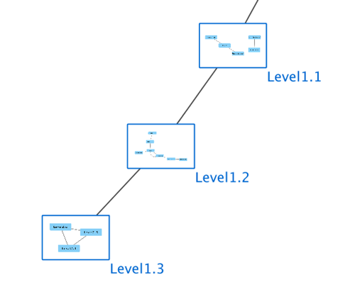

# 嵌套网络

Cytoscape 可以将嵌套网络与任何节点相关联。嵌套网络可以是当前 Cytoscape 中定义的任何其他网络。此功能允许创建网络层次结构和循环关系。例如：各种模块查找插件都可以在它们生成概览网络中的使用嵌套网络，每个节点表示包含一个嵌套网络的模块。

请注意，嵌套网络在概念上和[节点分组](/creating-networks/#节点分组)相似，但结果却截然不同。嵌套网络包含一个不与当前网络共享节点或属性的独立网络，只能作为单独的网络集合或单独的 Cytoscape 会话进行编辑。它的节点无法连接到当前网络中的节点，也无法使用 Cytoscape 的功能或应用进行查找和过滤。

大多数情况下，[节点分组](/creating-networks/#节点分组)功能更强大，也更易于使用。

## 创建嵌套网络

用户可以通过两种方式创建嵌套网络：

- 通过导入 Nested Network Format (NNF) 格式文件。（请参见：[NNF Network Format]()）
- 通过手动构建网络并通过右键单击节点上下文菜单为各个节点分配嵌套网络。（请参见：[Nested Network Node Context Menu]()）

## 嵌套网络可视化

包含已放大的嵌套网络的节点会充分显示该嵌套网络的图像。如果嵌套网络不存在当前网络视图，则图像将是默认图标，否则将是嵌套网络当前布局的低分辨率渲染。

