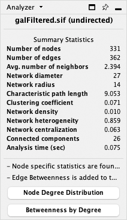

# 网络分析器

分析器可以为有向和无向网络计算一系列拓扑参数，包括：

- 节点、边和连接组件的数量。
- 网络直径、半径和聚类系数，以及特征路径长度。
- 拓扑系数、介数中心度和接近度中心度。
- 度分布、邻域连接度、平均聚类系数、最短路径长度、共享邻居数和重力中心度。

## 网络分析

### 分析网络

通过 `Tools -> Analyze Network` 运行分析。

根据网络是有向还是无向的，分析器会计算不同的统计信息。应用会根据目标箭头样式的定义来猜测网络的类型。

结果计算完毕后，将出现在结果面板中。

结果包含多个选项卡。在[此处](http://med.bioinf.mpi-inf.mpg.de/netanalyzer/help/2.7/index.html#complex)可以找到有关网络参数的详细信息。

- Simple Parameters
- Node Degree Distribution
- Avg. Clustering Coefficient Distribution
- Topological Coefficients
- Shortest Path Distribution
- Shared Neighbors Distribution
- Neighborhood Connectivity Distribution
- Betweenness Centrality
- Closeness Centrality
- Stress Centrality Distribution

### 分析节点子集

此工具的早期版本提供了分析所有节点或所选子集的选项，目前不再支持此功能。如果要分析子网络，需要使用 `File -> New Network -> From Selected Nodes, All Edges` 来预先创建所需的子网络。

### 参数绘图

运行分析器后，会在 `Node Table` 中添加额外的列（并在 `Edge Table` 中添加一个 `EdgeBetweenness` 列）。要绘制这些新列中的任何一个，右键单击列标题，选择 `Plot Histogram...` 绘制单个参数分布，选择 `Plot Scatter...` 绘制双变量数据图。在这两个图表的任意一个中都可以选择一部分数据，网络视图窗口中则会选择对应的节点（边）。

## 网络分析示例

Computation and Visualization of Topological Parameters and Centrality Measures for Biological Networks

Yassen Assenov[^1], Nadezhda Doncheva[^1], Thomas Lengauer[^1], and Mario Albrecht[^1]

[^1]: Department of Computational Biology and Applied Algorithmics, Max Planck Institute for Informatics, Campus E1.4, 66123 Saarbrücken, Germany

完善的在线文档和 Network Analyzer 教程请参见：http://med.bioinf.mpi-inf.mpg.de/networkanalyzer/。
