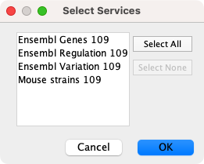

# 节点和边列数据

交互网络作为独立模型是很有用，但是当与其他信息集成在一起时更有助于解决科学问题。Cytoscape 允许用户添加节点/边/网络数据列。例如，用于蛋白质和蛋白质交互关系的基因注释数据和置信度值。通过设置从列到网络属性（颜色，形状等）的映射，可以自定义可视化。在[样式](/styles/)部分将对此进行更详细的讨论。

## 导数数据表文件

Cytoscape 提供了从分隔文本和 MS Excel 数据表格导入数据的支持。

**示例数据表 1**

| OBJECT KEY |        ALIAS         |   SGD ID   |
| :--------: | :------------------: | :--------: |
| AAC3       |    YBR085W\|ANC3     | S000000289 |
| AAT2       |    YLR027C\|ASP5     | S000004017 |
| BIK1       | YCL029C\|ARM5\|PAC14 | S000000534 |

数据表文件包含一个主键列和至少一个数据列。数据列的数量是无限制的。`Alias` 列是一个可选项，使用数据的第一行作为列名也是如此。或者你可以通过 `File -> Import -> Table from File...` 指定每个列的名称。


1. 选择 `File -> Import -> Table from File...`。或者可以简单地将文件从桌面拖放到表格面板中，或单击表格面板中的 `Import Table from File...` 按钮 。
2. 选择一个数据文件。文件可以是文本文件或 Excel（.xls/.xlsx）文件。
3. 在 `Target Table Data` 部分，选择将数据导入到的位置。你可以选择现有网络集合，一个特定网络或将数据导入到一个 `Unassigned Table`。
4. 根据 `Where to Import Table Data` 下拉列表中选择的内容，你需要选择一个网络集合或特定的网络。你还需要选择 `Import Data as` 来确定数据是节点、列还是网络表格数据。
5. 如果表格没有在预览面板中正确分隔，可以在 `Advanced Options` 面板中更改分隔符。默认分隔符是制表符。Excel 工作簿不需要此步骤。
6. 默认情况下，第一列指定为主键，由  指示。确保指定为键的列与在网络键列下选择的内容相匹配（即网络中的键）。要将另一列设置为键，请单击列标题旁边的箭头并选择键符号。
7. 同样，单击列标题旁边的箭头，然后选择正确的数据类型来改变列的数据类型，例如从整型改变为字符串。
    
8. 单击 `OK` 导入数据。

**未分配的数据表**

从 Cytoscape 3.1 开始，可以在不将数据表分配给现有网络的情况下导入数据表，这意味着数据不必与当前加载的任何节点或边相对应。如果以未分配的方式导入数据表，之后再导入包含节点或边的网络，则数据将会自动连接。在加载大型数据集，定义用于网络可视化的样式，之后再加载单个网络查看数据时很有用。这个功能允许将数据自动连接到任意适用的网络，而不必为每个网络加载数据。

## 旧版 Cytoscape 属性格式

除了表格数据外，在旧版本 Cytoscape 中使用的简单属性文件仍受支持。节点和边数据文件格式很简单：节点数据文件的第一行以列名开始（不能包含空格），下面每一行包含节点的名称，之后跟一个等号和数据值。数字和文本字符串是最常见的数据类型，给定的一个列的所有值都必须具有相同的类型，例如：

```
FunctionalCategory
YAL001C = metabolism
YAR002W = apoptosis
YBL007C = ribosome
```

边数据具有几乎相同的结构，不同之处在于边的名称是由源节点名称、包含括号的数据类型和目标节点名称组合而成。方向性至关重要，切换源和目标节点将指向不同（或可能不存在）的边。边数据文件示例如下：

```
InteractionStrength
YAL001C (pp) YBR043W = 0.82
YMR022W (pd) YDL112C = 0.441
YDL112C (pd) YMR022W = 0.9013
```

由于 Cytoscapoe 将边数据视为是有向的，因此第二个和第三个边数据指向两个不同的边（尽管节点是相同的，但源节点和目标节点是相反的）。

每个数据列都存储在一个单独的文件中。节点和边数据使用相同的格式，扩展名均为 `.attrs`。

同导入数据表文件一样，通过 `File -> Import -> Table` 可以导入节点和边数据。

当导入的数据为一个矩阵时，除非明确指定，否则它将自动作为节点数据被加载。

节点和边数据将会被独立于网络连接到节点和边上。节点和边数据将应用于所有已加载网络副本的节点和边，无论数据文件先导入还是网络文件先导入。

## 文件详细格式（进阶用户）

每个数据文件都有一个标题行用于给出数据列的名称，同时也提供了有关数据列的一些其他元信息。格式如下：

```
columnName (class=JavaClassName)
```

第一个字段始终为列名，它不能包含空格。`class` 定义了数据类型的类名，例如：`java.lang.String` 或 `String` 表示字符串，`java.lang.Double` 或 `Double` 表示浮点值，`java.lang.Integer` 或 `Integer` 表示整数值等。如果值为一个列表，则类应该是对象的列表。如果在标题行中未指定任何类，Cytoscape 将尝试根据第一个值猜测数据类型。如果第一个值包含浮点格式的数字，则 Cytoscape 将采用 `java.lang.Double`；如果第一个值仅包含不带小数的数字，则 Cytoscape 将采用 `java.lang.Integer`；否则 Cytoscape 将采用 `java.lang.String`。请注意第一个值可能会导致 Cytoscape 判断错误，例如：

```
floatingPointDataColumn
firstName = 1
secondName = 2.5
```

在这种情况下，第一个值会让 Cytoscape 认为数值类型为整型，但实际上应该是浮点型。因此明确指定数值类型是防止混淆的最安全的办法。更好的格式如下：

```
floatingPointDataColumn (class=Double)
firstName = 1
secondName = 2.5
```

或

```
floatingPointDataColumn
firstName = 1.0
secondName = 2.5
```

第一行之后的每一行都用来标识对象（节点数据文件中的节点或边数据中的边）的名称以及数据值的字符串表示形式。分隔符为等号，等号前后的空白字符（空格和制表符）将被忽略。这意味着名称和数值可以包含空白字符，但是对象名称不能包含等号，并且不能确保等号前后是否包含空白字符。如果数据列没有映射到任何内容，对象名称必须为节点 ID 或边 ID，如表格面板最左侧的一列所示。这些名称必须完整地被复制，包括大小写，否则无法进行匹配。

边名称为如下形式：

```
sourceName (edgeType) targetName
```

更具体的：

```
sourceName space openParen edgeType closeParen space targetName
```

注意边名称中不允许包含制表符。制表符可以用于分割边名称和 `=`，但不能包含在列名称中。还需要注意此格式与 SIF 文件格式的交互规范不同。具体而言，一个之前交互的 SIF 记录样式如下：

```
sourceName edgeType targetName
```

或

```
sourceName whiteSpace edgeType whiteSpace targetName
```

要指定值列表，请使用如下语法：

```
listDataColumnName (class=java.lang.String)
firstObjectName = (firstValue::secondValue::thirdValue)
secondObjectName = (onlyOneValue)
```

这个示例展示了一个值定义为字符串列表的数据列。第一个对象包含 3 个字符串，因此在列表中包含 3 个元素，而第二个对象为仅包含一个元素的列表。对于列表，每个数据值均使用列表语法（即括号），并且每个元素属于同一类。同样，如果未在标题行中指定数据类，则将对其进行推断。列表无法支持样式，因此也无法映射到网络属性中。

### 换行功能

有时候希望数据值包含换行符，例如节点标签包含两行。你可以通过插入数据值来完成，例如：

```
newlineDataColumn
YJL157C = This is a long\nline for a label.
```

### 表格面板


Cytoscape 启动后，表格面板位于 Cytoscape 主窗口的右下方。通过 ++f5++ 键或取消选择 `View -> Show Table Panel` 可以隐藏和还原面板。与其他面板一样，通过右上角的图标可以来解除面板停靠。

使用表格面板底部的选项卡可以切换显示节点、边和网络数据表格。默认情况下，表格面板显示所选网络中的所有节点和边。单击左上角的 `Change Table Mode` 按钮  可以仅显示选择的节点/表。要更改显示的列，可以单击 `Show Column` 按钮 ，然后选择要显示的列（单击选择每个列，然后单击屏幕上的其他位置以关闭列表）。

#### 编辑表格面板和数值

双击单元格即可编辑大多数值（仅 ID 无法编辑）。通过按 ++enter++ 或键入 `\n` 可以在字符列中插入换行符。完成编辑后，单击表格面板外部或按 ++shift+enter++ 保存编辑结果。按 ++esc++ 将会取消编辑时的所有更改。

通过单击列标题可以按照字母顺序对面板中的指定列进行排序。单击 `Create New Column` 按钮  创建新列，数据类型为整型、字符型、浮点型和布尔值四种类型之一。单击 `Deleta Columns...` 按钮  删除列。注意，删除列会将其从 Cytoscape 中删除，而不仅仅是从表格面板。要从面板中移除列而不是删除它们，只需要使用 `Show Columns` 按钮  取消选择列。

通过右键单击列标题并选择 `Rename Column...` 可以重命名表格面板中的列。表格面板支持命名空间，因此如果有几列包含相关信息，可以为其创建一个命名空间。命名空间和列名之间由双引号 `::` 分隔。例如，如果数据的多个列包含 `compartment` 信息，可以以 `compartment::cytosol`，`compartment::endosome` 等格式编辑列标题为其创建具有多个关联列的命名空间。之后可以对命名空间的所有列上进行显示/隐藏之类的操作。


#### 导出表格面板

单击 `Export Table to File...` 按钮  可以将表格面板中的全部内容导出。

也可以直接在表格面板和外部应用（例如 Excel）之间复制和粘贴，只需通过单击和拖动选择表格中的一组单元格，然后使用普通的键盘快捷键进行复制和粘贴。这消除了将表格导出到文件再将数据插入到 Excel 等应用中的必要性！

## 从公共数据库导入数据表

还可以通过 Web 服务，例如：[BioMart](https://www.ensembl.org/info/data/biomart/index.html)，从公共数据库导入节点数据。

### 基础操作

1. 载入一个网络，例如 `galFiltered.sif`。
2. 选择 `File -> Import -> Table from Public Databases...`。
3. 首先会要求你从一组 Web 服务中选择一个。例如选择 `Ensembl Genes 104`。



1. 在 `Import Data Table from Public Database` 对话框中，选择一个服务。由于 galFiltered 网络来自 yeast，因此选择 `Ensembl Genes - Saccharomyces cerevisiae genes`。
2. 对于 `Key Column in Cytoscape` 选择 `COMMON`，对于 `Data Type` 选择 `Gene Names(s)`。

在 `Data Type` 下选择的标示符类型必须与网络中所选列中使用的标示符匹配。


1. 选择要导入的数据。
2. 单击 `Import`。
3. 在 `Import Data` 界面中，将 `Key Column for Network` 选为 `COMMON`。


当导入完成后，你可以在表格面板中查看新导入的数据。


## 映射标示符

集成多个数据源的一个常见问题是数据之间的差异。标准化标示符有许多方言，一些数据库是用于特定生物或基因组的，其它则跨越这些领域。[BridgeDB](http://www.bridgedb.org/) 是一个致力于解决 ID 映射的 Web 服务。Cytoscape 包含对 BridgeDB 的快捷访问。如果你需要更多物种或数据源，使用 [BridgeDB APP](http://apps.cytoscape.org/apps/bridgedb) 可以访问更完整的功能集。

[Ensembl](http://www.ensembl.org/) 是一个用于规范的分类法。通常通过 Ensembl 映射每个数据源来实现两个任意数据源之间的转换。

要将标示符从一个数据源映射到另一个数据源，通过右键单击标示符的列标题，选择 `Map Column...` 选项。


1. 映射始终受物种限制，以防止跨物种进行无意义的匹配，你必须选择一个物种才能使功能正常运转。数据源和目标的选择由物种决定。
2. 根据选择列中的选项，可以合理地假设数据库会用作映射的数据源。如果这不是数据源，可以在 `Map from` 中对其进行覆盖。
3. `To` 为标示符映射的目标数据库。该列表按照物种过滤，并整理为最常见的选项。完整的支持目标列表见[这里](http://webservice.bridgedb.org/Human/targetDataSources)。
4. 在某些情况下可能有多个答案，`Force Single` 选项会将结果限制为服务返回的第一个答案。如果关闭该选项，则结果以列表形式显示在列中。
