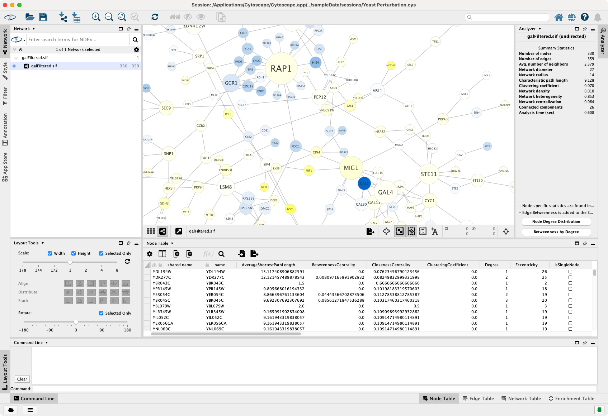

# 面板

共有 5 个可以显示或隐藏的面板：

- 控制面板（左侧）
- 工具面板（左下）
- 表格面板（右下）
- 结果面板（右侧）
- 命令面板（底部）

每个面板包含多个选项卡。例如，控制面板至少包含 `Network`，`Style`，`Filter` 和 `Annotation` 选项卡。表格面板包含 `Node Table`，`Edge Table`、`Network Table` 和 `Enrichment Table` 选项卡。`Node Table` 和 `Edge Table` 包含所有与[节点和边有关的数据](/node-and-edge-column-data/)。`Network Table` 包含网络维度的关联数据，例如 URL 或发布链接。可以通过在 `Network Table` 中添加列来讲相关的网络维度的信息添加到网络中。Network Analyzer（`Tools -> Analyze Network`）的分析结果显示在结果面板中。已安装的应用可能会添加到其他选项卡中。

## 管理面板

这些面板会争夺屏幕空间（例如：使网络视图过小），因此根据用户需求调整面板的状态和大小至关重要。你可以利用如下 5 种状态管理面板：

- 隐藏：如果不需要面板，可以将其完全从屏幕上移除。取消选中 `View` 菜单下相应的选项（例如：取消选中 `View -> Show Results Panel` 将隐藏结果面板）。隐藏面板后，其选项卡将不再出现在侧栏中。为了再次显示面板，选中对应的菜单项即可。或者，你可以右键单击任意侧边栏上的空白区域来隐藏/显示面板：

    

- 最小化：使用面板右上角的最小化图标  可以将其快速隐藏。最小化面板的选项卡仍显示在侧边栏上，并且通过单击选项卡可以再次显示未固定的面板。默认情况下，某些面板（例如：工具面板）可能处于最小化状态。在如下示例中，控制面板和工具面板处于最小化状态（结果面板和命令面板处于隐藏状态）：

    

- 停靠：默认情况下，常用面板（例如：控制面板和表格面板）均处于停靠状态。停靠后，面板会占用其相邻面板可用的空间，通过调整其大小来调整那些相邻面板的大小（例如：通过水平调整控制面板大小，网络视图面板大小也随之调整）。如果面板处于浮动状态，可以使用  将其固定。如下示例中，除了结果面板和命令面板外，其他面板均处于停靠状态。

    

- 取消停靠：单击最大化图标  将面板取消停靠或单击侧边栏上的一个选项卡来显示最小化的面板。在这种状态下，该面板显示在其他面板上，但仍固定在 Cytoscape 一角上。这样可以在不影响其他面板尺寸的情况下更自由地（垂直或水平）调整其大小。双击未停靠面板的标题栏可以快速将其最大化，再次双击最大化面板的标题栏可以将其恢复为先前的大小。单击最小化图标  可以临时隐藏未固定的面板。单击其他面板或非停靠面板外部的组件时，停靠面板将自动最小化。如下示例中，控制面板处于取消固定状态：

    

- 浮动：单击浮动图标  可以将面板与 Cytoscape 完全分离。浮动面板具有自己的窗口，可以像其他应用程序窗口一样调整大小、最大化和最小化窗口。也可以将其移动到多显示器设置的另一台显示器上。当面板浮动时，其选项卡不会从主窗口相应的侧边栏上删除，但你也可以使用浮动窗口标题栏中的下拉菜单来显示其他选项卡内容：

    

    在下图中，控制面板、表格面板和工具面板处于浮动状态：

    

## 其他特性

- 隐藏侧边栏标签

    当你安装和使用应用时，这些应用可能会添加自己的标签，有时可能会导致工具栏非常混乱。为了使边栏更加整洁和易于使用，Cytoscape 允许你隐藏选项卡标签并仅显示其图标。右键单击侧边栏上的任意位置，然后取消选中上下文菜单中的 `Show Labels`。

    在如下示例中，左侧边栏挤满了许多选项卡：

    

    下图中，选项卡标签已被隐藏：

    
