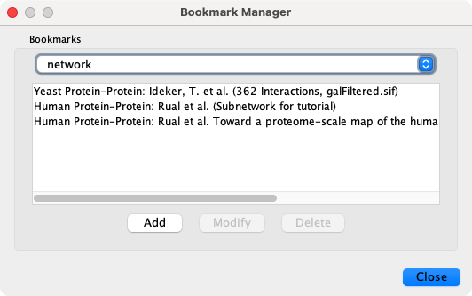
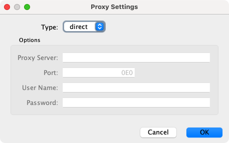

# 首选项

## 管理属性

通过 `Edit -> Preferences -> Properties` 可以打开 Cytoscape 属性编辑器配置默认属性。所有属性的修改都将保存在用户主目录的 `CytoscapeConfiguration` 子目录下的 `.props` 文件中。

可以通过 `Add`，`Modify` 和 `Delete` 按钮配置 Cytoscape 属性，如下图所示：

应用属性的编辑方式与 Cytoscape 属性的编辑方法相同。例如：要编辑 Linkout 的属性，从 `Cytoscape Preferences Editor` 的下拉框中选择 `linkout` 即可。某些应用可能将属性保存在会话文件中。

## 管理书签

Cytoscape 包含了一个预定义的书签列表，这些列表指向位于 Cytoscape Web 服务器上的示例网络文件。通过 `Edit -> Preferences -> Bookmarks...` 打开书签管理器添加、修改和删除书签。

基于数据类型有多种类型书签，包括网络和数据。网络书签是指向 Cytoscape 网络文件的 URL。这些是可以加载到 Cytoscape 中的常规网络。表格书签是指向数据文件的 URL。

## 管理代理服务器

通过 `Edit -> Preferences -> Proxy Settings...` 可以为 Cytoscape 配置代理服务器。

设置代理服务器后，从 URL 加载网络相关的所有网络流量都将通过代理服务器。Cytoscape 应用也会使用该代理服务器。代理设置保存在 `cytosvape3.props` 文件中。更改代理设置后，每次单击 `OK` 按钮时都会尝试使用更改后的设置连接到 Internet 上的一个站点（例如 google.com）。无论连接成功与否都会弹出通知，失败后你可以再次更改代理设置。

如果不再需要使用代理连接到 Internet，只需要将代理类型设置为 `direct`，然后单击 `OK` 即可。

## 管理分组设置

Cytoscape 的分组视图设置可以通过 `Edit -> Preferences -> Group Preferences...` 进行编辑。

!!! note "注意"

    分组选项适用于设置后新建的分组，当前存在的分组不受影响。

`Group Preferences` 对话框提供 3 个 `Group View Settings` 和所有 `Attribute Aggregation Settings` 的设置。分组视图和分组交互包含如下交互设置：

- 扩展分组如何显示。
- 双击节点（分组成员或分组节点）时会发生什么。
- 折叠时分组节点内部显示的内容。

### 分组视图设置

可以设置如下节点可视化选项：

- `None`；无特定的可视化效果，只进行扩展/收缩，不以任何方式对扩展分组进行特殊处理。
- `Compound Node`：将分组节点显示为包围成员节点的区域，同时将其放置在成员节点之后从而允许直接选择每个成员。要在区域内部移动节点，需要调整区域大小以确保能容纳所有成员节点。移动分组节点将会一并移动所有成员节点。通过一些视觉样式允许你更改复合节点的颜色、形状和内边距。
- `Show Group Node`：展开分组时，将分组节点显示为附加节点，并在分组节点和每个成员节点之间添加 `member edges`。例如，对于复合物，显示分组成员节点（每种蛋白质）同时显示一个分组节点（整个复合物）会很有用。
- `Single Node`：将分组节点显示为包围成员节点的区域，但将其放置在成员节点的前面，这样则不能够单独选择或移动成员节点。

如果将双击动作设置为 `Expand/Contract` 之外的其他选项，则在双击时分组不会折叠，这可能适用于显示包含其他节点的分组节点（例如，复合节点可视化或单节点可视化）。

### 属性聚合设置

属性聚合为分组提供了一种自动化方式聚合其他子级的所有属性。由于 Cytoscape 网络中数据列必须全部属于同一类型，因此分组不能简单地创建一个整数列表来聚合其他成员的整数列。聚合分组成员属性的正确方式取决于应用程序。Cytoscape 允许你为每种类型的列设置默认的聚合方法：`Default Aggregation` 中的 `Integer`，`Long`，`Double`，`String`，`Boolean`，`String List`，`Integer List`，`Long List` 或 `Double List`。

此外，用户可以通过 `Aggregation Overrides` 来指示特定列与默认列使用不同的聚合方法。

### 分组技巧

`Show collapsed node as a Nested Network` 复选框用于确定当分组节点的成员节点隐藏时的内容。如果选中，分组节点将包含成员节点布局的图形。对于复合节点可视化，这个复选框应保持未选中状态，以便分组节点可以显示为成员节点的背景。

仅当分组折叠或分组可视化改变时（例如，从单节点到复合节点）才会发生属性聚合。

## 管理 OpenCL 设置

通过 `Edit -> Preferences -> OpenCL Settings...` 可以在系统上安装的一个或多个 OpenCL 驱动程序之间进行切换。

OpenCL 是一个使 Cytoscape 可以使用系统的图形处理器（GPU）来加速某些布局和其他计算的库。如果没有可选的 OpenCL 驱动程序，请查阅系统图形处理器的支持网页。
