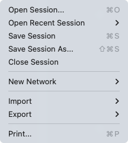
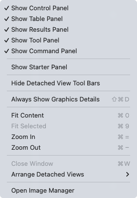
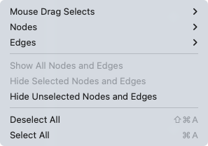

# 快速教程

本章将介绍 Cytoscape 的基本布局和机制。如果你希望边学边做，可以考虑从 [Basic Expression Analysis Tutorial](https://cytoscape.org/cytoscape-tutorials/protocols/basic-data-visualization/#/) 开始。

## 启动面板

启动 Cytoscape 时，可以从启动面板访问基本功能：

启动面板旨在使你可以快速访问一组示例会话文件、教程和 Cytoscape 新闻。示例会话文件包含各种网络，以便使你了解多种交互类型、可视化样式和生物学应用（关于每个示例会话网络的更多信息，请看见 Network Table 属性）。启动面板还将显示你自己的近期会话以便快速访问。

加载会话文件时，启动面板将会消失。你可以随时选择 `View -> Show Starter Panel` 来显示它。

有关用户隐私的信息，请参见 [Cytoscape 隐私政策](/cytoscape-privacy-policy)。

## 基础特性

加载网络后，Cytoscape 看起来类似下图：

大多数功能是不言自明的，但为了清楚起见，我们将给出简要说明。主窗口包含如下几个部分：

- 顶部的菜单栏（关于每个菜单的更多信息，请参见下文）。
- 包含常用功能图标的工具栏。这些功能也可以通过菜单使用。将鼠标指针悬停在图标上，短暂停留将会显示该工具的提示信息。右击工具栏可以自定义内容。
- 网络面板（控制面板的网络选项）。网络面板的顶部是一个搜索栏，可以直接访问多个外部资源。网络面板还包含一个可选的网络概述窗格（显示在左下方）。
- 用于显示网络的主网络视图窗口。网络视图的底部是一组网络视图工具。
- 表格面板（右下面板）。显示了选定节点和边的数据，同时允许修改。

网络面板和表格面板是可固定的选项卡式面板。你可以通过单击面板右上角的浮动窗口控件  来取消停放任何面板。这在当你想为网络面板分配尽可能多的屏幕空间时很有用。现在有两个 Cytoscape 窗口，一个主窗口和一个标题为 Table Panel 的新窗口，类似于下面。当你将鼠标指针放在单元格上时，将显示一个弹出指示。

单击  可以再次停靠该窗口。

单击  可以最小化面板。通过选择 `View -> Show` 并选择相应面板或单击最小化面板中的一个选项卡（例如 Network 或 Node Table），然后单击 ，可以再次显示该面板。

有关 Cytoscape 中面板的更多信息，请参考[面板](/panels/)部分。

### 编辑网络

Cytoscape 具有编辑功能，你可以在网络画布中交互地构建和修改网络。要编辑网络，只需右键单击网络窗口的开放空间，选择菜单项 `Add -> Node`，添加一个新的节点到画布中。要添加边，需要右键单击节点，然后选择菜单项 `Edit -> Add Edge`。然后选择目标节点，这将在两个节点之间添加新的边。以类似的方式可以添加注释、图片、形状或文本框，就像在 MS PowerPoint 或类似软件中一样。有关网络编辑的详细信息，请参见[编辑网络](/creating-networks/#创建一个新网络或手动编辑)部分。

## 菜单

### 文件

文件菜单包含最基本的文件功能：`File -> Open` 可以打开 Cytoscape 会话文件；`File -> New Network` 用于创建新网络，可以用于编辑空白网络，也可以从一个现有网络创建；`File -> Save` 用于保存会话文件；`File -> Import` 用于导入网络和表格；`File -> Export` 用于导出数据。`File -> Export Network to Image` 可以将网络导出为 JPEG，PDF，PNG，PostScript 或 SVG 格式图片。`File -> Export Network to Web Page` 可以利用 Cytoscape.js 将整个会话或单个网络导出为网页。

`File -> Open Recent` 将会列出最近打开的会话文件，以便快速访问。`File -> Print...` 可以进行打印。

### 编辑

编辑菜单包含剪切、复制和粘贴，以及撤销和重做功能，可以用于表格面板、网络编辑器和布局中所做的编辑。撤消和重做功能适用于最近执行的 10 个任务。

还有用于创建和销毁视图（网络的图形表示）和网络（尚未可视化的原始网络数据）的选项，以及用于从当前网络删除所选节点和边的选项。通过 `Edit -> Undo` 可以将所有已删除的节点和边进行恢复。

其他编辑选项包括：`Remove Duplicated Edges` 用于删除重复的边（具有相同的源节点和目标节点），只保留一条边；`Remove Self-Loops` 用于删除具有相同的源和目标节点的边；`Delete Selected Nodes and Edges...` 用于删除选定的节点和边；`Rename Network...` 用于重命名当前选择的网络。

编辑菜单中还提供了一组用于将注释向前、向后以及将其推/拉到前景层和背景层的功能。

在 `Edit -> Preferences -> Properties...` 下可以找到属性和应用程序的编辑首选项。有关如何编辑首选项的更多详细信息，请参见[此处](/preferences/)。

### 视图

视图菜单可以显示或隐藏面板，包括 Control 面板，Table 面板，Result 面板，Tool 面板和 Command 面板。此外，它还提供了一种查看 Starter 面板的方法。它还提供对其他与视图相关功能的控制。

### 选择

选择菜单包含用于选择节点和边的不同选项。

### 布局

布局菜单具有用于直观组织网络的一系列功能。菜单顶部的 `Bundle Edges`，`Clear Edge Bends` 和 `Node Layout Tools` 是用于操纵网络可视化的工具。菜单的底部列出了各种布局算法，这些算法可以自动布局网络。

### 应用

应用菜单可以让你访问应用管理器（`Apps -> App Manager`）来管理（安装/更新/删除）你的应用，并且为已安装的应用添加选项。根据加载的应用不同，你看到的应用菜单可能与此处显示的不同。下图显示了未安装应用时的应用菜单。

**注意**，在线提供的 Cytoscape 应用及其说明列表请参考：http://apps.cytoscape.org。

在之前版本的 Cytoscape 中，应用称为插件，两者具有类似功能。

### 工具

工具菜单包含了 `cyChart`，[`Analyze Network`](/network-analyzer/)，[`Open web page`](/web-browser/)，[`Merge`](/merge/)，[`Execute Command File...`](/command-panel/)，`Job Status Monitor`，`Run Script File...` 和 [`Diffuse`](/finding-and-filtering-nodes-and-edges/#扩散) 等高级功能。

Cytoscape 网页浏览器允许直接在 Cytoscape 中查看任何 HTML 页面。网页浏览器可以在单独的窗口中打开，也可以在结果面板中启动。

### 帮助

使用帮助菜单可以启动联机帮助查看器，浏览和搜索用户手册。它还提供对 Tour of Cytoscape 的直接访问，以及 Cytoscape 教程的完整列表。教程内容将在 Cytoscape 网页浏览器中自动打开。视频演示也可以通过帮助菜单链接直接访问。

`Citations` 选项显示了 Cytoscape 的主要参考文献，以及已安装应用的参考文献列表。根据你安装的应用程序不同，列表也会有所不同。

帮助菜单还允许你直接链接到 Cytoscape 帮助中心和错误报告界面。

## 网络管理

Cytoscape 允许一次加载多个网络，无论有无视图。一个网络存储了加载的所有节点和边，并在一个视图中显示它们。

下面一个示例显示了已加载的多个网络：

网络管理器（在控制面板中）显示已加载的网络。如果存在视图，单击此处的网络将使该视图在主窗口中处于活动状态。每个网络都有一个名称和大小（节点和边的数量），这些名称和大小在网络管理器中显示。如果从文件加载网络，则网络名称是文件的名称。

一些网络非常大（成千上万的节点和边），可能需要很长时间才能显示出来。因此 Cytoscape 中的网络可能不包含视图。有视图的网络以黑色字体显示，没有视图的网络以红色突出显示。你可以通过在网络管理器中右键单击网络名称或在 `Edit` 菜单中选择适当的选项来创建或销毁网络视图。你也可以通过这种方式销毁之前已经加载的网络。

Cytoscape 中的某些操作将创建新的网络。如果是从旧网络创建的新网络，例如通过选择一个网络中的一组节点并将这些节点复制到新网络（通过 `File -> New Network` 选项），则会在该网络之后立即显示衍生的网络。

网络视图也可以从 Cytoscape 主窗口中分离（取消固定）。分离后可以使用操作系统的常规窗口控件将视图窗口拖动到另一台显示器上，并调整其大小、最大化和最小化。但请注意，关闭视图窗口不会销毁它，而只是将其重新连接到 Cytoscape 主窗口中。

### 排列网络窗口

分离网络视图窗口后，通过 `View -> Arrange Detatched Views` 中的一个选项对其重新排列：

**Grid**

**Cascade**

**Vertical Stack**

**Side by Side**

## 网络视图工具

网络视图窗口的底部是一组网络工具：

- `Show Grid` 会将所有已加载的网络排列为网格。
- `Show Network` 将显示当前选择的网络。
- `Detach View` 将网络视图窗口与 Cytoscape 主窗口分离。
- `Export to File...` 提供了导出网络或图像的选项。
- `Always Show Graphics Detail` 将强制渲染图形细节。默认情况下是关闭的。
- `Toggle Node Selection` 允许你关闭/打开节点选择。默认情况下是开启的。
- `Toggle Edge Selection` 允许你关闭/打开边选择。默认情况下是开启的。
- `Toggle Annotation Selection` 允许你关闭/打开注释选择。默认情况下是关闭的。
- `Toggle Node Label Selection` 允许你关闭/打开节点标签选择。默认情况下是关闭的。
- `Hide Navigator` 可以隐藏导航器（鸟瞰视图）。

导航器（鸟瞰视图）显示了网络的概述。它可以用于在大型网络视图中导航。蓝色矩形表示当前在网络查看窗口中显示的网络部分，可以通过鼠标拖动它来查看网络的其他部分。放大将导致矩形变小，反之亦然。

