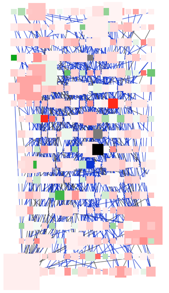
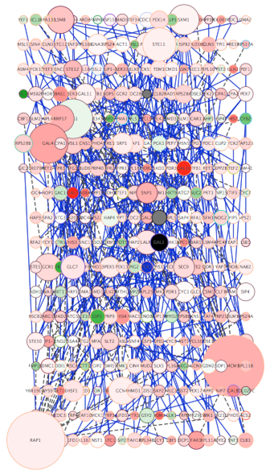

# 渲染引擎

## 什么是详细程度（LOD）？

Cytoscape 能够显示大型网络（大于 10,000 个节点），同时保持交互速度。为了实现该目标，程序根据当前显示的节点和边的数量选择显示网络的详细程度（Level of Detail，LOD）。例如，默认情况下，由于渲染文本是相对耗费资源的操作，仅当可见节点少于 200 个时才渲染节点标签（如果存在）。这会产生一些怪异行为，如果屏幕当前包含 198 个节点，将显示节点标签，如果网络上下平移，当节点数变为 201 时，节点标签将消失。如果渲染的节点和边的总和大于或等于默认值 4000 时，则会采用粗糙的细节级别，其中边始终为直线，节点始终为矩形，并且不会应用抗锯齿。

另外，在与网络进行交互（例如：平移，缩放，移动节点）时，Cytoscape 可能会暂时降低细节程度。例如，在交互过程中可能不会显示边和图表。当网络不在交互状态时，它将再次显示详细内容。

低 LOD 与高 LOD

|              低 LOD 下的网络              |              高 LOD 下的网络              |
| :---------------------------------------: | :---------------------------------------: |
|  |  |

在低 LOD 下，所有节点均显示为正方形，同时关闭了抗锯齿功能。在高 LOD 下，将打开抗锯齿功能，并以用户指定样式中的实际形状显示节点。

### 强制显示细节

如果要显示网络所有细节而不管 LOD 值为多少，可以通过 `View -> Show Graphics Details`（或在 Windows 和 Linux 上按 ++ctrl+shift+d++，在 macOS 上按 ++command+shift+d++）或单击 `Network View Tools` 中的 `Always Show Graphics Details` 按钮  开启详细模式。此选项将强制显示所有图形详细信息。如果网络很大，开启此选项会降低渲染速度。要隐藏详细信息，可以反选 `View -> Always Show Graphics Details`。

### 控制 LOD 的参数

通过 `Edit -> Preferences -> Properties...` 设置属性可以修改用于确定详细程度的默认值。

**注意**，阈值变得越大，性能会变得越慢。如果你使用小型网络（几百个节点）则不会有问题，但对于大型网络，这会明显降低速度。各种阈值如下所述。

**注意**，即使在选择高水平细节时，Cytoscape 3.9 也会保证交互可用。即使对于非常大的网络，增加细节级别或强制使用完整的图形细节也是安全的。

| 参数                         | 描述                                                         |
| :--------------------------- | :----------------------------------------------------------- |
| RENDER.COARSEDETAILTHRESHOLD | 如果渲染的节点和边的总和等于或超过此数量，则将选择粗糙的细节级别，并忽略所有其他细节参数。如果节点和边的总数低于此阈值，则开启抗锯齿功能，否则关闭。默认值为 4000。 |
| RENDER.NODEBORDERTHRESHOLD   | 如果渲染的节点数等于或超过此数量，将不渲染节点边框。默认值为 400。 |
| RENDER.NODELABELTHRESHOLD    | 如果渲染的节点数等于或超过此数量，将不渲染节点标签。默认值为 200。 |
| RENDER.EDGEARROWTHRESHOLD    | 如果渲染的边数等于或超过此数量，将不渲染边箭头。默认值为 600。 |
| RENDER.EDGELABELTHRESHOLD    | 如果渲染的边数等于或超过此数量，将不渲染边标签。默认值为 200。 |
| RENDER.HIDPI                 | 此属性在网络视图中启用/禁用 HiDPI 模式。设置为 true 时，网络将在 4K 超高清和 Retina 显示器上以原始分辨率呈现。Cytoscape 3.9 新增功能。默认为真。 |
| RENDER.LABELCACHE            | 此属性启用/禁用渲染器标签缓存，启用后可显着提高渲染速度。Cytoscape 3.9 新增功能。默认为真。 |
| RENDER.EDGEBUFFERPAN         | 此属性启用/禁用渲染器中的一项功能，该功能在平移网络时移动边缘缓冲区，从而避免在某些情况下平移时必须隐藏边缘。Cytoscape 3.9 新增功能。默认为真。 |

在打印或导出网络为 PostScript 之类格式时，无论当前屏幕上是什么，都始终选择最高级别的详细信息。
