# 样式

## 什么是样式？

Cytoscape 在网络可视化方面的优势之一是允许用户将任何表格数据（名称，类型，度，权重，表达式等）编码为网络的属性（颜色，节点大小，透明度，字体等）。这些编码或映射的表格数据的集合称为一个样式。通过控制面板中的 `Style` 面板可以创建或修改样式。在这个界面中，你可以轻松地定义网络的外观。例如：你可以为所有节点指定默认的颜色和形状：


根据节点的连通度设置节点大小。你可以直观地看到网络的中心：


或者设置节点标签的字体大小：


通过颜色渐变可视化基因表达数据：

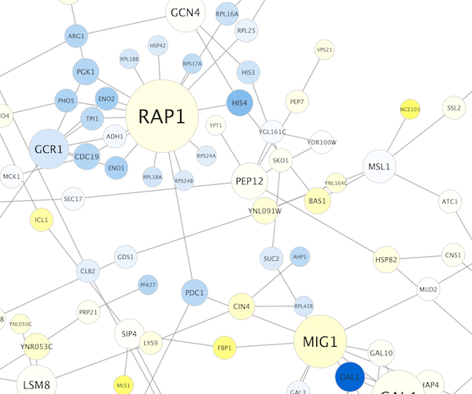

将特定的物理实体编码为不同形状的节点：


使用特定的线型表示不类型的交互：


使用边权重控制边的透明度：


使用边的分数控制边的多个属性：


通过控制节点的不透明度来浏览极其密集的网络：


通过边捆绑和不透明度展示高度连接的区域：


在节点上添加图片或图表：


Cytoscape 3 包含多种示例样式。以下是应用在 galFiltered.sif 网络中的一些示例：


## 样式界面简介

`Style` 界面位于控制面板的 `Style` 面板中。


在这个界面中允许你使用 `Current Style` 选项在不同样式之间创建/删除/查看/切换。面板显示给定样式的详细映射信息，同时可以用于编辑这些信息。

此界面允许你使用下拉菜单和选项菜单创建/删除/查看和在不同样式之间切换。选择特定样式后，`Style` 面板会显示给定样式的详细信息，也可用于编辑这些详细信息。


- 界面顶部有一个用于选择预定义样式的下拉菜单。
- 可用样式列表可使用搜索字段进行搜索。
- `Show only Applied Styles` 按钮  将过滤列表以仅显示应用的样式。
- 单击 `Edit...` 按钮  可以编辑可用样式列表。这将显示一组用于选择和删除样式的按钮。
- 还有一个 `Options` 按钮 ，其中包含重命名、删除、创建和复制样式的选项，以及为所选样式创建图例的选项。
- 界面主区域由 4 个选项卡组成，分别是 `Node`，`Edge` 和 `Network`，以及一个 `Column` 选项卡，用于在 `Table` 面板的 `Node` 和 `Label` 表格中的各列上设置映射。请注意，从 Cytoscape 3.10 开始，`Column` 样式将保存为当前样式的一部分。
- 每个选项卡包含与当前样式相关的属性列表，默认显示一部分属性。在列表顶部可以使用 `Properties` 下拉菜单为其添加额外的属性，显示所有属性或将当前显示的属性保存为默认值。
- 列表中的每个属性有 3 列：
    - `Default Value` 显示该属性的默认值。单击任意属性的 `Default Value` 可以更改默认值。
    - `Mapping` 显示该属性当前使用的映射类型。单击任意属性的 `Mapping` 会展开属性条目并显示映射关系编辑界面。有关提供的映射类型的详细信息请参见[这里](#映射如何工作)。
    - `Bypass` 显示所选节点或边的旁路样式。请注意，必须选择一个或多个节点/边时才能激活 `Bypass`。单击 `Bypass` 可以为选定的节点/边设置旁路样式。`Column` 样式没有 `Bypass` 选项。

`Default Value` 用做没有为属性定义映射或者特定属性的映射未能涵盖的节点/边的默认值。如果属性定义了 `Mapping`，则根据映射的定义来确定所有或部分节点/边的样式。一组选定节点/边的 `Bypass` 将会覆盖默认值和定义的映射。

## 样式简介

Cytoscape 发行版包含了几种预定义的样式来帮助大家入门。通过如下示例可以尝试这些样式：

**步骤 1** 载入样本数据

- 载入一个示例会话文件：从主菜单选择 `File -> Open...`，然后选择文件 `sampleData/galFiltered.cys`。
- 会话文件包含一个网络、一些注释和示例样式。默认情况下启用 `galFiltered Style` 样式。每个节点的基因表达值按照蓝色和黄色进行渐变着色（其中蓝色表示低表达率，黄色表示高表达率）。同时，节点大小映射为节点的度，所以网络中的 hub 为较大的节点。如下图所示：


**步骤 2** 在不同样式之间切换

你可以通过 `Style` 面板顶部的 `Current Style` 下拉列表来切换样式。

例如，如果选择 `Sample1`，一个新的样式会应用到网络中，此时可以看到一个白色背景和圆形蓝色节点的结果。放大后可以看到蛋白质和 DNA 之间的交互作用（用标签 `pd` 指定）用虚线绘制，蛋白质和蛋白质之间的交互作用（用标签 `pp` 指定）用实线绘制。


如果选择 `Solid` 样式，可视化结果如下：


该样式除了节点/边标签外没有其他映射，但你可以通过修改任意属性的 `Default Value` 来修改网络样式。

`sampleData` 目录中的 `sampleStyles.xml` 文件提供了其他示例样式。你可以利用 `File -> Import -> Styles form File...` 导入样式文件。

### 节点、边、网络和列属性列表

Cytoscape 允许控制多种属性，相关汇总如下表。默认情况下，某些属性在列表中可见，其他属性可以从 `Properties` 下拉菜单添加到列表中。

| 节点属性                      | 描述                                                         |
| :---------------------------- | :----------------------------------------------------------- |
| Border Line Type              | 节点边框的线型。                                             |
| Border Transparency           | 节点边框的透明度。0 表示完全透明，255 表示完全不透明。       |
| Border Width                  | 节点边框的宽度。该属性默认不显示。                           |
| Label                         | 节点标签文本。该属性默认不显示。                             |
| Label Background Color        | 节点标签背景颜色。仅在使用 `Label Background Shape` 时使用。 |
| Label Background Shape        | 节点标签背景形状。默认为 None。仅在使用 `Label Background Color` 时使用。 |
| Label Background Transparency | 节点标签背景透明度。0 表示完全透明，255 表示完全不透明。     |
| Label Font Face               | 节点标签字体。                                               |
| Label Font Size               | 节点标签字体大小。该属性默认不显示。                         |
| Label Position                | 节点标签相对于边的位置。                                     |
| Label Transparency            | 节点标签的透明度。0 表示完全透明，255 表示完全不透明。       |
| Label Width                   | 节点标签最大宽度。如果节点标签超过指定宽度，则 Cytoscape 会自动在空白字符处截断。Cytoscape 不会对文字截断，这意味着如果单个单词超过最大宽度，则该单词显示会超过最大宽度。 |
| Nested Network Image Visible  | 用于指示是否可视化嵌套网络的布尔值（假设指定节点存在嵌套网络）。 |
| Padding (Compound Node)       | 复合节点（包含其他节点的节点）的内边距。                     |
| Paint                         | 整个节点的颜色，包括边框、标签和选定的画板。                 |
| Border Paint                  | 节点边框的颜色。该属性默认不显示。                           |
| Image/Chart *1-9*             | 用户自定义的节点图形（图像、图标或渐变）。`Image/Chart 1` 默认显示，其他可以通过 `Properties -> Paint -> Custom Paint n -> Image/Chart n` 下拉菜单添加到列表中。 |
| Image/Chart Position *1-9*    | 每个图形（图像、图标或渐变）的位置。该属性（最多 9 个）可以通过 `Properties -> Paint -> Custom Paint n -> Image/Chart Position n` 下拉菜单添加到列表中。 |
| Fill Color                    | 节点的颜色。该属性默认不显示。                               |
| Label Color                   | 节点标签的颜色。该属性默认不显示。                           |
| Selected Paint                | 节点选中时的颜色。                                           |
| Shape                         | 节点的形状。该属性默认不显示。                               |
| Shape (Compound Node)         | 复合节点（包含其他节点的节点）的形状。                       |
| Size                          | 节点的大小。宽度和高度相同。此属性与 Node Height 和 Node Width 互斥。该属性默认不显示。 |
| Image/Chart Size *1-9*        | 相关节点图表的大小。`Image/Chart 1` 默认显示，其他可以通过 `Properties -> Size -> Image/Chart Size n` 下拉菜单添加到列表中。 |
| Height                        | 节点的高度。高度与宽度无关，与 Node Size 互斥。该属性默认不显示。 |
| Width                         | 节点的宽度。宽度与高度无关，与 Node Size 互斥。该属性默认不显示。 |
| Fit Custom Graphics to node   | 切换图表适配节点大小。                                       |
| Lock node width and height    | 切换锁定节点宽度和高度，使用 Size 作为两个属性的值。         |
| Tooltip                       | 鼠标悬停在节点上时显示的提示文字。                           |
| Transparency                  | 节点颜色的不透明度。0 表示完全透明，255 表示完全不透明。     |
| Visible                       | 设置为 false 时隐藏该节点，默认情况下值为 true。             |
| X Location                    | 节点的 X 坐标。默认值将被忽略，仅当定义了映射函数时才使用该值。 |
| Y Location                    | 节点的 Y 坐标。默认值将被忽略，仅当定义了映射函数时才使用该值。 |
| Z Location                    | 节点的 Z 坐标。默认值将被忽略，仅当定义了映射函数时才使用该值。 |

| 边属性                        | 描述                                                         |
| :---------------------------- | :----------------------------------------------------------- |
| Bend                          | 边弯曲。定义如何渲染边。用户可以添加多个控制柄来定义边线条的弯曲。 |
| Curved                        | 如果 Edge Bend 定义，则边会被渲染为直线或曲线。如果值设置为 true，则边会被渲染为曲线。 |
| Label                         | 边标签文本。                                                 |
| Label Autorotate              | 控制每个边标签的 `Label Rotation`。如果值为 true，则边标签将自动旋转，使标签与边对齐。如果值为 false，则边标签将水平放置。 |
| Label Background Color        | 边标签背景颜色。仅在使用 `Label Background Shape` 时使用。   |
| Label Background Shape        | 边标签背景形状。默认为 None。仅在使用 `Label Background Color` 时使用。 |
| Label Background Transparency | 边标签背景透明度。0 表示完全透明，255 表示完全不透明。       |
| Label Font Face               | 边标签文本的字体。                                           |
| Label Font Size               | 边标签文本的字体大小。                                       |
| Label Position                | 边标签相对于节点的位置。                                     |
| Label Rotation                | 边标签的角度，默认为 0。                                     |
| Label Transparency            | 边标签颜色的不透明度。0 表示完全透明，255 表示完全不透明。   |
| Label Width                   | 边标签宽度。                                                 |
| Line Type                     | 边线条类型（实线，虚线等）。                                 |
| Paint                         | 选择和非选择状态下整个边（线条和箭头）的颜色。               |
| Color (Selected)              | 选择状态下整个边（线条和箭头）的颜色。该属性可以通过 `Properties -> Paint -> Color (Selected) -> Color (Selected)` 下拉菜单添加到列表中。 |
| Color (Unselected)            | 非选择状态下整个边（线条和箭头）的颜色。该属性可以在 `Properties -> Paint -> Color (Unselected) -> Color (Unselected)` 下拉菜单中找到。 |
| Source Arrow Selected Paint   | 选择状态下边在源节点端箭头的颜色。该属性可以通过 `Properties -> Paint -> Color (Selected) -> Source Arrow Selected Paint` 下拉菜单添加到列表中。 |
| Label Color                   | 边标签颜色。该属性可以在 `Properties -> Paint -> Label Color` 下拉菜单中找到。 |
| Source Arrow Shape            | 边在源节点端箭头的形状。                                     |
| Source Arrow Size             | 边在源节点端箭头的大小。                                     |
| Source Arrow Unselected Paint | 非选择状态下边在源节点端箭头的颜色。该属性可以在`Properties -> Paint -> Color (Unselected) -> Source Arrow Unselected Paint` 下拉菜单中找到。 |
| Stacking                      | 确定当一对节点之间存在多条边时如何可视化边。                 |
| Stacking Density              | 当一对节点之间有多个边时，边之间的间距。                     |
| Stroke Color (Selected)       | 选择状态下边线条的颜色。该属性可以通过 `Properties -> Paint -> Color (Selected) -> Stroke Color (Selected)` 下拉菜单添加到列表中。 |
| Stroke Color (Unselected)     | 非选择状态下边线条的颜色。该属性可以在 `Properties -> Paint -> Color (Unselected) -> Stroke Color (Unselected)` 下拉菜单中找到。 |
| Target Arrow Selected Paint   | 选择状态下边在目标节点端箭头的颜色。该属性可以在 `Properties -> Paint -> Color (Selected) -> Target Arrow Selected Paint` 下拉菜单中找到。 |
| Target Arrow Shape            | 边在目标节点端箭头的形状。                                   |
| Target Arrow Size             | 边在目标节点端箭头的大小。                                   |
| Target Arrow Unselected Paint | 非选择状态下边在目标节点端箭头的颜色。该属性可以在 `Properties -> Paint -> Color (Unselected) -> Target Arrow Unselected Paint` 下拉菜单中找到。 |
| Tooltip                       | 当鼠标悬停在边上显示的提示文字。                             |
| Transparency                  | 边透明度。0 表示完全透明，255 表示完全不透明。               |
| Visible                       | 设置为 false 时隐藏该边，默认情况下值为 true。               |
| Width                         | 边线条宽度。                                                 |
| Z Order                       | 重叠边的顺序。具有较低值的边将在具有较高值的边下方。默认值将被忽略。只有在定义映射函数时才会使用该值。 |
| Edge color to arrows          | 如果设置为 true，则将 Color (Unselected) 应用于整个边，包括线条和箭头。该属性可以在 `Properties -> Paint -> Color (Unselected) -> Edge color to arrows` 下拉菜单中找到。 |

| 网络属性             | 描述                                                         |
| :------------------- | :----------------------------------------------------------- |
| Annotation Selection | 注释是否可以被选中。如果设置为 false，则无法选中注释。避免直接通过 Style 面板修改此属性。 |
| Background Paint     | 网络视图的背景色。                                           |
| Center X Location    | 网络视图中心的 X 坐标。                                      |
| Center Y Location    | 网络视图中心的 Y 坐标。                                      |
| Edge Selection       | 边是否可以被选中。如果设置为 false，则无法选中边。避免直接通过 Style 面板修改此属性。 |
| Force High Detail    | 网络视图的细节级别策略。如果为 true，则视图元素始终以高细节呈现。如果为 false，Cytoscape 将自动选择何时降低细节级别以提高性能。 |
| Node Label Selection | 节点标签是否可以被选中和手动修改位置。避免直接通过 Style 面板修改此属性。 |
| Node Selection       | 节点是否可以被选中。如果设置为 false，则无法选中节点。避免直接通过 Style 面板修改此属性。 |
| Scale Factor         | 网络视图的缩放级别。                                         |
| Size                 | 网络视图的大小（宽度和高度）。该属性可以在 `Properties -> Size -> Size` 下拉菜单中找到。 |
| Background Paint     | 网络视图的背景色。                                           |
| Height               | 网络视图的高度。该属性可以在 `Properties -> Size -> Height` 下拉菜单中找到。 |
| Width                | 网络视图的宽度。该属性可以在 `Properties -> Size -> Width` 下拉菜单中找到。 |
| Title                | 网络视图的标题。                                             |

| 列属性                | 描述                              |
| --------------------- | --------------------------------- |
| Cell Background Paint | 表格/列单元格的背景颜色。         |
| Cell Font Face        | 表格/列单元格文本的字体。         |
| Cell Font Size        | 表格/列单元格文本的字体大小。     |
| Cell Image/Sparkline  | 在表格/列单元格中添加图像或图表。 |
| Cell Text Paint       | 表格/列单元格中文本的颜色。       |
| Cell Tooltip          | 显示在表格/列单元格文本上的提示。 |

### 可用的形状和线型

| 形状和线型 | 示例                                       |
| ---------- | ------------------------------------------ |
| 节点形状   |   |
| 线型       |  |
| 箭头形状   |  |

### 边堆叠

当一对节点之间有多个边时，边堆叠属性决定了边的可视化方式。

| 边堆叠                                                 | 示例                                                         |
| ------------------------------------------------------ | ------------------------------------------------------------ |
| Auto Bend<br/> | 当选择 `Auto Bend` 后，一对节点之间的第一条边将绘制为直线，然后将后续边绘制为距第一条边渐增距离的曲线。 这将创建扇形样式的可视化。<br/> |
| Haystack<br/>  | `Haystack` 边被绘制为从源节点到目标节点的直线，从每个节点的中心沿某个角度随机放置。 以这种方式，许多平行的 `Haystack` 边缘形成一个紧密的束，尤其是在半透明时。 这使得 `Haystack` 边成为可视化具有大量平行边的图形的有效方法。 注意：当启用 `Haystack` 边时，边的箭头将不可见。<br/> |

### 映射如何工作

对于每个属性，你可以指定默认值或定义动态映射。Cytoscape 当前支持 3 种不同类型的映射：

- **直通映射（Passthrough Mapping）**：网络列数据的值直接传递给属性。直通映射通常用于指定节点/边的标签。例如：一个直通映射可以用通用基因名称标记所有节点。
- **离散映射（Discrete Mapping）**：离散类型列数据可以映射到离散属性。例如：一个离散映射可以将不同类型的分子映射到不同的节点形状，比如用矩形表示基因产物，用椭圆表示代谢物。
- **连续映射（Continuous Mapping）**：根据属性不同，连续数据到属性有 3 种情况：
    - 连续到连续映射（Continuous-to-Continuous Mapping）：例如：可以将连续值映射到节点大小。
    - 颜色渐变映射（Color Gradient Mapping）：这是连续到连续映射的特殊情况，连续的数值被映射到一个渐变颜色。
    - 连续到离散映射（Continuous-to-Discrete Mapping）：例如：所有小于 0 的值都映射为正方形节点，所有大于 0 的值都映射为圆形节点。但请注意，无法实现在圆形节点和方形节点之间的平滑变形。

下表展示了对于不同属性映射的支持：

**图例**

| 标识 | 描述                                             |
| :--: | :----------------------------------------------- |
|  -   | 映射无法支持指定的属性。                         |
|  +   | 映射完全支持指定的属性。                         |
|  o   | 映射部分支持指定的属性。不支持连续到连续的映射。 |

**节点映射**

| 节点属性类型 | 节点属性                     | 直通映射 | 离散映射 | 连续映射 |
| :----------: | ---------------------------- | :------: | :------: | :------: |
|     颜色     | Fill Color                   |    +     |    +     |    +     |
|     颜色     | Transparency                 |    +     |    +     |    +     |
|     颜色     | Border Paint                 |    +     |    +     |    +     |
|     颜色     | Border Transparency          |    +     |    +     |    +     |
|     颜色     | Label Color                  |    +     |    +     |    +     |
|     颜色     | Label Transparency           |    +     |    +     |    +     |
|     数值     | Size/Width/Height            |    +     |    +     |    +     |
|     数值     | Label Font Size              |    +     |    +     |    +     |
|     数值     | Border Width                 |    +     |    +     |    +     |
|     数值     | Label Width                  |    +     |    +     |    +     |
|     数值     | Padding (Compound Node)      |    +     |    +     |    +     |
|     数值     | Image/Chart Size             |    +     |    +     |    +     |
|     其他     | Border Line Type             |    +     |    +     |    o     |
|     其他     | Shape                        |    +     |    +     |    o     |
|     其他     | Shape (Compound Node)        |    +     |    +     |    o     |
|     其他     | Label                        |    +     |    +     |    o     |
|     其他     | Tooltip                      |    +     |    +     |    o     |
|     其他     | Label Font Face              |    +     |    +     |    o     |
|     其他     | Label Position               |    -     |    +     |    o     |
|     其他     | Nested Network Image Visible |    +     |    +     |    o     |
|     其他     | Image/Chart                  |    o     |    +     |    o     |
|     其他     | Image/Chart Position         |    -     |    +     |    o     |

**边映射**

| 边属性类型 | 边属性             | 直通映射 | 离散映射 | 连续映射 |
| :--------: | ------------------ | :------: | :------: | :------: |
|    颜色    | Color              |    +     |    +     |    +     |
|    颜色    | Transparency       |    +     |    +     |    +     |
|    颜色    | Target Arrow Color |    +     |    +     |    +     |
|    颜色    | Source Arrow Color |    +     |    +     |    +     |
|    颜色    | Label Color        |    +     |    +     |    +     |
|    颜色    | Label Transparency |    +     |    +     |    +     |
|    数值    | Width              |    +     |    +     |    +     |
|    数值    | Label Font Size    |    +     |    +     |    +     |
|    数值    | Label Width        |    +     |    +     |    +     |
|    其他    | Line Type          |    +     |    +     |    o     |
|    其他    | Bend               |    -     |    +     |    o     |
|    其他    | Curved             |    +     |    +     |    o     |
|    其他    | Source Arrow Shape |    +     |    +     |    o     |
|    其他    | Target Arrow Shape |    +     |    +     |    o     |
|    其他    | Label              |    +     |    +     |    o     |
|    其他    | Tooltip            |    +     |    +     |    o     |
|    其他    | Label Font Face    |    -     |    +     |    o     |
|    其他    | Stacking           |    -     |    +     |    o     |
|    其他    | Stacking Density   |    +     |    +     |    o     |

#### 文本直通映射

在 Cytoscape 2.8.0 和更高版本中，直通映射可以识别一些值的文本表示。这意味着，如果有一个名为 `Node Size Values` 的字符串数据列，可以通过设置 `Node Size Values` 为节点大小直通映射的控制列来直接将这些值映射为节点大小。支持如下值类型：

- **颜色**：[所有浏览器支持的标准颜色名称](https://www.w3schools.com/colors/colors_names.asp)或十六进制 RGB 颜色。
- **数值**：自动映射到指定属性。
- **图片**：URL 字符串。如果该 URL 有效，并且为实际存在的图像，则 Cytoscape 会自动下载并映射到该节点。

#### 示例

**颜色直通映射**


**节点大小直通映射**


**图表直通映射**


## 图像、图表和渐变

Cytoscape 允许为节点自定义图形。使用 `Style` 界面可以同其他属性一样将 `Image/Chart` 属性映射到节点。Cytoscape 提供了一组可用图像，同时你也可以在 `Image Manager` 中添加、修改和删除图像。

### 管理图像

通过 `View -> Open Image Manager...` 菜单可以打开图像管理器。

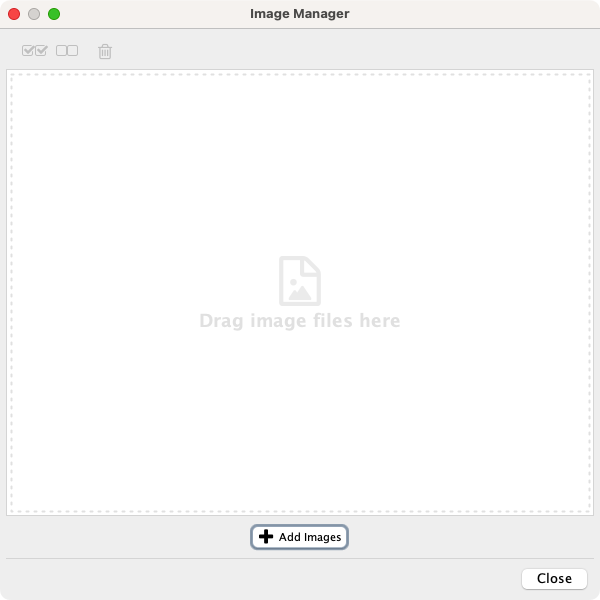

- 你可以通过拖放图像文件来添加图像。
- 单击 `Add Images` 按钮并在 `From File` 或 `From URL` 下添加图像来从本地系统或 Web 端添加图像。

    

- 如需从文件夹添加一张或多张图像，请在 `From File` 下添加所有图像。
- 要从当前绘画的图像库中删除图像，只需要选择一个或多个图像并单击 `Remove Selected Images` 按钮  即可。

### 在样式中使用图形


通过 `Style` 界面，可以像其他属性一样使用和定义节点图形。共有 9 个 `Image/Chart` 属性。

- Cytoscape 提供 3 种图形（通过 `Graphics` 对话框的选项卡选择）：
    - 图像：你可以选择任意提供的图像，也可以添加自己的图像（单击 `Add Images...` 按钮添加更多图像）。
    - 图表：可用的图表类型如下： 条形图， 箱线图， 热力图， 折线图， 饼图， 环形图。
    - 渐变：你可以为节点设置线性和径向渐变。


- 要添加图形，首先在 `Style` 界面中将一个 `Image/Chart` 属性添加至属性列表中（在 `Node` 选项卡中选择 `Properties -> Paint -> Custom Paint n -> Image/Chart n`）。之后，单击 `Image/Chart` 属性中的 `Default Value` 调出 `Graphics` 对话框。选择一个图像、图表或是渐变，然后单击 `Apply`。默认情况下，图像会自动调整大小并与 `Node Size` 属性保持一致。
- 单击 `Graphics` 对话框顶部的 `Remove Graphics` 按钮来删除图像、图表或渐变。

#### 图形位置

每个 `Image/Chart` 属性都与一个位置相关联。你可以使用具有相同编号的 `Image/Chart Position` 属性的 `Default Value` 列中的可用 UI 来编辑其位置。例如：修改 `Image/Chart Position 2` 来改变 `Image/Chart 2` 的位置。

!!! note "注意"

    对于图像位置设置线性或径向渐变是无效的，因为他们始终位于节点的中心。

#### Z 轴顺序

与 `Image/Chart` 属性一起显示的数字表示图层的顺序。首先会渲染节点的基本颜色和形状，然后依次是 `Image/Chart 1, 2, ...` 一直到 `9`。

#### 保存和加载图像

通常，保存和加载图像是自动的。当你退出 Cytoscape 时，图像管理器中的所有图像将被自动保存。有 2 种保存类型：

1. 保存到会话文件。将当前会话保存到文件时，当前样式中使用的图像也将保存到该文件中。例如：如果你的某个样式具有针对 `Image/Chart 1` 的离散映射，则该样式中使用的所有图像都将保存到会话文件中。其他图像将不会保存在你的会话文件中。这是因为当你向图像管理器中添加数千张图像时，图像库可能会很大，保存和加载会话文件将需要很长时间。
2. 自动保存至 `CytoscapeConfiguration/images3` 目录。当你选择 `File -> Quit`（Windows 或 Linux）或 `Cytoscape -> Quit Cytoscape`（macOS），所有图像管理器中的图片会自动保存到你的 Cytoscape 配置目录。通常保存在 `YOUR_HOME_DIRECTORY/CytoscapeConfiguration/images3` 中。

在任何情况下，图像都会自动保存到你的系统或会话中，并且在你重启 Cytoscape 或加载会话时被还原。

## 样式教程

下面教程演示了样式的一些基本功能，每个教程都是相互独立的。

### 教程 1：创建基本样式和设置默认值

本教程的目的是学习如何创建新样式并设置默认值。

1. 通过 `File -> Import -> Network from Files...`，选择 `sampleData/galFiltered.sif` 来加载示例网络。
2. 创建节点/边的统计信息：`Network Analyzer` 可以计算节点和边的一些基本统计信息。从主菜单中选择 `Tools -> Analyze Network`，单击 `OK`。所有的统计结果都存储为常规表格数据。
3. 选择控制面板中的 `Style` 面板。

    

4. 创建一个新样式：单击  下拉菜单，选择 `Create New Style...`。在弹出的对话框中输入新样式的名称。

    

    由于尚未设置映射，仅对于一些属性定义了默认值。在这个面板中，你可以创建用于节点/边映射的所有属性。

5. 更改默认的节点颜色和形状：单击 `Shape` 属性的 `Default Value` 列，设置节点的默认形状为三角形。在可用节点形状的列表中选择 `Triangle`，然后单击 `Apply` 按钮。你可以使用相同的方式编辑其他默认值。在如下示例中，节点形状设置为圆角矩形，填充颜色设置为白色。新样式会自动应用于当前网络，如下图所示：

    

### 教程 2：使用离散映射创建新样式

本节教程将演示如何使用离散映射创建新样式。目标是将蛋白质和 DNA 的交互作用画成虚线，将蛋白质和蛋白质的交互作用画为实线。

1. 查找属性：在 `Style` 面板的 `Edge` 选项卡中，找到 `Stroke Color (Unselected)` 属性。如果在属性列表中不可见，可以通过 `Properties -> Paint -> Color (Unselected) -> Stroke Color (Unselected)` 下拉菜单进行添加。
2. 选择用于映射的数据列：单击右侧的箭头图标展开 `Stroke Color (Unselected)` 条目。单击 `Column` 条目并从下拉菜单中选择 `interaction`。
3. 设置映射类型：在 `Mapping Type` 中选择 `Discrete Mapping`，将显示所有 `interaction` 可用的数据列，如下图所示。

    

4. 设置映射值：单击 `pd`（蛋白质和 DNA 交互）旁边的空白单元格。在单元格的右侧，单击 `...` 按钮。将出现一个弹出窗口，其中包含所有可用的调色板和颜色集合，你可以从任何调色板中选择一种颜色。选择绿色或类似的，更改将立即出现在网络窗口中。

    

对 `pp`（蛋白质和蛋白质交互）重复步骤 4，但选择较深的颜色。然后对 `Line Type` 属性重复步骤 3 和 4 从列表中选择 `Dash` 和 `Solid` 线型。

现在，网络中的 `pd` 交互将显示为绿色的虚线，`pp` 交互将显示为实线。示例如下图所示：


### 教程 3：使用连续映射创建新样式

本节教程将演示如何使用连续映射创建新样式。目的是将节点的统计信息（本示例中为节点的度）通过颜色渐变的形式展现在网络上。

1. 查找属性：在 `Style` 面板的 `Node` 选项卡中找到 `File Color` 属性。如果在属性列表中不可见，可以通过 `Properties -> Paint -> Fill Color` 来添加。
2. 设置节点数据列：单击右侧的箭头图标展开 `Fill Color` 条目。单击 `Column` 并从下单列表中选择 `Degree`。
3. 设置映射类型：在 `Mapping Type` 中选择 `Continuous Mapping`，这会基于 `Degree` 列的数据范围自动创建一个默认映射。

    

4. 定义调色板。建议从现有提供的调色板中选择一个，但你也可以自行选择颜色状态并设置任意数量的中间色。如下介绍这两种方法。

    - 从调色板中选择一个预定义的调色板。这些是来自科学和制图应用出版物建议的颜色，例如 [BrewerColors](http://colorbrewer2.org/)。单击 `Continuous Mapping Editor` 左上方的 `Current Palette` 按钮从一组调色板中进行选择。下图为用于选择一个完整调色板的 `Set Palette` 对话框。在本教程中，我们选择 `green shades` 调色板。请注意，任何调色板都可以通过选择反转颜色来反转。

        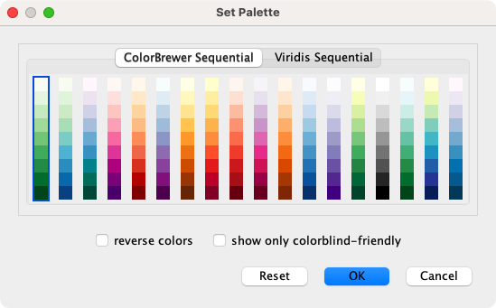

    - 定义颜色的改变点。双击 `Current Mapping` 旁边的黑白渐变矩形打开 `Continuous Mapping Editor`。注意渐变顶部的两个小三角形。

        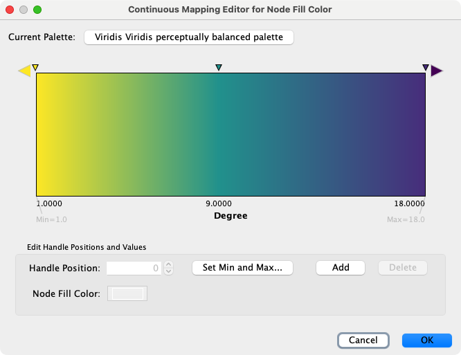

5. 定义点之间的颜色：双击最左边较大的三角形，将出现一个调色板。将颜色设置为白色，然后对左侧较小的三角形重复此操作。对右侧的三角形，将颜色设置为绿色，然后对右侧较小的三角形选择相同的颜色。

    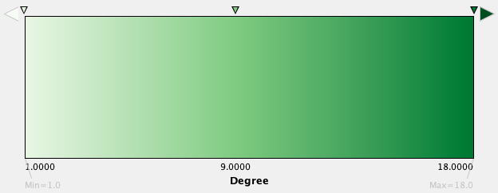

    颜色渐变会立即应用在网络上。所有度为 1 的节点都将被设置为白色，1 到 18 之间的所有值将被设置为白色到绿色的渐变，如下图所示：

    

    对于其他属性重复此操作：你可以为其他数值类型数据创建连续映射。例如，边数据表中的 `Edge Betweenness` 为数值，也可以将其用作连续映射。下图为将 `Edge Betweeness` 映射为边宽度的示例：

    

### 教程 4：为离散映射设置自动值

本节的目的是学习如何为离散映射生成自动值。

1. 将 `Current Style` 最小化，此时网络如下图所示：

    

2. 为 `Fill Color` 创建离散映射。选择由 Network Analyzer 计算得到的 `AverageShortestPathLength` 作为控制属性。
3. 右键单击 `Fill Color` 单元格，选择 `Mapping Value Generators -> Rainbow`。Cytoscape 将为所有属性自动生成不同的颜色，如下图所示：

    

4. 为 `Label Font Size` 创建离散映射。选择 `AverageShortestPathLength` 作为控制属性。
5. 右键单击 `Label Font Size` 单元格，选择 `Mapping Vbalue Generators -> Number Series`。键入 3 作为第一个值，然后单击 `OK`。输入 3 作为增量。
6. 应用 `Layout -> yFiles Organic Layout`，最终视图如下所示：

    

该映射生成器对于分类数据十分有用。下图展示了将物种列离散映射为节点颜色：


### 教程 5：在样式中使用图像

本节教程为设置节点图像的一个快速介绍。作为样式的一部分，每个节点最多设置 9 个图像。

1. 我们使用 Cytoscape 3 中的预设作为第一个示例。通常，你可以使用任何类型的图像，在作为样式之前，你需要将其添加到 `Image Manager` 中。
2. 如果你已经完成了上面的教程可以跳过这一步。否则，加载一个网络后运行 `Network Analyzer`（`Tools -> Analyze Network`）。这将创建几个新的数据列（节点和边的统计信息）。
3. 单击控制面板中的 `Style` 面板，选择 `Solid` 样式。
4. 如果 `Image/Chart 1` 不在属性列表中，可以通过 `Properties -> Paint -> Custom Paint 1 -> Image/Chart 1` 下拉菜单添加。

    

5. 单击 `Image/Chart 1` 条目中的 `Default Value` 单元格打开 `Graphics` 对话框。

    

6. 从列表中选择任意图像，然后单击 `Apply`。

    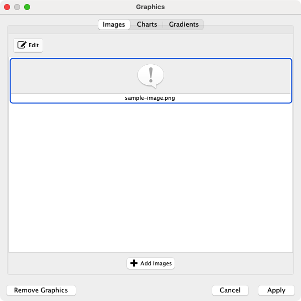

7. 单击节点 `Transparency` 的 `Default Value` 单元格，然后将该值设置为 0。
8. 设置节点 `Size` 的 `Default Value` 为 80。
9. 设置节点 `Label Font Size` 的 `Default Value` 为 10，以提高可读性。
10. 设置边 `Width` 为 6。现在网络应如下图所示：

    

11. 通过 `Veiw -> Open Image Manager...` 打开图像管理器。下载  图标，单后单击 `Add Images` 按钮将其添加到图像管理器，然后选择该图标。

    

12. 为 `Image/Chart 2` 创建一个连续映射，选择 `BetweennessCentrality` 作为控制属性。双击 `Current Mapping` 单元格打开 `Continuous Mapping Editor`。

    

13. 在 `Continuous Mapping Editor` 中，单击 `Add` 按钮添加一个控制点，将控制点移动至 0.2。双击大于 0.2 的区域并设置上一步添加的图标。

    

14. 在 `Properties -> Paint -> Custom Paint 2 -> Image/Chart Position 2` 下拉菜单中添加 `Image/Chart Position 2` 属性。单击 `Default Value` 单元格将图像位置移动至左上角。

    

    注意网络中的重要节点（具有高介数中心度）将用图标注释。

    

### 教程 6：创建节点图表

本节教程目标是学习如何从节点数据表创建和自定义节点图表。

1. 启动一个新会话并加载示例网络。通过主菜单 `File -> Import -> Network from File...` 选择 `sampleData/galFiltered.sif`。
2. 使用 Network Analyzer 创建节点和边的统计信息。通过主菜单中的 `Tools -> Analyzer Network...` 并单击 `OK` 计算节点和边的基础统计信息。所有统计信息将存储为常规表格数据。
3. 在控制面板中选择 `Style` 面板。
4. 创建新样式：单击  下拉菜单，选择 `Creae New Style`。在弹出的对话框中输入新样式的名称。
5. 如果 `Image/Chart 1` 没有在属性列表中，通过 `Properties -> Paint -> Custom Paint 1 -> Image/Chart 1` 添加。

    

6. 单击 `Image/Chart 1` 条目的 `Default Value` 单元格打开 `Graphics` 对话框。

    

7. 单击 `Charts` 选项卡并确保 `Bar Chart` 选项卡被选中。

    

8. 选择数据列：你需要在节点数据表中选择用于图表显示的数据列。`Available Columns` 列表显示可用于作图的所有数据列。
    - 首先单击 `Remove All` 按钮删除当前选定的列（默认情况下，Cytoscape 会选择 `Available Columns` 列表中的第一列）。

        

    - 之后从 `Available Columns` 选择所有中心度和相关度列，单击 `Add Selected` 按钮。

        

9. 单击 `Apply` 按钮利用选择的数据列和默认选项创建条形图。

    

10. 目前网络视图看起来不太好，所以我们需要对样式继续进行一些修改。在下面的示例中，节点的形状设置为矩形，节点的填充颜色设置为白色。

    

11. 聚焦一个节点来查看图表的详细信息。例如，搜索 `YMR043W` 聚焦节点。

    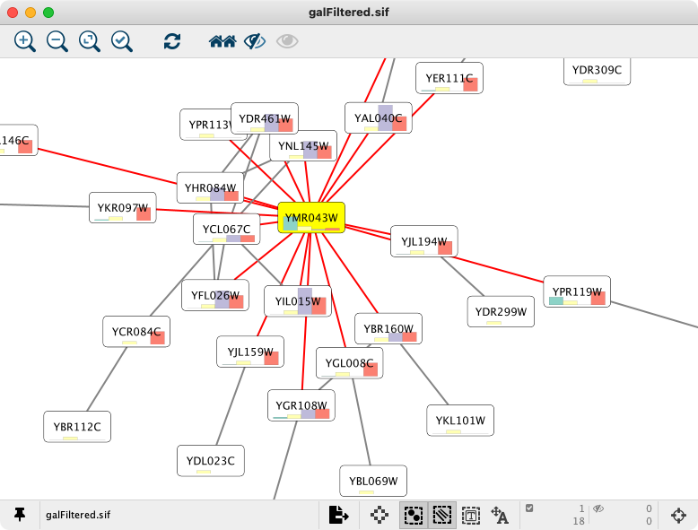

    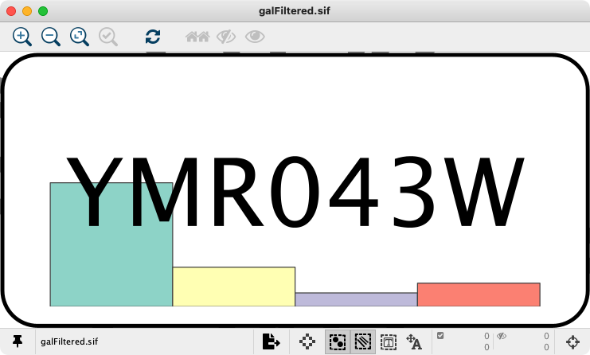

12. 选择其他图表选项：单击 `Image/Chart 1` 属性的 `Deafult Value` 单元格打开 `Graphics` 对话框，然后选择 `Bar Chart` 编辑器上的 `Customize` 选项。

    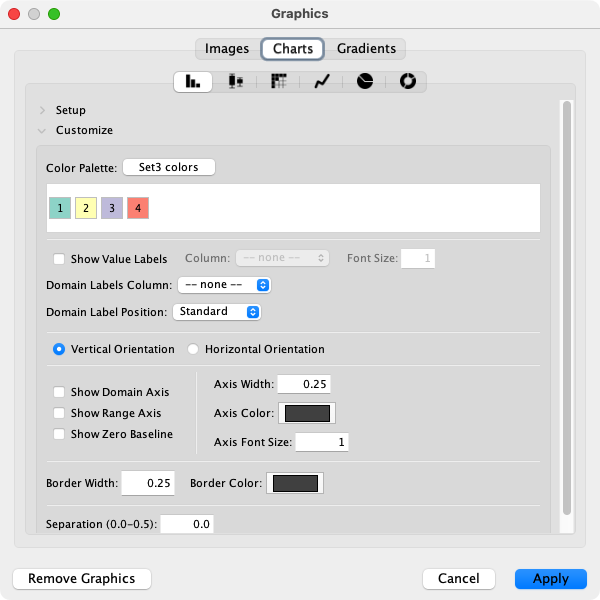

    在面板中，你可以：

    - 选择另一种配色方案或独立设置所有颜色。
    - 显示/隐藏 `Value` 和 `Domain Labels`，并设置 `Domain Label Position`。
    - 更改图表方向。
    - 显示/隐藏坐标轴。
    - 更改坐标轴和柱的线宽和颜色。
    - 增加或减少柱之间的间距（最大为图表宽度的 50%）。

    !!! note "注意"

        其他图表类型提供不同的选项。

13. 选中 `Show Domain Axis` 和 `Show Range Axis` 并应用。此时，节点图表如下所示：

    

14. 默认的 `Domain Labels` 并不是很有用，我们可以设置更好的标签：
    - 在节点表格中，创建一个新的字符串列表类型的数据列，命名为 `domain_labels`。
    - 双击新建列中的任意一个单元格，键入 `["Bet. Cent.","Closen. Cent","Clust. Coeff.","Topol. Coeff."]`。
    - 右键单击同一个单元格，然后选择应用于整列。

        

    - 打开图表编辑器，然后选择 `Options` 面板。
    - 在 `Domain Labels Column` 下拉框中选择 `domain_labels`。
    - 在 `Domain Labels Position` 下拉框中选择 `Up 45°`。

    标签现在如下所示：

    

### 教程 7：为节点表的列创建样式

本教程的目标是为 `Node Table` 中的列设置样式。`Style` 界面的 `Column` 选项卡为一组表格单元格属性提供默认和映射样式选项，在本教程中，我们将使用 `Cell Background Paint` 和 `Cell Font Face`。`Column` 样式没有 `Bypass` 选项。

1. 通过 `View -> Show Starter Panel` 打开 `Yeast Perturbation` 示例文件。
2. 在 `Style` 面板顶部的 `Column` 选项卡，单击加号并选择 `Table` 列中的 `Node`。
3. 接下来，在 `Column` 下拉列表中选择要添加样式的数据列，在本例中为 `gal80Rexp` 列。
4. 在 `Cell Background Paint` 的映射列中选择 `gal80Rexp` 并选择默认的红蓝连续映射。这将为 `Node Table` 中相应列中的单元格的背景着色。
5. 在 `Cell Font Face` 的默认列中选择 `Arial-BoldMT`。


## 进阶主题

### 离散映射

离散映射有几个实用功能，通过右键单击任何属性条目可以使用这些功能。


#### 自动值生成器

**映射值生成器**：此菜单中的函数用于离散映射的值生成。用户可以选择这些功能来自动设置离散映射的值。

- Rainbow 和 Rainbow OSC：这些函数尝试为每个数据值分配尽可能多的颜色集。

    

- 随机数和随机颜色：随机化数字和颜色。
- 数字系列：将一系列数字设置为指定的映射。需要一个起始编号和增量。

    

- 自适应标签宽度：此函数仅适用于节点的宽度和大小。如果用于节点宽度或大小为离散映射，则可以通过此功能来自动将每个节点的大小调整为其标签宽度。示例如下：

    

#### 一次性编辑选定的值

你可以一次性设置多个值。首先，你需要选择需要改变值的离散映射，然后右键单击 `Edit -> Edit Selected -> Discrete Mapping Values`。在弹出的对话框中，你可以为选定的行输入新值。

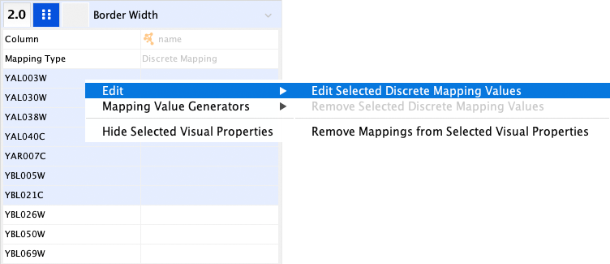

### 使用连续映射编辑器

共有 3 种连续映射编辑器，它们每个都与特定的属性类型相关联：

| 编辑器类型                   | 支持的数据格式 |                  属性                  |
| :--------------------------- | :------------: | :------------------------------------: |
| Color Gradient Editor        |     Color      |     node/edge/border/label colors      |
| Continuous-Continuous Editor |    Numbers     |        size/width/transparency         |
| Continuous-Discrete Editor   |   All others   | font/shape/text/graphics/position/etc. |

#### 范围设置面板


每个连续映射编辑器都包含一个范围设置部分（标记为 `Edit Handle Positions and Values`）以及以下字段和按钮。

- `Handle Position`：显示所选滑块的当前值，你也可以直接在此框中键入值，将滑块移动到精确位置。
- `Set Min and Max...`：单击此按钮设置编辑器的整个范围。首次打开编辑器时，最小值和最大值根据数据列的范围（即映射列的最小值和最大值）进行设置。在弹出的对话框中，你可以手动输入最小值和最大值，通过单击 `Reset` 按钮重置为数据列的最小值和最大值。
- `Add`：向编辑器添加一个新的控制块。
- `Remove`：从滑块控制器中删除一个控制块。
- `Handle Value`（例如 `Node Fill Color`）：单击此按钮可以编辑分配给所选控制块的值（例如：颜色）。

#### 渐变编辑器

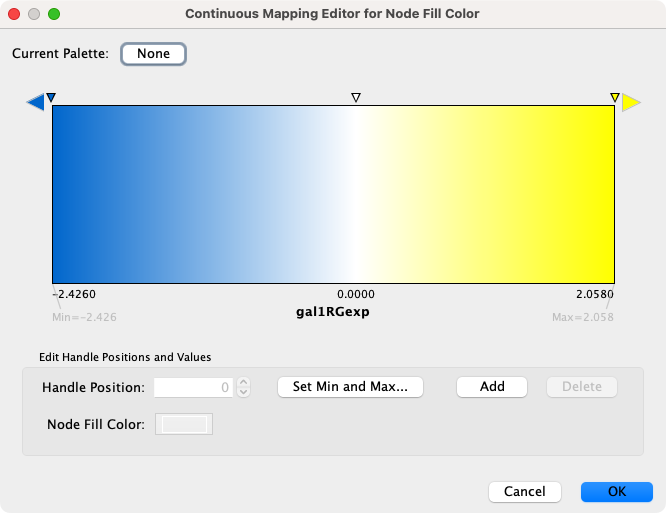

渐变编辑器是用于创建颜色连续映射的编辑器。默认调色板取决于用于映射的列中的值范围。要更改调色板，请单击当前调色板按钮并选择一个调色板。对话框还包括仅显示色盲友好和反转颜色的选项，用于反转调色板的颜色。要手动更改颜色，请双击控制器（顶部的小三角形），然后从任何调色板中选择一种颜色。仅当编辑器具有两个或更多控制器时才会创建颜色渐变（请参见下面的示例）。

|       1 个控制器（无渐变）        |            2 个控制器             |
| :-------------------------------: | :-------------------------------: |
|  |  |

#### 连续-连续编辑器

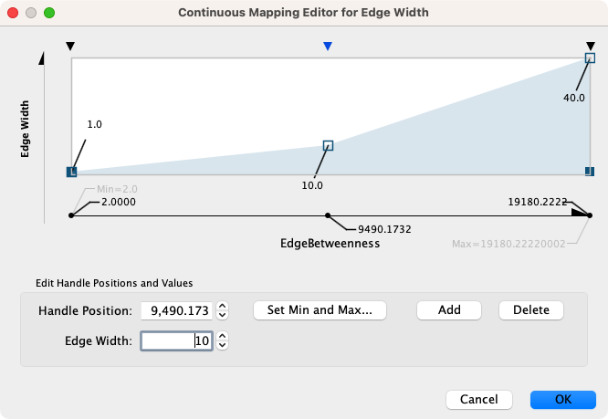

连续-连续编辑器用于数值数据和数值属性（例如：大小，透明度）之间映射的创建。要更改 Y 轴上的值（上例中显示的属性为边宽度），拖动小方框或双击来键入确切的值。

#### 连续-离散编辑器

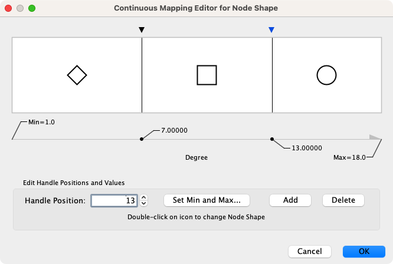

连续-离散编辑器用于数值数据和离散属性（例如：字体，形状或线型）之间映射的创建。双击轨道上的图标编辑特定区域的值。

### 增强图形

增强图形提供对一组视觉样式直通映射的支持，以便与自定义节点图形一起使用。这些映射都是如下形式：

```
type: argument1="val1" argument2="val2"
```

其中 `type` 是图表或渐变的类型，参数是构建该图表或图形的说明。

要是用增强图形，首先将所需的映射添加到 `Node` 表中的新列，然后使用新列直通映射为 `Custom Paint` 属性创建一个样式。这会将你自定义的图表或图形添加到节点上。

下图显示了使用增强图形向节点添加第二个标签的示例。在这种情况下，将酵母 ORF ID 添加为二级节点标签，并偏移到节点的右上角。有关支持的图形类型的完整列表，请案件[此处](http://www.rbvi.ucsf.edu/cytoscape/utilities3/enhancedcg.shtml)。其映射如下：

```
label: attribute=name labelsize=10 outline=false background=false color=orange
```


这种图表类型提供了一种可以将文本标签添加到具有比 Cytoscape 视觉属性提供的简单标签更多显示选项的节点的机制。参数有：

- `color`：指定标签的颜色
- `attribute`：从中获取标签的属性
- `background`：是否在标签后面和网络顶部绘制半透明背景
- `bgcolor`：背景颜色
- `dropShadow`：在标签后面添加阴影
- `label`：要绘制的标签
- `labelfont`：用于标签的字体
- `labelsize`：用于标签的字体大小
- `labelstyle`：用于标签的字体样式
- `outline`：字体轮廓
- `outlineColor`：字体轮廓的颜色

有关添加增强图形工作流程的更详细说明，请参见[教程](https://cytoscape.org/cytoscape-tutorials/protocols/custom-enhanced-graphics-style/#/)。

## 管理样式

所有 Cytoscape 样式均从默认文件加载，用户无法修改。当用户对属性进行更改时，`session_style.xml` 文件将保存在会话文件中。这意味着，保存会话文件则不会丢失任何属性。在常规操作期间不会保存其他样式文件。

### 保存样式

样式会与创建的会话一起自动保存。退出 Cytoscape 之前，系统会提示你确定退出之前保存会话。也可以将样式保存至与会话文件不同的文件中。通过 `File -> Export -> Styles to File...` 菜单可以将样式保存到文件中，从而与其他用户共享样式。

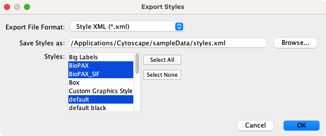

你还可以更改 Cytoscape 以后所有会话的默认样式。通过单击 `Style` 部分中的 `Option`  下拉菜单，然后选择 `Make Current Styles Default`。这会将当前样式作为 `default_vizmap.xml` 文件保存到 `CytoscapeConfiguration` 目录（位于 HOME 目录中）。每次启动 Cytoscape 时将加载这些样式。

#### 样式文件格式

Cytoscape 的本地样式格式为 Style XML。如果想要与其他 Cytoscape 用户共享样式文件，则需要将其导出为这种格式。

从 3.1.0 版本开始，Cytoscape 还可以导出与 [Cytoscape.js](http://cytoscape.github.io/cytoscape.js/#style) 兼容的 JSON 文件。由于 Cytoscape.js 是一个独立的 JavaScript 库，Cytoscape 和 Cytoscape.js 之间存在一定差异，因此并非所有属性都映射到 JSON。导出器不支持以下属性：

- 自定义图形及其位置
- 边弯曲
- 嵌套网络
- 网络背景（注意：可以在 Cytoscape.js 中手动设置为标准 CSS）

### 导入样式

通过 `File -> Import -> Styles from File...` 菜单导入现有样式，然后选择一个 `styles.xml`（Cytoscape 3 格式）文件。如果属性存在相同的名称，则导入的属性将补充到现有属性或覆盖现有属性。你还可以使用 `-V` 命令行选项指定样式文件。从命令行加载的属性将覆盖所有默认属性。
