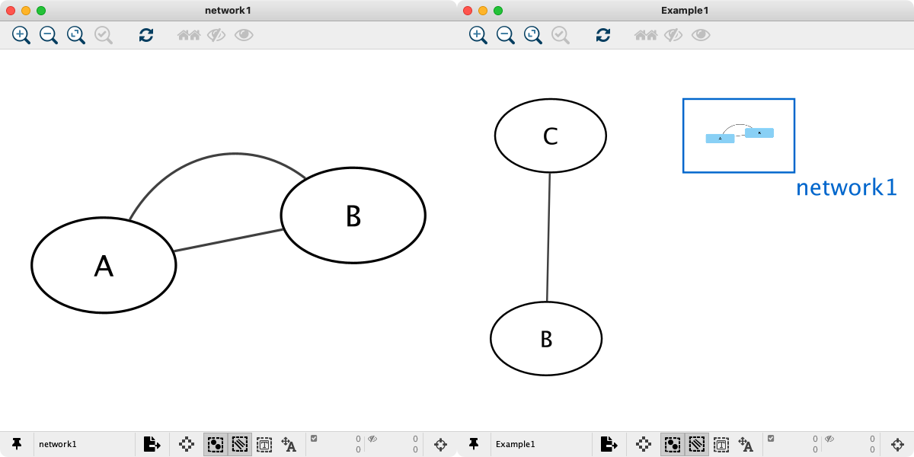
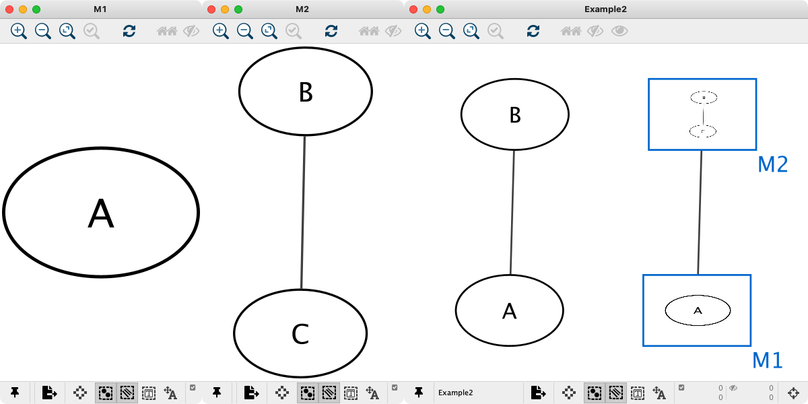
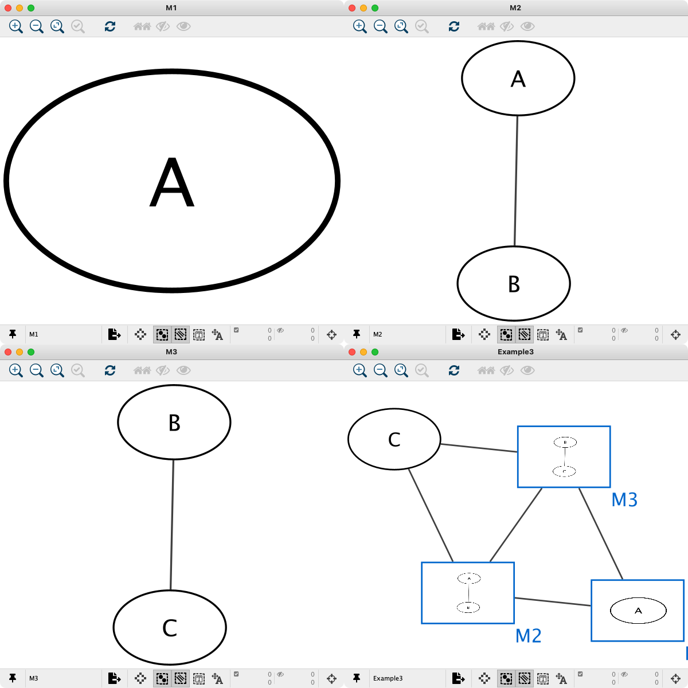
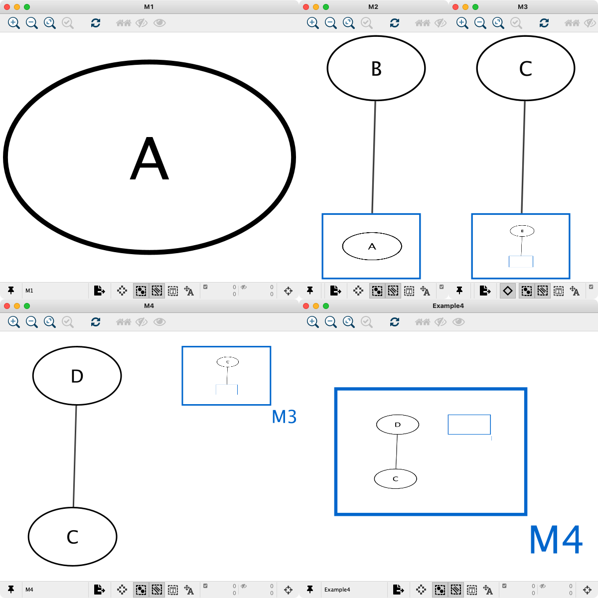
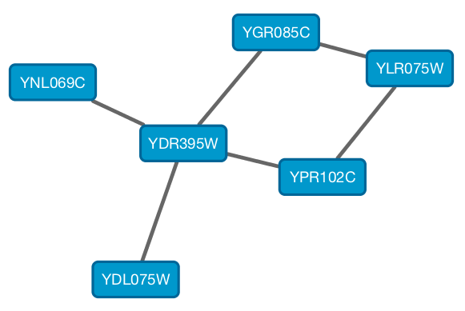
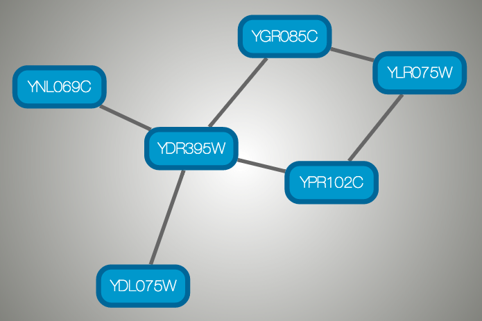
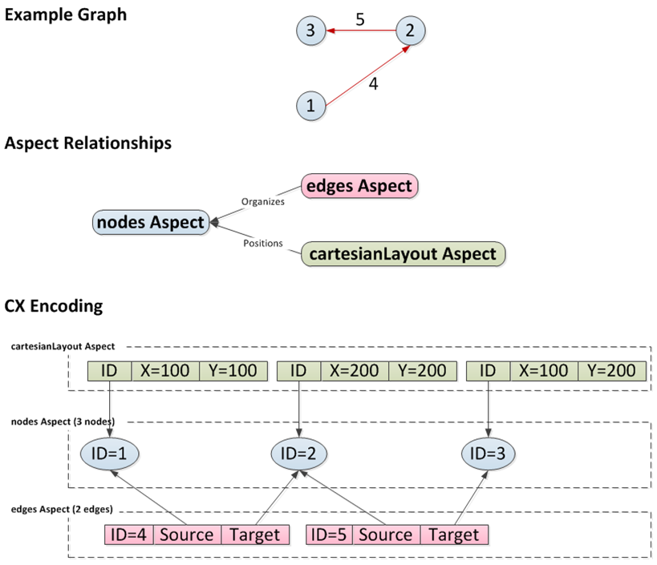

# 支持的网络文件格式

Cytoscape 可以读取以下格式的网络文件：

- Simple interaction file (SIF or .sif format)
- Nested network format (NNF or .nnf format)
- Graph Markup Language (GML or .gml format)
- XGMML (extensible graph markup and modelling language).
- SBML
- BioPAX
- GraphML
- Delimited text
- Excel Workbook (.xls, .xlsx)
- [Cytoscape.js JSON](http://cytoscape.github.io/cytoscape.js/#notation/elements-json)
- [Cytoscape CX](https://github.com/CyComponent/CyWiki)

SIF 格式仅指定了节点和交互，而其他格式则存储了有关网络布局的其他信息，并允许与各种网络程序和数据源交换网络数据。通常，由于 SIF 文件很容易通过文本编辑器或电子表格创建，因此在首次构建网络时会使用 SIF 文件导入交互信息。一旦加载了交互信息并且执行了网络布局，就可以将网络保存为 GML 或 XGMML 格式，以便与其他系统进行交互。上述列出的所有文件类型（Excel 除外）都是文本文件，你可以在常规文本编辑器中进行编辑和查看。

## SIF 格式

简单的交互格式方便从交互列表构建网络。它可以使得将不同的交互集合组合到一个更大的网络中或将新的交互添加到现有数据集中变得容易。该格式的主要缺点是不包含任何布局信息，从而使得 Cytoscape 每次加载时需要重新计算网络的布局。

SIF 文件中的行指定了源节点，关系类型（或边类型）以及一个或多个目标节点：

```sif
nodeA <relationship type> nodeB
nodeC <relationship type> nodeA
nodeD <relationship type> nodeE nodeF nodeB
nodeG
...
nodeY <relationship type> nodeZ
```

一个更具体的例子如下：

```sif
node1 typeA node2
node2 typeB node3 node4 node5
node0
```

第一行标识两个节点，分别是 `node1` 和 `node2`，以及 `node1` 和 `node2` 之间的单个关系 `typeA`。第二行指定了 3 个新节点，分别为 `node3`，`node4` 和 `node5`，`node2` 是指与第一行相同的节点。第二行还指定了 3 个关系，所有关系类型均为 `typeB`，以 `node2` 为源节点，以 `node3`，`node4` 和 `node5` 为目标节点。第二种形式只是用于指定与相同源节点具有相同类型的多个关系的简写形式。第三行指示如何指定与其他节点没有关系的节点。具有确实关系的节点不需要这种形式，因为关系的规范也隐式地标识了节点。

重复的记录将被忽略。同一节点之间的多个边必须具有不同的边类型。例如：以下指定同一对节点之间的两条边，其中一条类型为 `xx`，另一条类型为 `yy`：

```sif
node1 xx node2
node1 xx node2
node1 yy node2
```

允许存在连接到自身的边（自边）：

```sif
node1 xx node1
```

Cytoscape 中的每个节点和边都有一个名称列。对于以 SIF 格式定义的网络，节点名称应该是唯一的，因为名称相同的节点将被视为相同的节点。默认情况下，每个节点的名称将是此文件中的名称（除非使用样式将另一个字符串映射显示在节点上）。在[样式](/styles/)部分将对此进行讨论。每个边的名称将由源节点和目标节点的名称加上交互类型构成，例如：`sourceName (edgeType) targetName`。

标签 `edgeType` 可以为任何字符串。整个单词或拼接的单词可以用于定义关系类型，例如：`geneFusion`，`cogInference,`，`pullsDown`，`activates`，`degrades`，`inactivates`，`inhibits`，`phosphorylates`，`upRegulates` 等。

系统生物学社区中使用的一些常用交互类型如下：

```
pp .................. protein - protein interaction
pd .................. protein -> DNA
(e.g. transcription factor binding upstream of a regulating gene.)
```

一些不常见的交互类型如下：

```
pr .................. protein -> reaction
rc .................. reaction -> compound
cr .................. compound -> reaction
gl .................. genetic lethal relationship
pm .................. protein-metabolite interaction
mp .................. metabolite-protein interaction
```

### 分隔符

空白字符（空格或制表符）用于分隔简单交互文件格式的名称。但是在某些情况下，节点名称或边类型中也需要空格。如果文件包含任何制表符，则制表符用于分隔字段，空格将被视为名称的一部分。如果文件不包含任何制表符，则任何空格都是分隔名称的分隔符（名称不能包含空格）。

如果你的网络恰巧不包含任何边，并且节点名称看起来像边的名称，则可能意味着文件包含使解析器迷惑的散乱的制表符。另一方面，如果你的网络中的节点名称是全名的一半，那么你可能需要使用制表符来分隔节点名称和空格。

简单交互格式的网络通常存储在扩展名为 `.sif` 的文件中，Cytoscape 在浏览目录时也会识别此扩展名的文件。

## NNF

NNF 格式是一种非常简单的格式，与 SIF 不同，它允许每个节点可选地分配单个嵌套网络。其中不能指定其他节点列，仅有 2 种可能的格式：

- 网络中包含一个节点：`network node`
- 网络中包含连接在一起的 2 个节点：`network node1 interaction node2`

如果网络名称（一行中的第一个条目）先前作为节点名称出现（在第 2 列或第 4 列中），则网络将嵌套在具有相同名称的节点中。同样，如果先前已定义为网络的名称（在第 1 列中），后来又显示为节点名称（在第 2 列或第 4 列中），则先前定义的网络将以相同的名称嵌套在节点中。任何时候相同的名称同时作为网络名称和节点名称时，网络都将嵌套在相同名称的节点中。此外，所有行中都有可能包含注释。注释以 `#` 开头，一直到行尾。尾部注释（在数据之后）和全空白行也是允许的。请注意，如果你在 Cytoscape 中加载多个 NNF 文件，他们将被视为合并的长 NNF 文件。如果你需要在名称中插入空格、制表符或反斜杠，必须在前面加上反斜杠对其进行转义。例如一个反斜杠会变成两个反斜杠，一个空格会变成一个反斜杠紧跟一个空格。

### 示例

#### 示例 1



```nnf
Example1       C
Example1       network1
network1       A        pp        B
network1       B        pp        A
Example1       C        pp        B
```

#### 示例 2



```nnf
Example2       M1
Example2       M2
M1             A
M2             B        pp        C
Example2       A        pp        B
Example2       M1       im        M2
```

#### 示例 3



```nnf
Example3       M1       im        M2
Example3       M3       im        M1
Example3       M2       im        M3
Example3       C        pp        M3
Example3       M2       pp        C
M1             A
M2             A        pp        B
M3             B        pp        C
```

#### 示例 4



```nnf
Example4       M4
M4             D
M4             M3
M3             M2        pp        C
M2             M1        pp        B
M1             A
M4             C         pp        D
```

## GML 格式

与 SIF 相比，GML 是许多其他网络可视化软件支持的丰富图形格式语言。GML 文件格式规范可以从如下连接获取：

http://www.graphviewer.nl/misc/gmllanguage/gml-technical-report.pdf

通常无法直接修改 GML 文件的内容。一旦以 SIF 格式构建了网络并进行了布局，就可以将布局保存到 GML 或从 GML 加载。加载 GML 文件时，通过 GML 文件指定属性时将产生一个名为 `Filename.style` 的新样式。

## XGMML 格式

XGMML 是 GML 的 XML 进化版本，它基于 GML 定义。除了网络数据之外，XGMML 还包含节点/边/网络列数据，更多信息请参见 Wikipedia：https://en.wikipedia.org/wiki/XGMML。

XGMML 比 GML 更受青睐，因为它提供了与所有 XML 文档类型相关的灵活性。如果不确定要使用哪个，请选择 XGMML。

如果你在读取较旧的文件遇到问题时，可以将 Java 系统属性 `cytoscape.xgmml.repair.bare.ampersands` 设置为 `true`。

仅当由于不正确的编码而无法读取 XGMML 文件或会话时才应该使用此方法。因为这会减慢读取过程，但与尝试手动编辑修复此类文件相比，这个方法还是更好的选择。

## SBML (Systems Biology Markup Language) 格式

Systems Biology Markup Language (SBML) 是一种用于描述生物网络的 XML 格式。SBML 文件格式规范请参见：http://sbml.org/documents/。

## BioPAX (Biological PAthways eXchange) 格式

BioPAX 是一种 OWL (Web Ontology Language) 文档，旨在交换生物数据。有关此格式的完整文档请参见：http://www.biopax.org/。

## GraphML

GraphML 是用于图形的一种基于 XML 的全面且易于使用的文本格式。有关此格式的完整文档请参见：http://graphml.graphdrawing.org/。

## 分隔的文本表格和 Excel 工作簿

Cytoscape 原生支持 Microsoft Excel 文件（`.xls` 和 `.xlsx`）和分隔的文本文件。这些文件中的表格包含网络数据和边列。用户可以在文件导入时指定包含源节点、目标节点、交互类型和边列的列。其他网络分析工具，例如 igraph（https://igraph.org/）具有将图形导出为简单文本文件的功能。Cytoscape 可以读取这些文本文件并据此建立网络。更多详细信息，请参考[创建网络](/creating-networks/#创建网络)部分。

## Cytoscape.js JSON

从 Cytoscape 3.1.0 开始，Cytoscape 支持 [Cytoscape.js](http://cytoscape.github.io/cytoscape.js/) JSON 文件。你可以使用此功能将网络可视化文件导出到 Web 浏览器。Cytoscape.js 有两种表示网络数据的方式，当前仅支持读写数据样式图表。例如：Cytoscape 中的网络：



可以导出为如下 JSON：

```json
{
  "elements" : {
    "nodes" : [ {
      "data" : {
        "id" : "723",
        "selected" : false,
        "annotation_Taxon" : "Saccharomyces cerevisiae",
        "alias" : [ "RPL31A", "RPL34", "S000002233", "ribosomal protein L31A (L34A) (YL28)" ],
        "shared_name" : "YDL075W",
        "SUID" : 723,
        "degree_layout" : 1,
        "name" : "YDL075W"
      },
      "position" : {
        "x" : 693.0518315633137,
        "y" : -49.47506554921466
      },
      "selected" : false
    }, {
      "data" : {
        "id" : "726",
        "selected" : false,
        "annotation_Taxon" : "Saccharomyces cerevisiae",
        "alias" : [ "RP23", "RPL16B", "S000005013", "ribosomal protein L16B (L21B) (rp23) (YL15)" ],
        "shared_name" : "YNL069C",
        "SUID" : 726,
        "degree_layout" : 1,
        "name" : "YNL069C"
      },
      "position" : {
        "x" : 627.3147710164387,
        "y" : -205.99251969655353
      },
      "selected" : false
    }, {
      "data" : {
        "id" : "658",
        "selected" : false,
        "annotation_Taxon" : "Saccharomyces cerevisiae",
        "alias" : [ "RPL11B", "S000003317", "ribosomal protein L11B (L16B) (rp39B) (YL22)" ],
        "shared_name" : "YGR085C",
        "SUID" : 658,
        "degree_layout" : 2,
        "name" : "YGR085C"
      },
      "position" : {
        "x" : 804.3092778523762,
        "y" : -245.6235926946004
      },
      "selected" : false
    }, {
      "data" : {
        "id" : "660",
        "selected" : false,
        "annotation_Taxon" : "Saccharomyces cerevisiae",
        "alias" : [ "KAP108", "S000002803", "SXM1" ],
        "shared_name" : "YDR395W",
        "SUID" : 660,
        "degree_layout" : 8,
        "name" : "YDR395W"
      },
      "position" : {
        "x" : 730.8733342488606,
        "y" : -157.50702317555744
      },
      "selected" : false
    }, {
      "data" : {
        "id" : "579",
        "selected" : false,
        "annotation_Taxon" : "Saccharomyces cerevisiae",
        "alias" : [ "RPL11A", "S000006306", "ribosomal protein L11A (L16A) (rp39A) (YL22)" ],
        "shared_name" : "YPR102C",
        "SUID" : 579,
        "degree_layout" : 2,
        "name" : "YPR102C"
      },
      "position" : {
        "x" : 841.1395696004231,
        "y" : -130.77909119923908
      },
      "selected" : false
    }, {
      "data" : {
        "id" : "578",
        "selected" : false,
        "annotation_Taxon" : "Saccharomyces cerevisiae",
        "alias" : [ "GRC5", "QSR1", "RPL10", "S000004065", "ribosomal protein L10" ],
        "shared_name" : "YLR075W",
        "SUID" : 578,
        "degree_layout" : 2,
        "name" : "YLR075W"
      },
      "position" : {
        "x" : 910.3755162556965,
        "y" : -217.0562556584676
      },
      "selected" : false
    } ],
    "edges" : [ {
      "data" : {
        "id" : "659",
        "source" : "658",
        "target" : "578",
        "selected" : false,
        "interaction" : "pp",
        "shared_interaction" : "pp",
        "shared_name" : "YGR085C (pp) YLR075W",
        "SUID" : 659,
        "name" : "YGR085C (pp) YLR075W"
      },
      "selected" : false
    }, {
      "data" : {
        "id" : "661",
        "source" : "658",
        "target" : "660",
        "selected" : false,
        "interaction" : "pp",
        "shared_interaction" : "pp",
        "shared_name" : "YGR085C (pp) YDR395W",
        "SUID" : 661,
        "name" : "YGR085C (pp) YDR395W"
      },
      "selected" : false
    }, {
      "data" : {
        "id" : "724",
        "source" : "660",
        "target" : "723",
        "selected" : false,
        "interaction" : "pp",
        "shared_interaction" : "pp",
        "shared_name" : "YDR395W (pp) YDL075W",
        "SUID" : 724,
        "name" : "YDR395W (pp) YDL075W"
      },
      "selected" : false
    }, {
      "data" : {
        "id" : "733",
        "source" : "660",
        "target" : "579",
        "selected" : false,
        "interaction" : "pp",
        "shared_interaction" : "pp",
        "shared_name" : "YDR395W (pp) YPR102C",
        "SUID" : 733,
        "name" : "YDR395W (pp) YPR102C"
      },
      "selected" : false
    }, {
      "data" : {
        "id" : "727",
        "source" : "660",
        "target" : "726",
        "selected" : false,
        "interaction" : "pp",
        "shared_interaction" : "pp",
        "shared_name" : "YDR395W (pp) YNL069C",
        "SUID" : 727,
        "name" : "YDR395W (pp) YNL069C"
      },
      "selected" : false
    }, {
      "data" : {
        "id" : "580",
        "source" : "578",
        "target" : "579",
        "selected" : false,
        "interaction" : "pp",
        "shared_interaction" : "pp",
        "shared_name" : "YLR075W (pp) YPR102C",
        "SUID" : 580,
        "name" : "YLR075W (pp) YPR102C"
      },
      "selected" : false
    } ]
  }
}
```

下图为 Cytoscape.js 中的可视化：



### 重要提示

Cytoscape 将网络和表格导出到 Cytoscape.js 时会创建一个没有样式的 JSON 文件。这意味着如果你将样式用于网络，需要将样式导出到单独的 JSON 文件中。更多信息请参见[样式](/styles/)部分。

## Cytoscape CX

CX 是基于 JSON 的传输格式，它使得 Cytoscape Cyberinfrastructure (CI) 服务在交换网络时可以保留所有与网络相关的信息。它旨在实现灵活性、模块化和可扩展性，并作为常见 CI REST 协议中的信息负载。它使应用可以对网络的核心部分进行标准化，在具体或唯一的标准上协调，并忽略不相关的部分。它不是用于存储或应用于特定功能的优化格式。

CX 是 Aspect-Oriented 的网络交换格式，其中基本信息是节点列表。独立的数据结构（称为 aspects）在节点以及彼此之间得到组织和完善。尽管全面的 CX 文档定义了很多方面，但 CX 的核心仅包含 5 个方面。

| ASPECT              | 目的                   |
| :------------------ | :--------------------- |
| `networkAttributes` | 描述网络的键值对       |
| `nodes`             | 指定网络中节点的标示符 |
| `edges`             | 指定连接节点的边       |
| `nodeAttributes`    | 描述节点的键值对       |
| `edgeAttributes`    | 描述边的键值对         |

`nodes` 包含网络节点的标示符，`edges` 包含边的标示符以及边连接节点的标示符。`networkAttributes` 包含描述网络的键值对。`nodeAttributes` 和 `edgeAttributes` 包含了描述节点和边的键值对。

至关重要的是，应用程序可以自由添加和维护自己的 aspects，而无需与其他程序进行协调。

如下图说明，可以将一个包含 3 个节点的网络描述为节点（`nodes Aspect`）和边（`edges Aspect`）的列表。如果已经添加了布局，则可以使用单独的 aspect（`cartesianLayout Aspect`）来描述每个节点的位置。更具体的说，CX 编码在 `nodes Aspect` 中具有 3 个节点，每个节点具有唯一 ID。`edges Aspect` 按照 ID 引用每个节点，每个边也有其自己的 ID。最后，`cartesianLayout Aspect` 通过 ID 绑定节点的坐标。实际上，网络可能具有很多 aspects 用来描述节点和边属性、子网络、视觉属性和分组等。



CX 流的实际 JSON 编码通过 [CX 文档](https://github.com/CyComponent/CyWiki)进行描述，如下所示：

```json
{
  "nodes": [{"@id": 1}, {"@id": 2}, {"@id": 3}],
  "edges": [{"s": 1, "@id": 4, "t": 2},
            {"s": 2, "@id": 5, "t": 3}],
  "cartesianLayout": [{"x": 100, "node": 1, "y": 100},
                      {"x": 200, "node": 2, "y": 200},
                      {"x": 100, "node": 3, "y": 200}]
}
```
