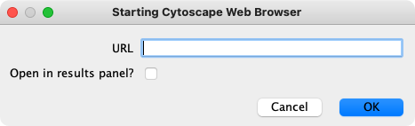
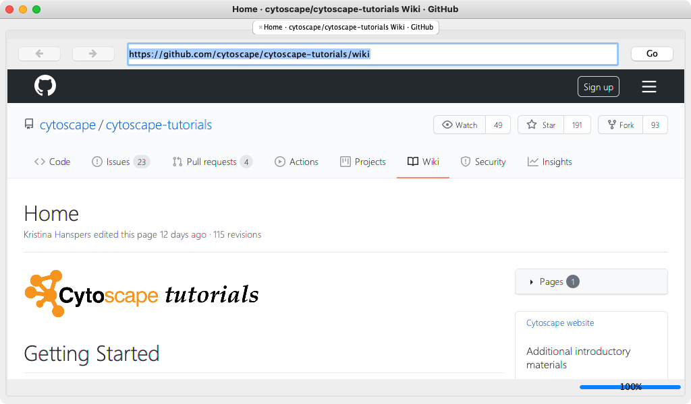
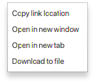
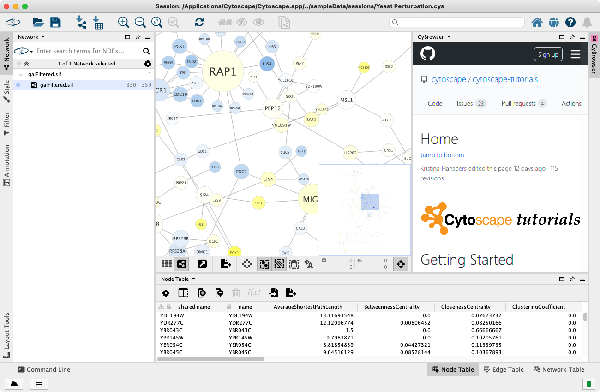

# 网页浏览器

Cytoscape 包含一个简单的 Web 浏览器，可用于从 Cytoscape 中查看网站。同时也用于 Cytoscape 应用，link out，显示用户手册和交互式教程。通常浏览器自动启用，通过 `Tools -> Cytoscape Web Browser` 或单击工具栏中的  按钮打开浏览器窗口。

初始的 CyBrowser 对话框提供一个用于输入网址的输入框和一个用于指示是否在 [Cytoscape 结果面板](#结果面板中的-cybrowser)中打开浏览器窗口的复选框。

## CyBrowser 窗口

CyBrowser 主窗口提供了基本的浏览界面，包括前进/后退按钮，用于输入新 URL 的文本框，以及跳转至新页面的 `Go` 按钮。此外还有 3 个上下文菜单：

- `Selected text`：选择文本菜单仅包含一项 `Copy`，即复制选定的文本。
- `Link`：使用链接菜单，用户可以复制链接地址，在新窗口或新选项卡中打开链接。还可以使用它将链接目标下载到文件。

    

- `Other`：如果光标不在连接上并且未选择任何文本，则显示默认菜单。使用默认菜单，用户可以关闭浏览器或重新加载页面。

    

## 结果面板中的 CyBrowser

除了能够将网络在单独的窗口打开之外，还可以在结果面板中打开网页。除了不包含前进和后退按钮，以及无法在其他标签中打开连接外，它提供了与浏览器窗口相同的功能。

## 为什么使用 CyBrowser？

CyBrowser 并不是 Chrome 或 Firefox 的替代物，它提供了一种快速查看 Cytoscape 特定网页的功能。与 Cytoscape 的集成是所运行系统上的其他浏览器很难提供的。此外，CyBrowser 支持 Cytoscape 命令样式的连接，对于 JavaScript 开发者来说，CyBrowser 还提供用于监听 Cytoscape 中节点和边选择的钩子。
